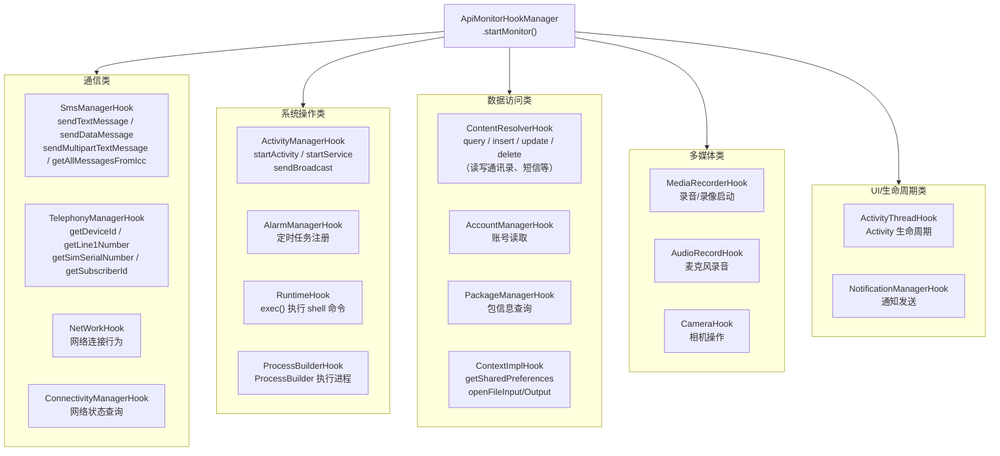
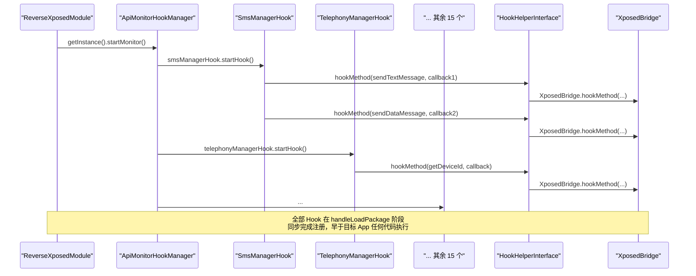
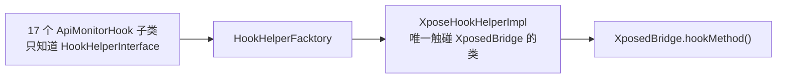

# 👁️ API 监控子系统架构

ZjDroid 除了脱壳，还内置了一套行为监控子系统：在目标 App 运行期间，自动捕获发短信、录音、拍照、读通讯录等 17 类敏感 API 调用并输出到 logcat。本篇拆解这套子系统的分层设计与 Hook 注册机制。

## 整体架构

```mermaid
classDiagram
    class ApiMonitorHookManager {
        -smsManagerHook: SmsManagerHook
        -telephonyManagerHook: TelephonyManagerHook
        -mediaRecorderHook: MediaRecorderHook
        -accountManagerHook: AccountManagerHook
        -activityManagerHook: ActivityManagerHook
        -alarmManagerHook: AlarmManagerHook
        -connectivityManagerHook: ConnectivityManagerHook
        -contentResolverHook: ContentResolverHook
        -contextImplHook: ContextImplHook
        -packageManagerHook: PackageManagerHook
        -runtimeHook: RuntimeHook
        -activityThreadHook: ActivityThreadHook
        -audioRecordHook: AudioRecordHook
        -cameraHook: CameraHook
        -networkHook: NetWorkHook
        -notificationManagerHook: NotificationManagerHook
        -processBuilderHook: ProcessBuilderHook
        +startMonitor() void
        +getInstance()$ ApiMonitorHookManager
    }

    class ApiMonitorHook {
        <<abstract>>
        #hookhelper: HookHelperInterface
        +startHook() void*
    }

    class AbstractBahaviorHookCallBack {
        <<abstract>>
        +beforeHookedMethod(param: HookParam) void
        +afterHookedMethod(param: HookParam) void
        +descParam(param: HookParam) void*
    }

    ApiMonitorHookManager "1" *-- "17" ApiMonitorHook
    ApiMonitorHook <|-- SmsManagerHook
    ApiMonitorHook <|-- TelephonyManagerHook
    ApiMonitorHook <|-- MediaRecorderHook
    ApiMonitorHook <|-- "... 14 others"
    AbstractBahaviorHookCallBack <|-- "各 Hook 内部匿名类"
```

## 三层抽象

### 第一层：ApiMonitorHookManager — 统一入口

```java
// ApiMonitorHookManager.java
public class ApiMonitorHookManager {
    private static ApiMonitorHookManager hookmger;
    // 17 个 Hook 实例字段...
    private SmsManagerHook smsManagerHook;
    private TelephonyManagerHook telephonyManagerHook;
    // ... 共 17 个

    private ApiMonitorHookManager() {
        // 构造函数中实例化全部 17 个 Hook
        this.smsManagerHook = new SmsManagerHook();
        this.telephonyManagerHook = new TelephonyManagerHook();
        // ...
    }

    public void startMonitor() {
        this.smsManagerHook.startHook();
        this.telephonyManagerHook.startHook();
        // ... 依次调用全部 17 个
    }
}
```

`ApiMonitorHookManager` 是一个门面（Facade）类：它不包含任何业务逻辑，只负责聚合 17 个子 Hook 对象，并在 `startMonitor()` 中串行调用各自的 `startHook()`。`ReverseXposedModule.handleLoadPackage()` 只需调用一行 `ApiMonitorHookManager.getInstance().startMonitor()` 即可激活全部监控。

### 第二层：ApiMonitorHook — 公共基础设施

```java
// ApiMonitorHook.java
public abstract class ApiMonitorHook {
    // 唯一的公共字段：Hook 助手（通过工厂获取）
    protected HookHelperInterface hookhelper = HookHelperFacktory.getHookHelper();

    // 每个子类实现此方法来注册自己的 Hook
    public abstract void startHook();
}
```

`ApiMonitorHook` 极简：只提供 `hookhelper`（子类直接调用 `hookhelper.hookMethod()`），以及 `startHook()` 抽象方法规范接口。每个子类在 `startHook()` 中使用 `RefInvoke.findMethodExact()` 定位目标方法，再用 `hookhelper.hookMethod()` 注册回调。

### 第三层：AbstractBahaviorHookCallBack — 统一日志格式

```java
// AbstractBahaviorHookCallBack.java
public abstract class AbstractBahaviorHookCallBack extends MethodHookCallBack {

    @Override
    public void beforeHookedMethod(HookParam param) {
        // 统一格式：打印"被调用的类名→方法名"
        Logger.log_behavior("Invoke "
                + param.method.getDeclaringClass().getName()
                + "->" + param.method.getName());
        this.descParam(param);  // 委托子类输出参数细节
    }

    @Override
    public void afterHookedMethod(HookParam param) {
        // 默认不打印 after，保持日志简洁
    }

    public abstract void descParam(HookParam param);
}
```

所有 17 个 Hook 类的回调都继承此类，`beforeHookedMethod` 自动打印方法签名，子类只需实现 `descParam()` 输出业务参数（如短信内容、电话号码等）。日志通过 `Logger.log_behavior()` 写入 logcat，tag 格式为 `zjdroid-apimonitor-<包名>`：

```bash
adb logcat -s "zjdroid-apimonitor-com.target.app:D"
```

## 17 类监控覆盖范围



## 以 SmsManagerHook 为例的实现模式

```java
// SmsManagerHook.java
public class SmsManagerHook extends ApiMonitorHook {
    @Override
    public void startHook() {
        // Hook 1：发送文本短信
        Method sendTextMessagemethod = RefInvoke.findMethodExact(
                "android.telephony.SmsManager",
                ClassLoader.getSystemClassLoader(),
                "sendTextMessage",
                String.class, String.class, String.class,
                PendingIntent.class, PendingIntent.class);

        hookhelper.hookMethod(sendTextMessagemethod,
                new AbstractBahaviorHookCallBack() {
            @Override
            public void descParam(HookParam param) {
                Logger.log_behavior("Send SMS ->");
                String dstNumber = (String) param.args[0];
                String content = (String) param.args[2];
                Logger.log_behavior("SMS DestNumber:" + dstNumber);
                Logger.log_behavior("SMS Content:" + content);
            }
        });

        // Hook 2：发送数据短信（Base64 编码输出）
        Method sendDataMessagemethod = RefInvoke.findMethodExact(
                "android.telephony.SmsManager", ...);
        hookhelper.hookMethod(sendDataMessagemethod,
                new AbstractBahaviorHookCallBack() {
            @Override
            public void descParam(HookParam param) {
                String content = Base64.encodeToString(
                        (byte[]) param.args[3], 0);
                Logger.log_behavior("SMS Base64 Content:" + content);
            }
        });
        // ... 共 4 个 SMS 相关 Hook
    }
}
```

每个 `ApiMonitorHook` 子类通常注册 2～5 个方法 Hook，覆盖同一 API 类的多个敏感方法。

## Hook 注册的时序



::: tip 监控在 Application.onCreate 之前生效
所有 API Monitor Hook 在 `handleLoadPackage` 阶段注册，这比目标 App 的 `Application.onCreate` 更早。这意味着即使目标 App 在 `Application.onCreate` 中发短信，也会被捕获到。
:::

## 日志输出格式

API 监控的日志与指令执行日志使用**不同的 tag**，以便分开过滤：

```
# 指令执行日志（脱壳、dump 等）
zjdroid-shell-com.target.app

# API 行为监控日志
zjdroid-apimonitor-com.target.app
```

典型的 API 监控日志输出（以发短信为例）：

```
D/zjdroid-apimonitor-com.target.app: Invoke android.telephony.SmsManager->sendTextMessage
D/zjdroid-apimonitor-com.target.app: Send SMS ->
D/zjdroid-apimonitor-com.target.app: SMS DestNumber:13800138000
D/zjdroid-apimonitor-com.target.app: SMS Content:您的验证码是12345
```

## 与 Hook 框架的关系

API 监控子系统是 [Hook 框架抽象设计](/architecture/hook-framework) 的最大用户，17 个 Hook 类均通过 `HookHelperFacktory.getHookHelper()` 获取 `HookHelperInterface`，不直接依赖 Xposed。这意味着整个 API 监控子系统可以在不修改任何业务代码的情况下切换底层 Hook 引擎。



## 📎 交叉链接

- Hook 框架设计原理 → [Hook 框架抽象设计](/architecture/hook-framework)
- 监控功能用户文档 → [API 监控功能](/features/api-monitor)
- AbstractBahaviorHookCallBack 逐类讲解 → [AbstractBahaviorHookCallBack](/source/apimonitor/AbstractBahaviorHookCallBack)
- ApiMonitorHookManager 逐类讲解 → [ApiMonitorHookManager](/source/apimonitor/ApiMonitorHookManager)
- Logger 逐类讲解 → [Logger](/source/util/Logger)

## 小结

API 监控子系统用三层架构管理 17 个 Hook 类：`ApiMonitorHookManager` 作为门面聚合所有 Hook 实例，`ApiMonitorHook` 提供公共基础设施（hookhelper）并规范 `startHook()` 接口，`AbstractBahaviorHookCallBack` 统一日志格式并留出 `descParam()` 扩展点。整个子系统在 `handleLoadPackage` 阶段一次性完成全部 Hook 注册，对目标 App 透明无感，结果通过专用 logcat tag 输出，与指令执行日志清晰分离。
