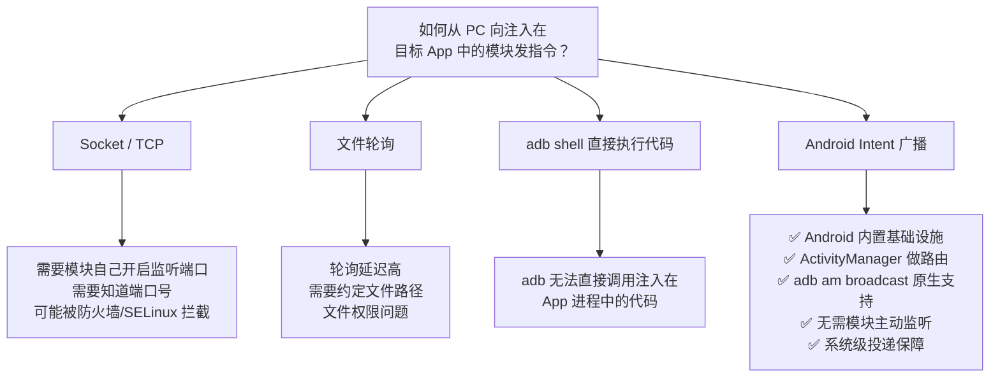
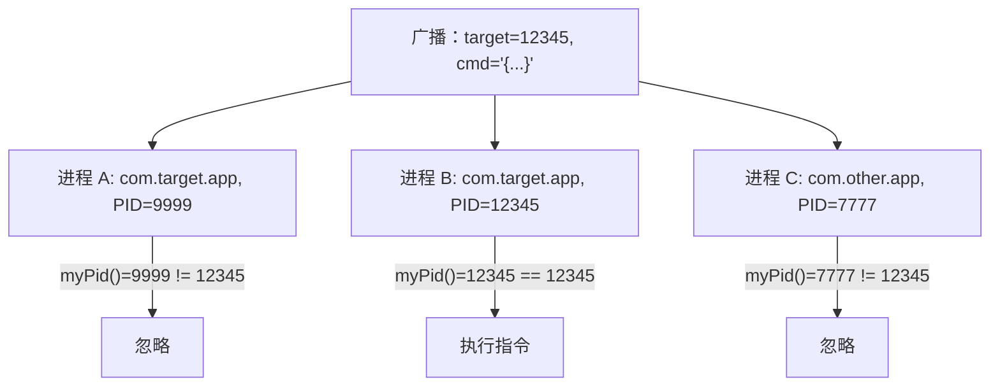
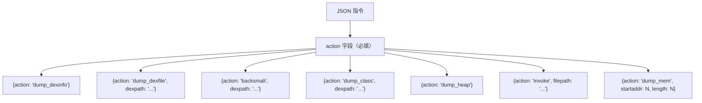
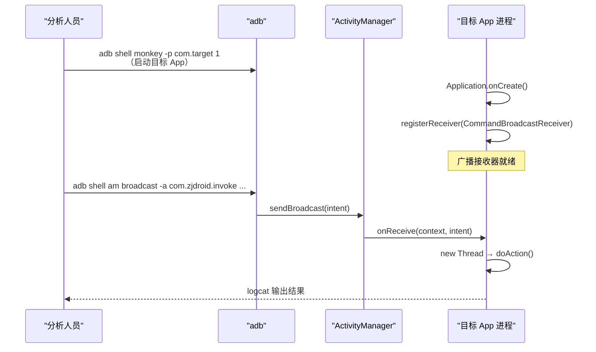
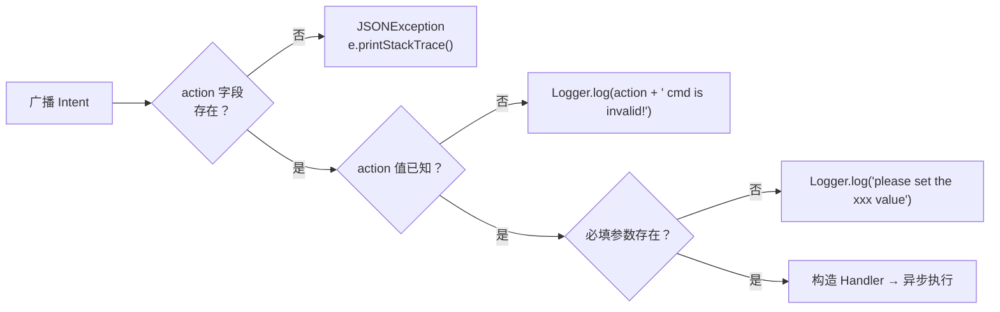

# 📻 广播指令协议设计

ZjDroid 选择用 Android 广播（Broadcast）作为控制信道，而非 socket、文件、HTTP 或 ADB shell。这不是随意的选择——本篇从协议设计的角度拆解每个决定背后的约束与权衡。

## 协议全貌

```
adb shell am broadcast \
  -a com.zjdroid.invoke \
  --ei target <PID: int> \
  --es cmd '<JSON: string>'
```

三个组成部分：
- **Intent Action** `com.zjdroid.invoke`：全局命名空间，充当"协议端口"
- **`target` 字段（int）**：目标进程 PID，充当"路由地址"
- **`cmd` 字段（JSON string）**：指令内容，包含 `action` 和业务参数

## 为什么用广播而不是其他通信机制



广播的核心优势是 **"零基础设施"**：ActivityManager 天然提供跨进程消息投递，`adb am broadcast` 是 Android 内置工具，ZjDroid 模块只需注册一个 `BroadcastReceiver` 即可，无需自建任何通信基础设施。

### 广播 vs Socket 的对比

| 维度 | Android 广播 | Unix Domain Socket |
|------|-------------|-------------------|
| 基础设施 | Android 系统内置，ActivityManager 投递 | 需要模块自己 bind/listen |
| adb 集成 | `adb am broadcast` 原生支持 | 需要额外工具转发 |
| 多目标路由 | 系统广播所有进程，模块自行 PID 过滤 | 需要知道 socket 路径 |
| 权限 | 无需额外权限（模块已在 App 进程中） | 需要确保 socket 文件权限 |
| 延迟 | Binder IPC，毫秒级 | 更低，但差异在实践中无意义 |

## 为什么用 PID 而非包名路由



使用 PID 而非包名的理由：

1. **多进程 App**：一个包名下可能有 `:remote`、`:push` 等多个进程，PID 精确定位到某一个。
2. **避免歧义**：如果用包名，同一包名的所有进程都会执行，可能引发竞争。
3. **PID 易获取**：`adb shell ps | grep com.target` 即可找到目标 PID。

::: tip 获取目标 PID
```bash
# 方法一：ps 过滤
adb shell ps | grep com.target.app

# 方法二：ZjDroid 自动打印
# 模块注入时会在 logcat 输出：
# D/zjdroid-shell-com.target.app: the app target id = 12345
adb logcat -s "zjdroid-shell-com.target.app:D" | grep "target id"
```
:::

## 为什么在新线程执行

```java
// CommandBroadcastReceiver.java
new Thread(new Runnable() {
    @Override
    public void run() {
        handler.doAction();
    }
}).start();
// onReceive 立即返回
```

`BroadcastReceiver.onReceive()` 运行在 App 主线程（Main Looper）。Android 限制主线程超过 10 秒未响应触发 ANR。`backsmali` 操作（遍历 DEX 所有类、反汇编、重组）通常需要数秒到数十秒，必须异步执行。

这也意味着：**广播命令立即返回，但实际工作异步完成，结果通过 logcat 异步查看**。用户在执行 `backsmali` 后无需等待广播返回，而是监控 logcat 等待完成日志。

## JSON 指令格式设计

```json
{
    "action": "backsmali",
    "dexpath": "/data/app/com.target/base.apk"
}
```

选择 JSON 的理由：
- **Android 内置**：`org.json.JSONObject` 是 Android SDK 的一部分，零外部依赖
- **可读可调试**：指令内容人类可读，adb 命令行直接拼写，便于调试
- **可扩展**：新增 action 只需扩展 JSON schema，协议层无需修改

各 action 的 JSON schema：



## 广播生命周期与时序保证

广播的投递时机由 Android 系统保证。ZjDroid 的广播接收器在 `Application.onCreate()` 执行完毕后才注册，因此需要确保：

1. 目标 App 完全启动（`Application.onCreate` 执行完）
2. 再发送广播指令



::: warning 如果广播没有被处理
可能原因：(1) 目标 App 尚未启动或还未完成 `Application.onCreate`；(2) PID 填写错误；(3) ZjDroid 模块未对该包启用（Xposed 管理器中未勾选）。确认方式：先用 `adb logcat -s zjdroid-shell-com.target.app:D` 查看是否有注入日志。
:::

## 广播的安全语义

使用系统广播有一个安全含义：目标设备上任何 App 都可以发送 `com.zjdroid.invoke` 广播（无权限限制）。但 PID 路由提供了一定程度的保护——攻击者需要知道目标 PID 才能触发特定进程的 ZjDroid 操作。

在实际使用场景（逆向分析环境，通常是 root 设备且无生产数据）下，这不是安全问题。详见 [能力边界与安全模型](/architecture/security-boundary)。

## 指令协议的错误处理



所有错误都通过 `Logger.log()` 写入 logcat，不抛异常到主线程（`catch (Exception e)` 包住了整个 `onReceive` 主逻辑），确保广播处理不会导致目标 App 崩溃。

## 结果回传：为什么用 logcat

分析结果通过 `android.util.Log.d()` 写入 logcat，而非回传广播、写入特定文件或建立 socket 连接。选择 logcat 的理由：

1. **零基础设施**：logcat 是 Android 内置的全局日志系统，任何代码随时可写
2. **adb 内置支持**：`adb logcat` 实时流式读取，无需额外工具
3. **不阻塞执行**：`Log.d()` 是非阻塞异步写入
4. **多路复用**：不同模块用不同 tag 区分（`zjdroid-shell-*` 和 `zjdroid-apimonitor-*`），互不干扰

落盘文件（DEX dump、hprof 等）写入 `/data/data/<包名>/files/`，通过 adb pull（root 环境）读取，与 logcat 互补：logcat 提供实时反馈，文件提供二进制数据。

## 📎 交叉链接

- 指令完整数据流 → [一条指令的完整数据流](/architecture/command-flow)
- 广播接收器注册时机 → [Xposed 注入与模块初始化生命周期](/architecture/injection-lifecycle)
- CommandBroadcastReceiver 逐类讲解 → [CommandBroadcastReceiver](/source/mod/CommandBroadcastReceiver)
- CommandHandlerParser 逐类讲解 → [CommandHandlerParser](/source/request/CommandHandlerParser)

## 小结

ZjDroid 的广播指令协议是在 Android 系统约束下的最优选择：广播利用系统内置投递能力、PID 实现多进程精确路由、JSON 提供可扩展的指令格式、新线程执行规避 ANR、logcat 提供零基础设施的结果回传。整套协议没有引入任何外部依赖，仅依靠 Android 平台自身的机制运作，这是 ZjDroid 作为 Xposed 模块的设计哲学的体现：**寄生而不改变宿主**。
