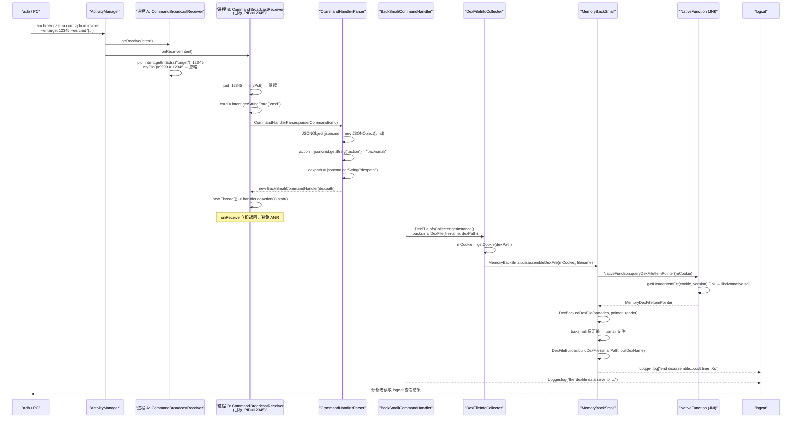
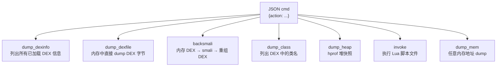
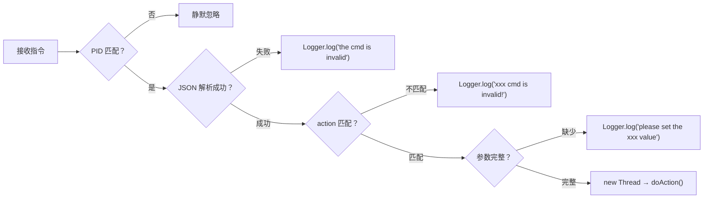

# 📡 一条指令的完整数据流

ZjDroid 的所有操作都由一条 `adb am broadcast` 命令触发。本篇以 `backsmali` 指令为例，完整追踪从命令行敲下回车，到结果出现在 logcat 的每一步。

## 一条指令长什么样

```bash
adb shell am broadcast -a com.zjdroid.invoke \
  --ei target 12345 \
  --es cmd '{"action":"backsmali","dexpath":"/data/app/com.target/base.apk"}'
```

三个核心要素：
- **action** `com.zjdroid.invoke`：广播的 Intent Action，固定值
- **target**：目标进程的 PID，用于多进程路由
- **cmd**：JSON 字符串，描述要执行的操作

## 🗺️ 完整数据流图



## 逐层拆解

### 第一层：广播分发与 PID 路由

`CommandBroadcastReceiver.onReceive()` 是整个指令链路的入口：

```java
// CommandBroadcastReceiver.java
public static String INTENT_ACTION = "com.zjdroid.invoke";
public static String TARGET_KEY = "target";
public static String COMMAND_NAME_KEY = "cmd";

@Override
public void onReceive(final Context arg0, Intent arg1) {
    if (INTENT_ACTION.equals(arg1.getAction())) {
        int pid = arg1.getIntExtra(TARGET_KEY, 0);
        if (pid == android.os.Process.myPid()) {  // PID 路由
            String cmd = arg1.getStringExtra(COMMAND_NAME_KEY);
            final CommandHandler handler = CommandHandlerParser.parserCommand(cmd);
            if (handler != null) {
                new Thread(new Runnable() {
                    @Override
                    public void run() {
                        handler.doAction();  // 异步执行，避免 ANR
                    }
                }).start();
            }
        }
    }
}
```

PID 路由解决了一个关键问题：**广播是设备全局的**，所有被注入了 ZjDroid 的进程都会收到同一条广播，但只有 PID 匹配的进程才执行。

::: warning 为什么用新线程执行
`onReceive` 运行在主线程的消息循环中。Android 规定 BroadcastReceiver 的 `onReceive` 超过 10 秒未返回会触发 ANR（Application Not Responding）。而 `backsmali` 操作涉及遍历 DEX 所有类、逐类反汇编、再重组为 DEX，通常耗时数秒甚至数十秒。因此 ZjDroid 必须用 `new Thread` 异步执行，让 `onReceive` 立即返回。
:::

### 第二层：JSON 解析与命令分发（CommandHandlerParser）

```java
// CommandHandlerParser.java
public static CommandHandler parserCommand(String cmd) {
    JSONObject jsoncmd = new JSONObject(cmd);
    String action = jsoncmd.getString("action");  // 读取 action 字段

    if ("dump_dexinfo".equals(action)) {
        handler = new DumpDexInfoCommandHandler();
    } else if ("dump_dexfile".equals(action)) {
        String dexpath = jsoncmd.getString("dexpath");
        handler = new DumpDexFileCommandHandler(dexpath);
    } else if ("backsmali".equals(action)) {
        String dexpath = jsoncmd.getString("dexpath");
        handler = new BackSmaliCommandHandler(dexpath);
    } else if ("dump_class".equals(action)) {
        String dexpath = jsoncmd.getString("dexpath");
        handler = new DumpClassCommandHandler(dexpath);
    } else if ("dump_heap".equals(action)) {
        handler = new DumpHeapCommandHandler();
    } else if ("invoke".equals(action)) {
        String filepath = jsoncmd.getString("filepath");
        handler = new InvokeScriptCommandHandler(filepath, ScriptType.FILETYPE);
    } else if ("dump_mem".equals(action)) {
        int start = jsoncmd.getInt("startaddr");
        int length = jsoncmd.getInt("length");
        handler = new DumpMemCommandHandler(start, length);
    }
    return handler;
}
```

支持的全部 action 一览：



### 第三层：Handler 执行

每个 `CommandHandler` 实现 `doAction()` 接口，将业务逻辑完全封装——这是**命令模式**的典型应用：

```java
// DumpDexFileCommandHandler.java（以 dump_dexfile 为例）
@Override
public void doAction() {
    String filename = ModuleContext.getInstance()
            .getAppContext().getFilesDir() + "/dexdump.odex";
    DexFileInfoCollecter.getInstance().dumpDexFile(filename, dexpath);
    Logger.log("the dexfile data save to =" + filename);
}
```

### 第四层：采集层执行与结果输出

以 `backsmali` 为例，Handler 最终调用到 `DexFileInfoCollecter.backsmaliDexFile()`，进而触发完整的脱壳链路。结果以两种形式输出：

1. **落盘文件**：`/data/data/<目标包名>/files/dexdump.odex`（需 root 读取）
2. **logcat 日志**：通过 `Logger.log()` 写入

```java
// Logger.java
public static String LOGTAG_COMMAN = "zjdroid-shell-";

public static void log(String message) {
    Log.d(LOGTAG_COMMAN + PACKAGENAME, message);
}
```

logcat tag 格式为 `zjdroid-shell-<包名>`，用以下命令过滤：

```bash
adb logcat -s "zjdroid-shell-com.target.app:D"
```

## 所有 action 的参数结构

| action | 必填参数 | 说明 |
|--------|----------|------|
| `dump_dexinfo` | — | 列出进程内所有 DEX 及其路径/mCookie |
| `dump_dexfile` | `dexpath` | 从内存 dump 指定 DEX 字节流到文件 |
| `backsmali` | `dexpath` | 脱壳 + 反汇编 + 重组，输出标准 DEX |
| `dump_class` | `dexpath` | 列出指定 DEX 中的所有类名 |
| `dump_heap` | — | 生成 hprof 堆转储文件 |
| `invoke` | `filepath` | 在目标进程中执行指定路径的 Lua 脚本 |
| `dump_mem` | `startaddr`, `length` | dump 指定起始地址的内存区域 |

::: info 指令协议的详细设计理念
为什么用广播？为什么用 JSON？为什么用 PID 路由而非包名？这些设计决策的深层原因详见 [广播指令协议设计](/architecture/broadcast-protocol)。
:::

## 错误处理路径



## 📎 交叉链接

- 广播接收器注册时机 → [Xposed 注入与模块初始化生命周期](/architecture/injection-lifecycle)
- `mCookie` 获取原理 → [DEX 在内存中的结构与 mCookie 原理](/architecture/dex-in-memory)
- 脱壳完整链路 → [脱壳全链路原理](/architecture/unpacking-pipeline)
- Lua invoke 的执行路径 → [Lua 脚本注入架构](/architecture/lua-injection)
- 广播协议设计决策 → [广播指令协议设计](/architecture/broadcast-protocol)
- 各 Handler 逐类讲解 → [CommandHandlerParser](/source/request/CommandHandlerParser)

## 小结

ZjDroid 的指令数据流呈现出清晰的责任分离：**广播层**负责接收与 PID 路由、**解析层**负责 JSON 解析与 Handler 工厂、**Handler 层**封装业务逻辑、**采集层**执行实际工作、**日志层**统一输出结果。每层之间只通过接口或简单方法调用耦合，使得添加新指令只需在 `CommandHandlerParser` 增加一个 `else if` 分支并实现对应的 `CommandHandler`，其他层完全不受影响。
