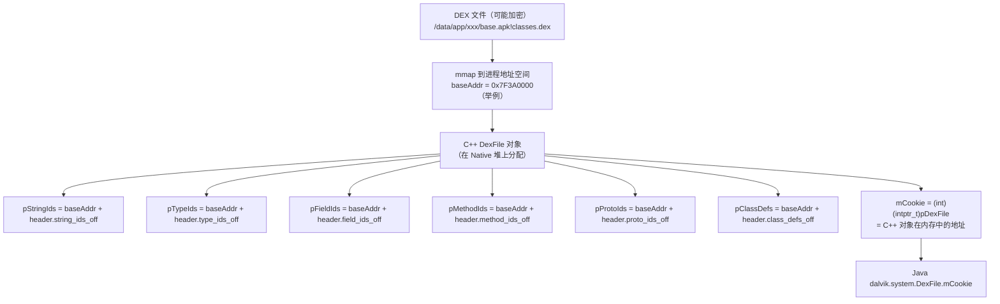
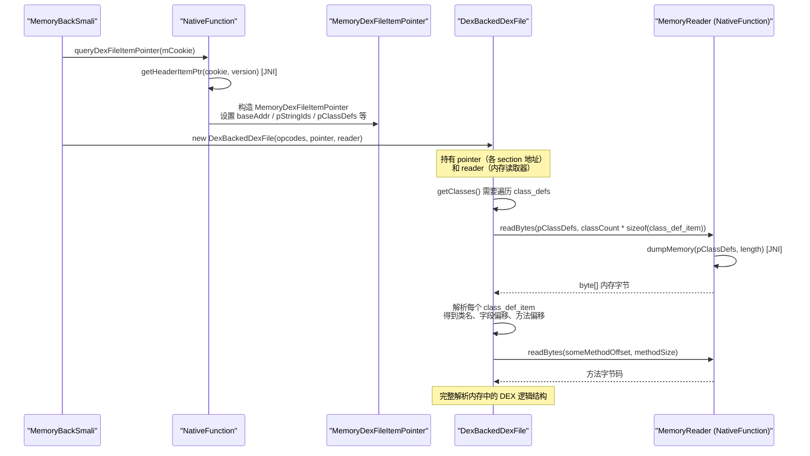
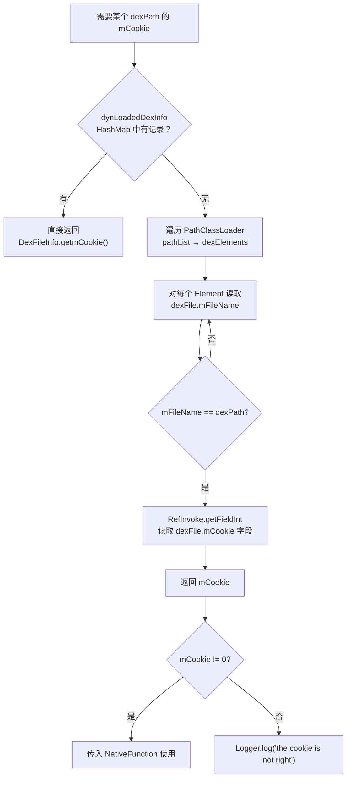
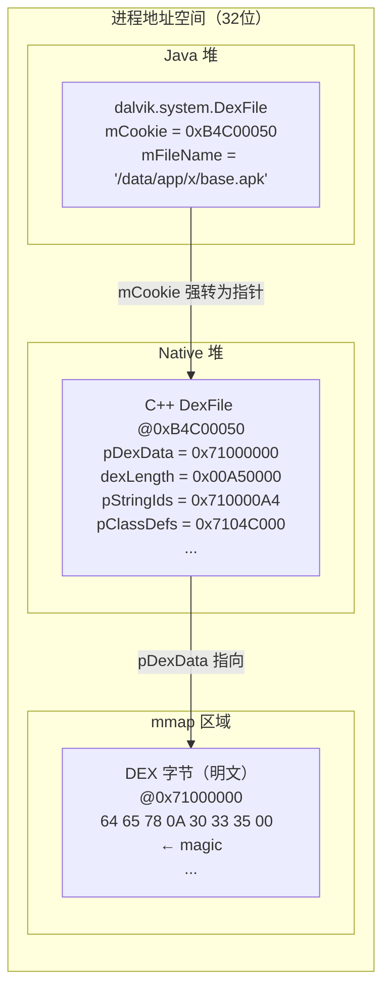

# 🧠 DEX 在内存中的结构与 mCookie 原理

ZjDroid 整个脱壳能力的核心抓手是 `mCookie`，一个看起来普通的 `int` 字段，实际上是通向 Dalvik 内部世界的钥匙。本篇从 DEX 文件格式讲起，深入 Dalvik 的内存布局，解释 `mCookie` 的真实含义，以及 `DexFileHeadersPointer` 中七个指针各自代表什么。

## DEX 文件格式快速回顾

DEX（Dalvik Executable）是 Android 的 Java 字节码格式，其二进制结构高度紧凑：

```
DEX 文件布局（标准格式）
┌────────────────────────────┐
│ header_item                │ ← 固定 112 字节，包含魔数、版本、各 section 偏移量
├────────────────────────────┤
│ string_id_list             │ ← 字符串表指针数组
├────────────────────────────┤
│ type_id_list               │ ← 类型（类/基本类型）索引
├────────────────────────────┤
│ proto_id_list              │ ← 方法原型（参数+返回类型）
├────────────────────────────┤
│ field_id_list              │ ← 字段引用（类名+字段名+类型）
├────────────────────────────┤
│ method_id_list             │ ← 方法引用（类名+原型+名称）
├────────────────────────────┤
│ class_def_list             │ ← 类定义（字段/方法 offset）
├────────────────────────────┤
│ data section               │ ← 方法字节码、注解、静态值等
└────────────────────────────┘
```

`header_item` 中的关键字段（偏移量均相对于 DEX 起始）：

| 字段 | 偏移 | 含义 |
|------|------|------|
| `magic` | 0x00 | `dex\n035\0` 或 `dex\n036\0` |
| `string_ids_size` | 0x38 | string_id_list 条目数 |
| `string_ids_off` | 0x3C | string_id_list 起始偏移 |
| `type_ids_size` | 0x40 | type_id_list 条目数 |
| `type_ids_off` | 0x44 | type_id_list 起始偏移 |
| `proto_ids_size` | 0x48 | proto_id_list 条目数 |
| `proto_ids_off` | 0x4C | proto_id_list 起始偏移 |
| `field_ids_size` | 0x50 | field_id_list 条目数 |
| `field_ids_off` | 0x54 | field_id_list 起始偏移 |
| `method_ids_size` | 0x58 | method_id_list 条目数 |
| `method_ids_off` | 0x5C | method_id_list 起始偏移 |
| `class_defs_size` | 0x60 | class_def_list 条目数 |
| `class_defs_off` | 0x64 | class_def_list 起始偏移 |

## DEX 加载到内存后发生了什么

Dalvik 加载 DEX 时（通过 `openDexFileNative`），会：

1. 将 DEX 文件（或其解密后的内容）映射到进程内存（`mmap`）
2. 在 C++ 堆上创建一个 `DexFile`（或 `RawDexFile`）C++ 对象，记录各 section 的**内存绝对地址**（文件偏移量 + 映射基址）
3. 将这个 C++ 对象的指针强制转换为 `int`，赋给 Java 层 `dalvik.system.DexFile` 的 `mCookie` 字段



## DexFileHeadersPointer — 七个指针的含义

`libdvmnative.so` 读出这七个绝对地址后，封装为 `DexFileHeadersPointer` 返回给 Java 层：

```java
// DexFileHeadersPointer.java
public class DexFileHeadersPointer {
    private int baseAddr;    // DEX 内存映射的起始地址
    private int pStringIds;  // string_id_list 在内存中的绝对地址
    private int pTypeIds;    // type_id_list 在内存中的绝对地址
    private int pFieldIds;   // field_id_list 在内存中的绝对地址
    private int pMethodIds;  // method_id_list 在内存中的绝对地址
    private int pProtoIds;   // proto_id_list 在内存中的绝对地址
    private int pClassDefs;  // class_def_list 在内存中的绝对地址
    private int classCount;  // DEX 中定义的类总数
}
```

::: tip 为什么用 int 存储指针？
在 32 位 Android 系统（ZjDroid 的目标环境：Dalvik 时代主流为 32 位 ARMv7），内存地址是 32 位无符号整数，恰好可以用 Java `int` 表示（Java `int` 是有符号 32 位，但只要不做有符号比较就没问题）。64 位系统上此策略会失效，这也是 ZjDroid 局限于 32 位系统的原因之一。
:::

## dexlib2 如何用这些指针解析内存 DEX



dexlib2 的 `DexBackedDexFile` 原本设计为读取文件字节，但 ZjDroid 将 `NativeFunction` 作为 `MemoryReader` 注入，使其每次需要读取某个偏移量的数据时，实际调用 JNI 从进程内存读取——无论 DEX 文件磁盘上是否存在、是否加密，内存里的明文字节总是可以读到。

## mCookie 的两条来源路径



两条路径对应两种 DEX 加载场景：

- **动态加载**（加固常用路径）：加固壳调用 `DexFile.openDexFileNative()` 动态加载加密 DEX，被 `hookMethod` 拦截，`afterHookedMethod` 记录 `dexPath → mCookie` 到 `dynLoadedDexInfo`。
- **静态加载**（主 DEX）：App 自身的主 DEX 通过 `PathClassLoader` 在启动时加载，直接通过反射读取 `DexFile.mCookie` 字段。

## 关键内存布局示意



## 为什么读到的总是明文

加固壳的工作是：加载时解密 → Dalvik 加载明文 DEX → Dalvik 执行字节码。一旦 Dalvik 加载了 DEX，内存中的 DEX 数据就必须是明文（Dalvik 不执行密文）。ZjDroid 在 Dalvik 已经加载之后读取内存，所以永远读到的是解密后的明文。

::: warning 加固的对抗演化
现代加固（尤其是 ART 时代）已经进化为更复杂的对抗手段：方法体抽取（运行时才还原方法字节码）、VMP（虚拟机保护，自定义指令集）、多 DEX 分离等。这些技术可以使单纯的内存 dump 得到不完整的 DEX。ZjDroid 针对的是 Dalvik 时代的整 DEX 加密加固，对上述现代技术效果有限。详见 [能力边界与安全模型](/architecture/security-boundary)。
:::

## defineClassNative Hook — 补全 ClassLoader 信息

```java
// DexFileInfoCollecter.java
hookhelper.hookMethod(defineClassNativeMethod, new MethodHookCallBack() {
    @Override
    public void afterHookedMethod(HookParam param) {
        if (!param.hasThrowable()) {
            int mCookie = (Integer) param.args[2];
            setDefineClassLoader(mCookie, (ClassLoader) param.args[1]);
        }
    }
});
```

`defineClassNative` 是 Dalvik 定义类时调用的方法，其参数包含 `mCookie` 和使用的 `ClassLoader`。Hook 此方法可以将 ClassLoader 信息关联到对应的 `DexFileInfo`，完善 `dynLoadedDexInfo` 的记录，方便后续分析哪个 ClassLoader 加载了哪个 DEX。

## 📎 交叉链接

- mCookie 在脱壳中的使用 → [脱壳全链路原理](/architecture/unpacking-pipeline)
- JNI 如何读内存结构 → [Native 层与 JNI 桥](/architecture/native-bridge)
- DexFileHeadersPointer 逐类讲解 → [DexFileHeadersPointer](/source/smali/DexFileHeadersPointer)
- DexFileInfo 逐类讲解 → [DexFileInfo](/source/collecter/DexFileInfo)
- DexFileInfoCollecter 逐类讲解 → [DexFileInfoCollecter](/source/collecter/DexFileInfoCollecter)

## 小结

`mCookie` 是 Dalvik 暴露给 Java 层的"名义上的整数，实际上的 C++ 指针"，通过它可以还原出整个 DEX 在内存中的布局——`baseAddr` 是 DEX 数据的起点，`pStringIds`、`pTypeIds`、`pFieldIds`、`pMethodIds`、`pProtoIds`、`pClassDefs` 分别是六个核心 section 的内存绝对地址，`classCount` 是类的总数。这七个数据项构成了 dexlib2 解析内存 DEX 的全部导航信息，使得 ZjDroid 在无需任何文件的情况下，完整重建 DEX 的逻辑结构。
