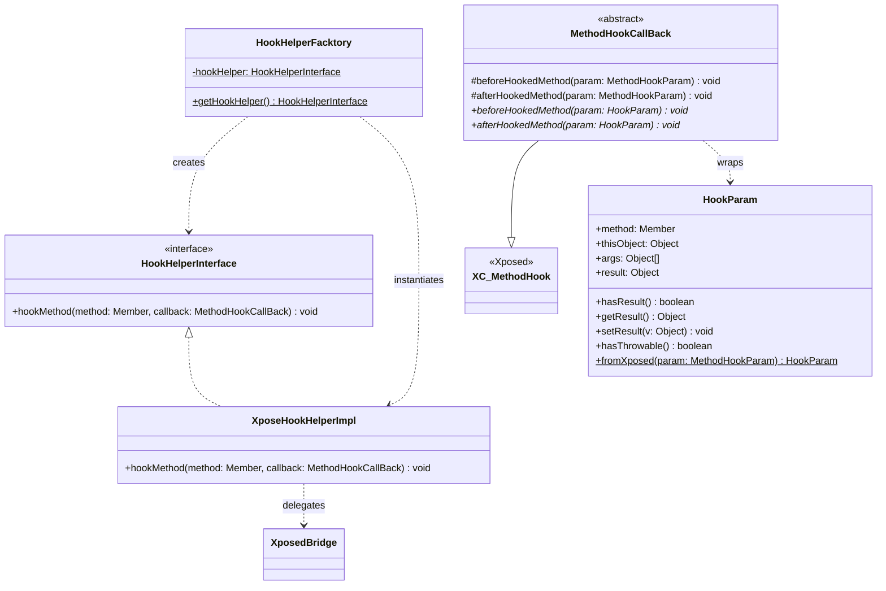
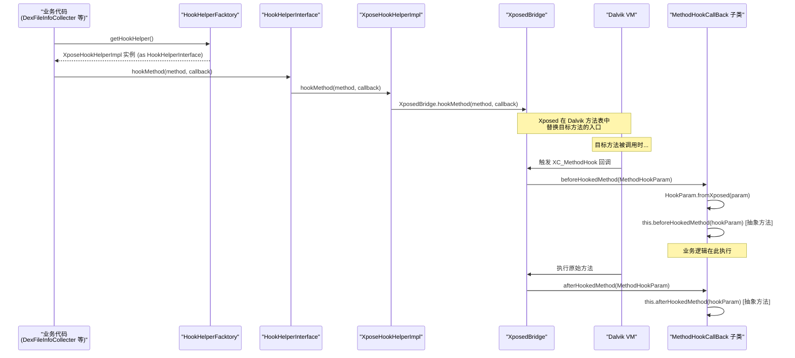
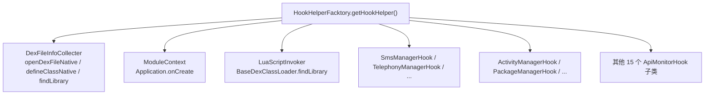

# 🪝 Hook 框架抽象设计

ZjDroid 的几乎所有能力都依赖"方法 Hook"——在目标方法执行前后插入自己的逻辑。本篇拆解 ZjDroid 如何在只有 200 行代码的小型框架内，实现对 Xposed API 的完整解耦，以及这个设计带来的扩展性收益。

## 为什么要抽象 Xposed？

直接使用 `XposedBridge.hookMethod()` 当然可行，但这样做有两个问题：

1. **测试困难**：Xposed API 只在安装了 Xposed 框架的设备上才有效，单元测试无法运行。
2. **迁移风险**：如果未来要支持非 Xposed 的 Hook 框架（如 Frida JNI 桥），需要改动所有调用点。

ZjDroid 的解决方案是引入一个极简的**策略模式**三件套：接口 + 工厂 + 实现。

## 🧩 类关系图



## 三个核心类详解

### 1. HookHelperInterface — 最小化接口契约

```java
// HookHelperInterface.java
public interface HookHelperInterface {
    public abstract void hookMethod(Member method, MethodHookCallBack callback);
}
```

只有一个方法。`Member` 是 Java 反射中 `Method`、`Constructor` 等的父接口，确保接口对 Hook 目标类型保持通用。`MethodHookCallBack` 是 ZjDroid 自己的回调抽象——注意**不是** Xposed 的 `XC_MethodHook`，这正是解耦的关键所在。

### 2. HookHelperFacktory — 懒加载单例工厂

```java
// HookHelperFacktory.java
public class HookHelperFacktory {
    private static HookHelperInterface hookHelper;

    public static HookHelperInterface getHookHelper() {
        if (hookHelper == null)
            hookHelper = new XposeHookHelperImpl();
        return hookHelper;
    }
}
```

懒汉式单例，线程不安全（但在 Xposed 模块的单线程初始化场景下没有问题）。工厂的存在使得"创建哪种实现"与"使用接口的地方"完全解耦——调用方只知道 `HookHelperInterface`，不感知 `XposeHookHelperImpl` 的存在。

工厂名字中有个拼写错误（`Facktory` 而非 `Factory`），这是原始代码的历史遗留，不影响功能。

### 3. XposeHookHelperImpl — 唯一与 Xposed 耦合的类

```java
// XposeHookHelperImpl.java
public class XposeHookHelperImpl implements HookHelperInterface {
    @Override
    public void hookMethod(Member method, MethodHookCallBack callback) {
        XposedBridge.hookMethod(method, callback);
    }
}
```

整个项目中**唯一**直接调用 `XposedBridge` API 的地方。整个框架的 Xposed 依赖被收窄到这一行。`MethodHookCallBack` 继承自 `XC_MethodHook`，所以可以直接传入 `XposedBridge.hookMethod()`。

## MethodHookCallBack — 两层封装

```java
// MethodHookCallBack.java
public abstract class MethodHookCallBack extends XC_MethodHook {

    @Override
    protected void beforeHookedMethod(MethodHookParam param) throws Throwable {
        super.beforeHookedMethod(param);
        HookParam hookParam = HookParam.fromXposed(param);  // 转换为 ZjDroid 类型
        this.beforeHookedMethod(hookParam);
        if (hookParam.hasResult())
            param.setResult(hookParam.getResult());  // 回写结果拦截
    }

    @Override
    protected void afterHookedMethod(MethodHookParam param) throws Throwable {
        super.afterHookedMethod(param);
        HookParam hookParam = HookParam.fromXposed(param);
        this.afterHookedMethod(hookParam);
        if (hookParam.hasResult())
            param.setResult(hookParam.getResult());
    }

    // 子类实现的抽象方法，参数类型是 ZjDroid 的 HookParam，而非 Xposed 的 MethodHookParam
    public abstract void beforeHookedMethod(HookParam param);
    public abstract void afterHookedMethod(HookParam param);
}
```

`MethodHookCallBack` 在继承 Xposed 的 `XC_MethodHook` 的同时，将 Xposed 的 `MethodHookParam` 转换为 ZjDroid 自定义的 `HookParam`，使得所有子类回调的参数类型都是 `HookParam`，而非 Xposed 类型。这层转换保证了**业务逻辑代码（所有 `MethodHookCallBack` 子类）完全不导入 Xposed 包**。

::: info 结果拦截机制
`if (hookParam.hasResult()) param.setResult(hookParam.getResult())` 这段代码实现了"返回值拦截"。当子类回调调用 `param.setResult()` 时，`hasResult()` 返回 true，`MethodHookCallBack` 再将这个值回写给 Xposed 的 `MethodHookParam`，达到修改方法返回值的效果。例如 `DexFileInfoCollecter` 中拦截 `findLibrary()` 的返回路径就利用了这一机制。
:::

## HookParam — 独立于 Xposed 的参数载体

```java
// HookParam.java（结构推断自使用方式）
public class HookParam {
    public Member method;     // 被 Hook 的方法
    public Object thisObject; // 被 Hook 方法的 this 指针
    public Object[] args;     // 方法参数列表

    private Object result;
    private boolean hasResult = false;

    public static HookParam fromXposed(XC_MethodHook.MethodHookParam param) {
        HookParam hp = new HookParam();
        hp.method = param.method;
        hp.thisObject = param.thisObject;
        hp.args = param.args;
        hp.result = param.getResult();
        // ...
        return hp;
    }

    public boolean hasResult() { return hasResult; }
    public Object getResult() { return result; }
    public void setResult(Object v) { this.result = v; this.hasResult = true; }
    public boolean hasThrowable() { /* ... */ }
}
```

`HookParam` 是对 Xposed `MethodHookParam` 的镜像类型，字段语义相同，但脱离了对 Xposed 包的依赖。

## Hook 框架的调用链



## 谁在使用这个框架

整个 ZjDroid 中，所有 Hook 操作都通过这套框架进行，零例外：



这意味着：如果未来需要支持 EdXposed、LSPosed 或完全自定义的 Hook 引擎，只需新增一个 `HookHelperInterface` 的实现类，并修改 `HookHelperFacktory.getHookHelper()` 中的返回值即可。所有业务代码零修改。

## AbstractBahaviorHookCallBack — API 监控专用扩展

`apimonitor` 包还在 `MethodHookCallBack` 之上进一步封装了 `AbstractBahaviorHookCallBack`：

```java
// AbstractBahaviorHookCallBack.java
public abstract class AbstractBahaviorHookCallBack extends MethodHookCallBack {

    @Override
    public void beforeHookedMethod(HookParam param) {
        // 统一的行为日志格式
        Logger.log_behavior("Invoke "
                + param.method.getDeclaringClass().getName()
                + "->" + param.method.getName());
        this.descParam(param);  // 委托子类描述参数细节
    }

    @Override
    public void afterHookedMethod(HookParam param) {
        // 默认不记录 after，子类可覆盖
    }

    public abstract void descParam(HookParam param);  // 子类实现参数打印
}
```

这形成了三层继承体系：`XC_MethodHook`（Xposed）→ `MethodHookCallBack`（ZjDroid 解耦层）→ `AbstractBahaviorHookCallBack`（API 监控领域层）→ 17 个具体 Hook 类。每一层只做一件事。

```mermaid
classDiagram
    class "XC_MethodHook (Xposed)" {
        #beforeHookedMethod(MethodHookParam)
        #afterHookedMethod(MethodHookParam)
    }
    class MethodHookCallBack {
        +beforeHookedMethod(HookParam)*
        +afterHookedMethod(HookParam)*
    }
    class AbstractBahaviorHookCallBack {
        +descParam(HookParam)*
    }
    class SmsManagerHook_CB {
        +descParam() 打印短信内容
    }
    class CameraHook_CB {
        +descParam() 打印相机操作
    }

    "XC_MethodHook (Xposed)" <|-- MethodHookCallBack
    MethodHookCallBack <|-- AbstractBahaviorHookCallBack
    AbstractBahaviorHookCallBack <|-- SmsManagerHook_CB
    AbstractBahaviorHookCallBack <|-- CameraHook_CB
```

## 📎 交叉链接

- Hook 框架如何驱动 API 监控 → [API 监控子系统架构](/architecture/api-monitor-arch)
- Hook 框架如何驱动 DEX 跟踪 → [脱壳全链路原理](/architecture/unpacking-pipeline)
- Hook 框架如何支撑 Lua 注入 → [Lua 脚本注入架构](/architecture/lua-injection)
- HookHelperInterface 逐类讲解 → [HookHelperInterface](/source/hook/HookHelperInterface)
- XposeHookHelperImpl 逐类讲解 → [XposeHookHelperImpl](/source/hook/XposeHookHelperImpl)

## 小结

ZjDroid 的 Hook 框架用不到 100 行代码实现了一个教科书级的策略模式：`HookHelperInterface` 定义契约，`HookHelperFacktory` 隐藏创建细节，`XposeHookHelperImpl` 集中承载 Xposed 耦合，`MethodHookCallBack` 隔离参数类型。最终效果是：整个项目 56 个类中，只有 `XposeHookHelperImpl` 一个类直接调用 Xposed Bridge API，Xposed 的"传染范围"被严格控制在一个文件内。
