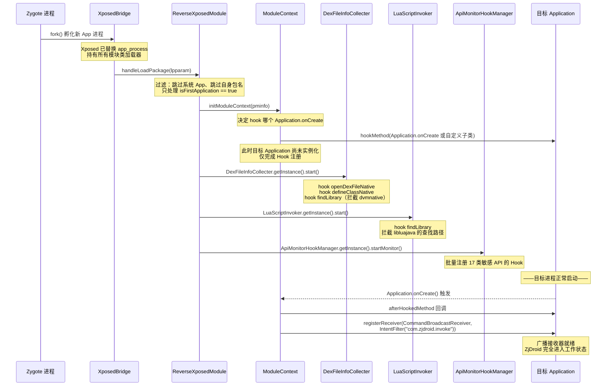
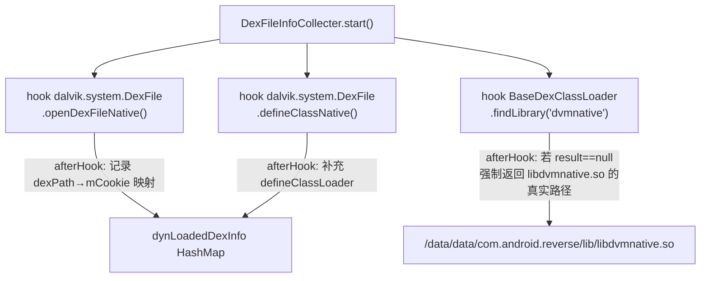
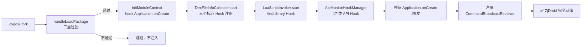

# 🚀 Xposed 注入与模块初始化生命周期

ZjDroid 不是一个普通 APK，它是一个 **Xposed 模块**——它的生命周期由 Xposed 框架驱动，而非 Android Activity 栈。本篇从 Zygote 进程 fork 的一刻开始，逐步拆解 ZjDroid 如何"潜入"目标进程、完成自身初始化、并最终注册好指令监听器。

## 为什么需要了解这条生命周期？

理解注入生命周期，是理解 ZjDroid 所有能力的前提：Hook 在什么时机生效？广播接收器为何不是立即注册？Context 从哪来？这些疑问都能在这条时序里找到答案。

## 🧵 时序全图：从 Zygote fork 到广播就绪



## 📋 每个阶段详解

### 阶段一：Zygote Fork 与 Xposed 拦截

Android 所有 App 进程都由 Zygote 通过 `fork()` 孵化。Xposed 框架预先替换了 `/system/bin/app_process`，使得每次 fork 后，Xposed 的 `XposedBridge` 先于 App 自身代码执行。它遍历 `/data/data/de.robv.android.xposed.installer/conf/modules.list`，加载所有激活模块——包括 ZjDroid。

模块入口点声明在 `assets/xposed_init` 文件中：

```
com.android.reverse.mod.ReverseXposedModule
```

Xposed 读到此文件后，实例化 `ReverseXposedModule` 并调用其 `handleLoadPackage()`。

### 阶段二：handleLoadPackage 中的三重过滤

```java
// ReverseXposedModule.java
public void handleLoadPackage(LoadPackageParam lpparam) throws Throwable {
    if (lpparam.appInfo == null ||
            (lpparam.appInfo.flags & (ApplicationInfo.FLAG_SYSTEM
                    | ApplicationInfo.FLAG_UPDATED_SYSTEM_APP)) != 0) {
        return;  // 过滤 ①：跳过系统应用
    } else if (lpparam.isFirstApplication
            && !ZJDROID_PACKAGENAME.equals(lpparam.packageName)) {
        // 过滤 ②：只处理首个 Application（避免多进程重复注入）
        // 过滤 ③：不注入 ZjDroid 自身
        Logger.PACKAGENAME = lpparam.packageName;
        PackageMetaInfo pminfo = PackageMetaInfo.fromXposed(lpparam);
        ModuleContext.getInstance().initModuleContext(pminfo);
        DexFileInfoCollecter.getInstance().start();
        LuaScriptInvoker.getInstance().start();
        ApiMonitorHookManager.getInstance().startMonitor();
    }
}
```

`lpparam.isFirstApplication` 保证了多进程 App（如有 `:remote` 进程）只注入一次。`ZJDROID_PACKAGENAME` 常量值为 `"com.android.reverse"`，防止模块注入自身导致递归。

### 阶段三：ModuleContext.initModuleContext — 延迟注册广播的关键

`ModuleContext` 接收到 `PackageMetaInfo`（含包名、ClassLoader、ApplicationInfo 等）后，**并不立即注册广播**，而是先 hook 目标 App 的 `Application.onCreate()`：

```java
// ModuleContext.java
public void initModuleContext(PackageMetaInfo info) {
    this.metaInfo = info;
    String appClassName = this.getAppInfo().className;
    if (appClassName == null) {
        // 没有自定义 Application，hook 基类
        Method hookOncreateMethod = Application.class
                .getDeclaredMethod("onCreate", new Class[]{});
        hookhelper.hookMethod(hookOncreateMethod, new ApplicationOnCreateHook());
    } else {
        // 有自定义 Application，hook 具体子类
        Class<?> hook_application_class =
                this.getBaseClassLoader().loadClass(appClassName);
        Method hookOncreateMethod =
                hook_application_class.getDeclaredMethod("onCreate", new Class[]{});
        hookhelper.hookMethod(hookOncreateMethod, new ApplicationOnCreateHook());
    }
}
```

::: tip 为什么不直接注册广播？
注册广播需要 `Context`。在 `handleLoadPackage` 阶段，目标 App 的 `Application` 对象尚未创建，自然没有有效的 `Context`。ZjDroid 的做法是：先 hook `Application.onCreate()`，等目标进程自己创建好 `Application` 后，在回调里"借用"该 `Application` 对象作为 Context 来注册广播。
:::

`ApplicationOnCreateHook.afterHookedMethod` 的实现：

```java
// ModuleContext.java 内部类
@Override
public void afterHookedMethod(HookParam param) {
    if (!HAS_REGISTER_LISENER) {
        fristApplication = (Application) param.thisObject; // 取到真实 Application 实例
        IntentFilter filter = new IntentFilter(CommandBroadcastReceiver.INTENT_ACTION);
        fristApplication.registerReceiver(new CommandBroadcastReceiver(), filter);
        HAS_REGISTER_LISENER = true; // 防重复注册标志
    }
}
```

`HAS_REGISTER_LISENER` 标志确保即使某些情况下 `onCreate` 被调用多次，也只注册一个广播接收器。

### 阶段四：DexFileInfoCollecter.start() — DEX 跟踪基础设施

此阶段 hook 了三个方法，为后续 mCookie 获取奠定基础：



其中 `findLibrary` 的 hook 尤其巧妙：目标 App 的 ClassLoader 不知道 ZjDroid 的 native 库在哪，hook 后可以将 `dvmnative` 的查找结果重定向到 ZjDroid 安装目录，使 `System.loadLibrary("dvmnative")` 正常工作。

### 阶段五：LuaScriptInvoker.start() — Lua 环境准备

类似地，也 hook 了 `BaseDexClassLoader.findLibrary`，拦截 `"luajava"` 的查找，确保 `libluajava.so` 能从 ZjDroid 的 lib 目录加载。

### 阶段六：ApiMonitorHookManager.startMonitor() — 批量注册行为监控

构造函数中实例化 17 个 Hook 类，`startMonitor()` 依次调用每个的 `startHook()`，在**同一个 handleLoadPackage 调用栈里**完成全部 Hook 注册。详见 [API 监控子系统架构](/architecture/api-monitor-arch)。

## 🗺️ 生命周期状态机



## ⚠️ 常见误区

::: warning 所有 Hook 在 Application.onCreate 之前就已生效
从 `S3` 到 `S5` 的 Hook 在 `handleLoadPackage` 阶段就已注册完毕，早于目标 App 的任何代码执行。这意味着即使目标 App 在 `Application.onCreate` 之前（如静态初始化块）动态加载 DEX，ZjDroid 也能捕获到 `openDexFileNative` 的调用。
:::

::: info PackageMetaInfo 的作用
`PackageMetaInfo` 是对 Xposed `LoadPackageParam` 的轻量封装，持有包名、进程名、ClassLoader 和 ApplicationInfo。整个模块通过 `ModuleContext.getInstance()` 单例随时访问这些信息，无需重复传参。详见 [PackageMetaInfo](/source/mod/PackageMetaInfo) 和 [ModuleContext](/source/collecter/ModuleContext)。
:::

## 📎 交叉链接

- 广播接收器注册后如何处理指令 → [一条指令的完整数据流](/architecture/command-flow)
- `findLibrary` Hook 与 Lua 的关系 → [Lua 脚本注入架构](/architecture/lua-injection)
- `mCookie` 在 DEX 跟踪中的作用 → [DEX 在内存中的结构与 mCookie 原理](/architecture/dex-in-memory)
- Hook 框架本身的设计 → [Hook 框架抽象设计](/architecture/hook-framework)

## 小结

ZjDroid 的注入生命周期分两个大阶段：**模块加载期**（在 `handleLoadPackage` 里完成所有 Hook 注册和上下文初始化）和**运行期**（等待目标 App 的 `Application.onCreate` 触发后注册广播，进入被动等待状态）。广播接收器的延迟注册是整条生命周期中最精妙的设计——它解决了"Xposed 模块加载时没有有效 Context"这一根本约束。
