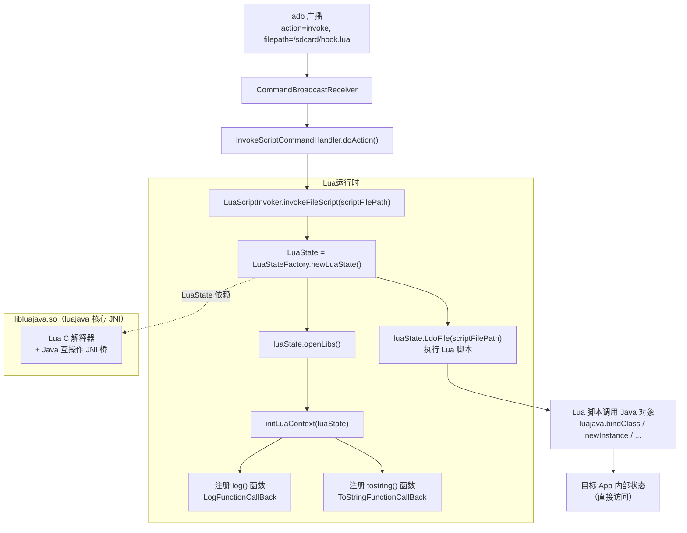
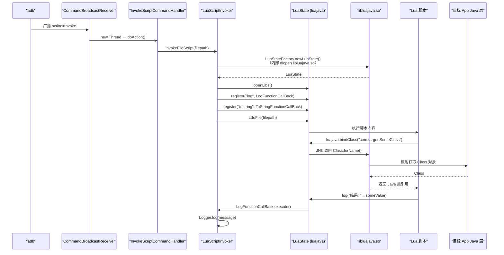

# 🌙 Lua 脚本注入架构

ZjDroid 支持在目标 App 进程内执行任意 Lua 脚本，使分析人员能用脚本语言直接操作 Java 对象、调用方法、读取字段——无需重编译、无需重启 App。本篇拆解 Lua 运行时的加载机制、Java↔Lua 互操作桥的实现，以及脚本的执行入口链路。

## 为什么选择 Lua

Lua 是一门极度轻量的脚本语言（解释器核心约 200KB），非常适合嵌入宿主程序。`luajava` 库提供了 Lua 与 Java 的双向互操作桥，可以在 Lua 脚本中直接创建 Java 对象、调用方法、读写字段。这使得 ZjDroid 的 Lua 注入能力远超简单的命令行调用——它本质上是在目标 App 进程内嵌入了一个可编程的 Java 操控环境。

## 🧩 架构图



## libluajava.so 的加载机制

与 `libdvmnative.so` 类似，`libluajava.so` 存放在 ZjDroid 的 APK 里，但需要在目标 App 的进程中加载。直接 `System.loadLibrary("luajava")` 会失败，因为目标 App 的 ClassLoader 不知道 ZjDroid 的 lib 目录。

ZjDroid 的解决方案：hook `BaseDexClassLoader.findLibrary()`，拦截 `"luajava"` 的路径查找：

```java
// LuaScriptInvoker.java
public void start() {
    Method findLibraryMethod = RefInvoke.findMethodExact(
            "dalvik.system.BaseDexClassLoader",
            ClassLoader.getSystemClassLoader(),
            "findLibrary", String.class);

    hookhelper.hookMethod(findLibraryMethod, new MethodHookCallBack() {
        @Override
        public void afterHookedMethod(HookParam param) {
            Logger.log((String) param.args[0]);
            // 当有人查找 luajava 且查找失败时，重定向到 ZjDroid 的 lib 目录
            if (LUAJAVA_LIB.equals(param.args[0]) && param.getResult() == null) {
                param.setResult("/data/data/com.android.reverse/lib/libluajava.so");
            }
        }
    });
}
```

`LUAJAVA_LIB` 的值是 `"luajava"`，对应 `libluajava.so`（Android 约定去掉 `lib` 前缀和 `.so` 后缀）。当 `luajava` 包中的代码调用 `System.loadLibrary("luajava")` 时，最终会触发这个 hook，返回正确路径，使 `dlopen()` 能找到并加载 `libluajava.so`。

::: info 与 dvmnative 的对比
`DexFileInfoCollecter` 也 hook 了同样的 `findLibrary`，拦截 `"dvmnative"`。两个模块的 `findLibrary` hook **可以共存**，因为它们拦截的是不同的库名，不会互相干扰。
:::

## 指令触发链路

通过 `adb` 发送 `invoke` 指令：

```bash
adb shell am broadcast -a com.zjdroid.invoke \
  --ei target <PID> \
  --es cmd '{"action":"invoke","filepath":"/sdcard/test.lua"}'
```

`CommandHandlerParser` 解析到 `action=invoke` 后，构造 `InvokeScriptCommandHandler`：

```java
// CommandHandlerParser.java
} else if (ACTION_INVOKE_SCRIPT.equals(action)) {
    if (jsoncmd.has(FILE_SCRIPT)) {
        String filepath = jsoncmd.getString(FILE_SCRIPT);  // filepath 字段
        handler = new InvokeScriptCommandHandler(filepath, ScriptType.FILETYPE);
    }
}
```

`InvokeScriptCommandHandler.doAction()` 调用：

```java
// InvokeScriptCommandHandler.java
LuaScriptInvoker.getInstance().invokeFileScript(filepath);
```

## LuaScriptInvoker 的执行流程

```java
// LuaScriptInvoker.java
public void invokeFileScript(String scriptFilePath) {
    LuaState luaState = LuaStateFactory.newLuaState();  // 创建 Lua 虚拟机
    luaState.openLibs();    // 加载 Lua 标准库（math, string, table 等）
    this.initLuaContext(luaState);  // 注册 ZjDroid 自定义函数
    int error = luaState.LdoFile(scriptFilePath);  // 加载并执行脚本文件
    if (error != 0) {
        Logger.log("Read/Parse lua error. Exit");
        return;
    }
    luaState.close();  // 销毁 Lua 虚拟机，释放资源
}
```

也支持直接执行字符串形式的 Lua 代码（`invokeScript`），使用 `luaState.LdoString(script)`。

## Java↔Lua 互操作桥

### ZjDroid 注入的两个 Java 函数

```java
// LuaScriptInvoker.java
private void initLuaContext(LuaState luaState) {
    JavaFunction logfunction = new LogFunctionCallBack(luaState);
    logfunction.register("log");      // 注册为 Lua 全局函数 log()

    JavaFunction tostringfunction = new ToStringFunctionCallBack(luaState);
    tostringfunction.register("tostring");  // 覆盖 Lua 内置 tostring()
}
```

**`log(message)`** — 将字符串输出到 logcat：

```java
public static class LogFunctionCallBack extends JavaFunction {
    @Override
    public int execute() throws LuaException {
        int param_size = this.L.getTop();
        if (param_size == 2) {
            String message = this.L.getLuaObject(2).getString();
            Logger.log(message);
        }
        return 0;  // Lua 约定：返回值个数
    }
}
```

**`tostring(obj)`** — 将 Java 对象序列化为 JSON 字符串并输出到 logcat：

```java
public static class ToStringFunctionCallBack extends JavaFunction {
    @Override
    public int execute() throws LuaException {
        int param_size = this.L.getTop();
        for (int i = 2; i <= param_size; i++) {
            try {
                String objDsrc = JsonWriter.parserInstanceToJson(
                        this.getParam(i).getObject());  // 反射序列化
                Logger.log(objDsrc);
            } catch (Exception e) {
                e.printStackTrace();
            }
        }
        return 0;
    }
}
```

### luajava 提供的 Java 互操作

luajava 库本身提供了更强大的 Java 操控能力，在 Lua 脚本中可以：

```lua
-- 绑定 Java 类
local Activity = luajava.bindClass("android.app.Activity")

-- 创建 Java 对象
local sb = luajava.newInstance("java.lang.StringBuilder")
sb:append("Hello from Lua!")

-- 调用静态方法
local System = luajava.bindClass("java.lang.System")
local currentTime = System:currentTimeMillis()
log("Current time: " .. currentTime)

-- 读取字段（通过反射）
-- 输出 Java 对象的 JSON 表示
tostring(someJavaObject)
```

::: warning 脚本文件路径的权限问题
`filepath` 指向的 Lua 脚本文件需要目标 App 进程能读取。推荐放在 `/sdcard/` 下（需要 `READ_EXTERNAL_STORAGE` 权限，通常 root 环境下无碍）。将脚本放在 `/data/local/tmp/` 也可以，该目录通过 adb 可读写。
:::

## Lua 执行时序



## 单例与生命周期

`LuaScriptInvoker` 是进程级单例（懒汉式）：

```java
public static LuaScriptInvoker getInstance() {
    if (luaInvoker == null)
        luaInvoker = new LuaScriptInvoker();
    return luaInvoker;
}
```

但每次 `invokeFileScript()` 或 `invokeScript()` 调用都会**新建一个 `LuaState`** 并在执行结束后调用 `luaState.close()` 销毁，确保每次脚本执行在隔离的 Lua 虚拟机实例中进行，不会残留上次执行的全局变量。

## 与广播系统的集成

`invoke` 指令触发的整条调用链与其他指令（如 `backsmali`、`dump_dexfile`）完全相同：广播接收 → PID 路由 → `CommandHandlerParser` → `InvokeScriptCommandHandler` → 新线程执行。Lua 能力并不是"特殊"实现，而是与其他功能对等的一条指令分支。

::: info 扩展 Lua API
如果需要向 Lua 脚本暴露更多 Java 辅助函数（如直接调用 ADB 命令、访问特定系统服务等），只需在 `LuaScriptInvoker.initLuaContext()` 中仿照 `LogFunctionCallBack` 的模式新增 `JavaFunction` 实现并 `register()` 即可，不需要修改其他任何代码。
:::

## 📎 交叉链接

- 指令触发完整链路 → [一条指令的完整数据流](/architecture/command-flow)
- `findLibrary` Hook 的工作原理 → [Xposed 注入与模块初始化生命周期](/architecture/injection-lifecycle)
- `JsonWriter` 序列化机制 → [JsonWriter](/source/util/JsonWriter)
- LuaScriptInvoker 逐类讲解 → [LuaScriptInvoker](/source/collecter/LuaScriptInvoker)
- Lua invoke 功能使用文档 → [Lua 脚本调用](/features/lua-invoke)

## 小结

ZjDroid 的 Lua 注入架构包含三个核心机制：**findLibrary Hook** 解决 `libluajava.so` 的跨目录加载问题、**`initLuaContext`** 将 `log()` 和 `tostring()` 注入 Lua 全局空间、**luajava 桥** 赋予 Lua 脚本直接操控 Java 层的能力。每次脚本执行使用独立的 `LuaState` 实例，与其他指令共享同一套广播-线程-Handler 基础设施，没有任何特殊路径。这种设计使得 Lua 成为 ZjDroid 最灵活的扩展机制——任何不在内置命令集中的分析需求都可以通过编写 Lua 脚本实现。
