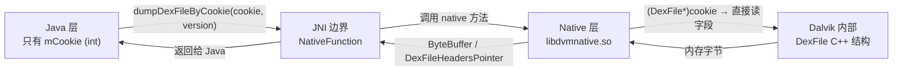
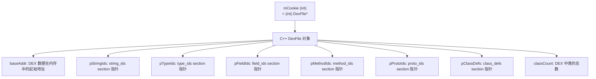
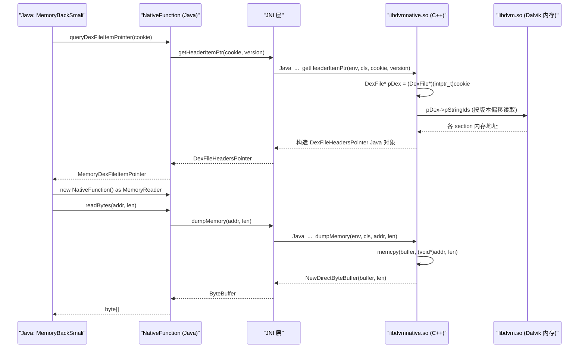

# ⚙️ Native 层与 JNI 桥

ZjDroid 最核心的能力——从 Dalvik 内存中提取 DEX——需要跨越 Java/Native 边界才能实现。本篇拆解 `NativeFunction` 类和 `libdvmnative.so` 如何通过 JNI 协作，直读 Dalvik 虚拟机的内部 C++ 数据结构。

## 为什么必须下沉到 Native 层

Dalvik 虚拟机的内部状态（如 `DexFile*` 结构体、内存中 DEX 的各 section 指针）都是 C++ 对象，存活在进程的 Native 堆上。Java 层只能看到 `mCookie`（一个整数，本质是指针值），无法直接解引用它。要从这个整数出发读取内存数据，只能通过 JNI 调用 Native 代码，在 C/C++ 层做指针操作。



## NativeFunction 的六个 native 方法

```java
// NativeFunction.java
public class NativeFunction implements MemoryReader {

    private final static String DVMNATIVE_LIB = "dvmnative";

    static {
        System.loadLibrary(DVMNATIVE_LIB);  // 加载 libdvmnative.so
    }

    // 通过 DexFile 中某个 Class 对象定位并 dump 该 DEX 的完整字节
    public static native ByteBuffer dumpDexFileByClass(Class classInDex, int version);

    // 通过 mCookie 直接 dump DEX 完整字节流
    public static native ByteBuffer dumpDexFileByCookie(int cookie, int version);

    // dump 任意内存区域 [start, start+length) 的字节
    public static native ByteBuffer dumpMemory(int start, int length);

    // 获取 mCookie 对应的 DexFile 内各 section 指针
    private static native DexFileHeadersPointer getHeaderItemPtr(int cookie, int version);

    // 获取当前 Dalvik 的 inline 操作表（用于 deodex 还原）
    public static native String getInlineOperation();

    // 获取当前进程的共享库快照（syslink 信息）
    public static native HashMap getSyslinkSnapshot();
}
```

### loadLibrary 的特殊问题与解决方案

`System.loadLibrary("dvmnative")` 需要 ClassLoader 知道 `libdvmnative.so` 的路径。常规情况下 ClassLoader 只搜索 App 自身的 native 库目录，不会搜索 ZjDroid 的目录。

解决方案是在 `DexFileInfoCollecter.start()` 中 hook `BaseDexClassLoader.findLibrary()`：

```java
// DexFileInfoCollecter.java
hookhelper.hookMethod(findLibraryMethod, new MethodHookCallBack() {
    @Override
    public void afterHookedMethod(HookParam param) {
        // 当目标 App 的 ClassLoader 找不到 dvmnative 时，强制指向 ZjDroid 的 lib 目录
        if (DVMLIB_LIB.equals(param.args[0]) && param.getResult() == null) {
            param.setResult("/data/data/com.android.reverse/lib/libdvmnative.so");
        }
    }
});
```

::: info 为什么不直接用绝对路径？
`System.loadLibrary()` 内部调用 `ClassLoader.findLibrary()`，这个方法返回 `.so` 文件的绝对路径，然后再调用 `dlopen()`。ZjDroid 通过 hook 这个查找过程，将 `dvmnative` 的查找结果重定向，等效于"让目标 App 的 ClassLoader 帮 ZjDroid 找到自己的 native 库"。
:::

## MemoryReader 接口的实现

`NativeFunction` 实现了 dexlib2 定义的 `MemoryReader` 接口：

```java
// NativeFunction.java
@Override
public byte[] readBytes(int address, int length) {
    ByteBuffer data = dumpMemory(address, length);
    data.order(ByteOrder.LITTLE_ENDIAN);
    byte[] buffer = new byte[data.capacity()];
    data.get(buffer, 0, data.capacity());
    return buffer;
}
```

dexlib2 的 `DexBackedDexFile` 需要一个 `MemoryReader` 来按地址读取字节。通常它读的是文件字节（`FileBackedByteProvider`），但 ZjDroid 提供的是内存字节——调用 JNI `dumpMemory()` 直接从进程地址空间读取。这是 ZjDroid 对 dexlib2 做的最关键扩展。

## queryDexFileItemPointer — 指针转换枢纽

```java
// NativeFunction.java
public static MemoryDexFileItemPointer queryDexFileItemPointer(int cookie) {
    int version = ModuleContext.getInstance().getApiLevel();
    DexFileHeadersPointer iteminfo = getHeaderItemPtr(cookie, version);  // JNI 调用
    MemoryDexFileItemPointer pointer = new MemoryDexFileItemPointer();
    pointer.setBaseAddr(iteminfo.getBaseAddr());
    pointer.setpClassDefs(iteminfo.getpClassDefs());
    pointer.setpFieldIds(iteminfo.getpFieldIds());
    pointer.setpMethodIds(iteminfo.getpMethodIds());
    pointer.setpProtoIds(iteminfo.getpProtoIds());
    pointer.setpStringIds(iteminfo.getpStringIds());
    pointer.setpTypeIds(iteminfo.getpTypeIds());
    pointer.setClassCount(iteminfo.getClassCount());
    return pointer;
}
```

这个方法把 JNI 返回的 `DexFileHeadersPointer`（ZjDroid 自定义类型）转换为 dexlib2 内部的 `MemoryDexFileItemPointer`，完成两个世界之间的类型桥接。

## libdvmnative.so 的工作原理

### Dalvik 的 DexFile C++ 结构

Dalvik 虚拟机（位于 `/system/lib/libdvm.so`）在加载 DEX 时，会在内存中创建一个 C++ `DexFile` 对象（或实际上是 `RawDexFile` 等变体），`mCookie` 就是这个对象的地址（强转为 `int`）。



### 多版本适配

`getHeaderItemPtr(cookie, version)` 接受 `version`（即 Android API level），这是因为不同 Android 版本的 Dalvik `DexFile` C++ 类字段偏移量不同。`libdvmnative.so` 内部维护了一张偏移量表，根据 `version` 选择正确的偏移读取字段。

```java
// ModuleContext.java
public NativeFunction() {
    // apiLevel 由 ModuleContext 在初始化时从 Build.VERSION.SDK_INT 读取
}
```

`ModuleContext.getApiLevel()` 在运行时动态获取，确保 Native 层使用正确的结构偏移。

### dumpDexFileByCookie 的 Native 实现原理

```c
// libdvmnative.so (伪代码)
JNIEXPORT jobject JNICALL
Java_com_android_reverse_util_NativeFunction_dumpDexFileByCookie(
        JNIEnv *env, jclass clazz, jint cookie, jint version) {
    DexFile* pDexFile = (DexFile*)(intptr_t)cookie;  // 指针反转换
    // 根据 version 确定 DEX 数据的起始地址字段偏移
    void* dexData = pDexFile->pDexData; // 字段名/偏移因版本而异
    size_t dexSize = pDexFile->dexSize;
    // 将内存区域包装为 Java ByteBuffer 返回
    return env->NewDirectByteBuffer(dexData, dexSize);
}
```

::: warning 这是对 Dalvik 私有 ABI 的直接操作
`libdvmnative.so` 依赖 Dalvik（而非 ART）内部的未公开 C++ 类布局。这正是 ZjDroid **仅支持 Dalvik 时代（Android 4.x 及更早/使用 Dalvik 的 4.4）而不支持 ART（Android 5.0+）** 的根本原因：ART 的 `DexFile` 内部结构与 Dalvik 完全不同，`mCookie` 的语义也发生了变化。详见 [能力边界与安全模型](/architecture/security-boundary)。
:::

## getInlineOperation — deodex 的关键数据

```java
public static native String getInlineOperation();
```

Dalvik 在 ODEX 优化时会将部分 `invoke-virtual` 指令替换为内联调用（`execute-inline`），执行速度更快但可读性差。`getInlineOperation()` 从运行中的 Dalvik 获取当前设备的 inline 操作表（每台设备/ROM 略有差异），用于 baksmali 的 `CustomInlineMethodResolver` 将内联指令还原为标准 Dalvik 字节码。

## getSyslinkSnapshot — 共享库快照

```java
public static native HashMap getSyslinkSnapshot();
```

获取当前进程已加载共享库的快照（库名 → 加载地址映射），用于 `NativeHookCollecter` 分析 native hook 情况。

## JNI 调用全链路



## 📎 交叉链接

- JNI 桥如何融入脱壳链路 → [脱壳全链路原理](/architecture/unpacking-pipeline)
- mCookie 的 Dalvik 内存含义 → [DEX 在内存中的结构与 mCookie 原理](/architecture/dex-in-memory)
- NativeFunction 逐类讲解 → [NativeFunction](/source/util/NativeFunction)
- Dalvik 的局限性 → [能力边界与安全模型](/architecture/security-boundary)

## 小结

`NativeFunction` 是 ZjDroid 的 JNI 核心，它扮演三个角色：其一是 **dexlib2 的 MemoryReader**，按地址提供内存字节；其二是 **Dalvik 结构体解码器**，通过 `getHeaderItemPtr` 把不透明的 `mCookie` 解码为可用的 section 指针；其三是 **inline 表查询接口**，为 deodex 还原提供设备级数据。`libdvmnative.so` 则是唯一真正触碰 Dalvik 私有数据结构的地方，也是 ZjDroid 整个能力体系中最"危险"、最难移植的组件。
