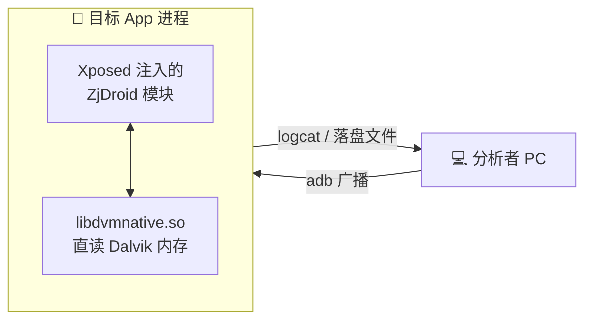
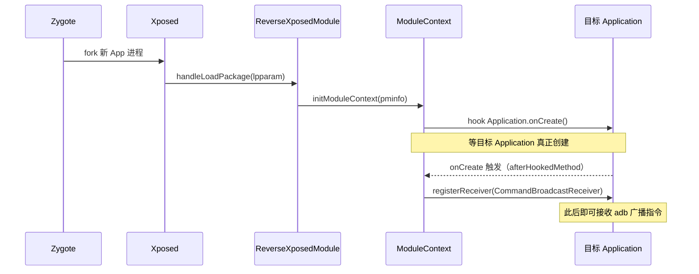
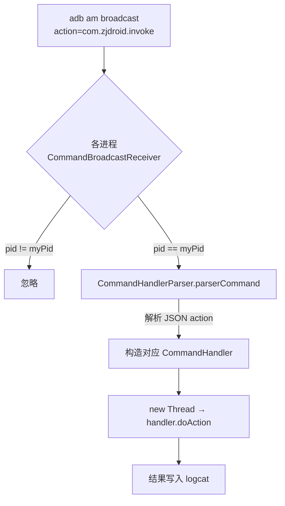
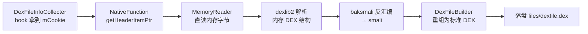

# 🏛️ 架构总览

ZjDroid 本质是一个 **Xposed 模块**：它把自己的代码注入到目标 App 进程里，然后在进程内部完成脱壳、内存 dump、API 监控等工作。理解它，先理解它"如何进入目标进程"、"如何被驱动"、"如何执行"这三件事。

## 🧩 一句话架构

> ZjDroid 借 Xposed 之力**寄生**进目标进程，靠一条 **adb 广播**被外部驱动，在进程内部用 **JNI 直读 Dalvik 内存**完成脱壳与分析，结果通过 **logcat** 回传。



## 🔌 第一件事：如何进入目标进程

ZjDroid 依赖 [Xposed 框架](https://repo.xposed.info/)。Xposed 会替换 Android 的 `app_process`，让每个新启动的 App 进程在执行自身代码前，先加载所有已启用的 Xposed 模块。ZjDroid 的入口是 [`ReverseXposedModule`](/source/mod/ReverseXposedModule)，它实现 `IXposedHookLoadPackage` 接口：

```java
public void handleLoadPackage(LoadPackageParam lpparam) throws Throwable {
    // 跳过系统应用；只处理"首个 Application"且非 ZjDroid 自身的包
    if (lpparam.isFirstApplication && !ZJDROID_PACKAGENAME.equals(lpparam.packageName)) {
        Logger.PACKAGENAME = lpparam.packageName;
        PackageMetaInfo pminfo = PackageMetaInfo.fromXposed(lpparam);
        ModuleContext.getInstance().initModuleContext(pminfo);   // ① 初始化上下文
        DexFileInfoCollecter.getInstance().start();              // ② 开始收集 DEX 信息
        LuaScriptInvoker.getInstance().start();                  // ③ 准备 Lua 注入能力
        ApiMonitorHookManager.getInstance().startMonitor();      // ④ 启动 API 监控
    }
}
```

::: tip 为什么只处理 `isFirstApplication`
一个 App 可能有多进程。ZjDroid 只在"首个 Application"注入，避免重复初始化。同时排除系统应用（`FLAG_SYSTEM`）和 ZjDroid 自身，避免污染。
:::

### 注入与初始化时序



关键细节：[`ModuleContext`](/source/collecter/ModuleContext) **并不立即**注册广播接收器，而是**先 hook 目标 `Application.onCreate()`**，等目标进程的 `Application` 真正实例化后，才用它的 `Context` 注册 [`CommandBroadcastReceiver`](/source/mod/CommandBroadcastReceiver)。因为注册广播需要一个有效的 `Context`，而模块加载那一刻还没有。

## 📡 第二件事：如何被外部驱动

ZjDroid 没有 UI，所有主动操作都靠一条广播触发：

```bash
adb shell am broadcast -a com.zjdroid.invoke \
  --ei target <目标PID> \
  --es cmd '{"action":"backsmali","dexpath":"..."}'
```

广播是设备全局的——所有被注入的进程都会收到。ZjDroid 用 `target` PID 路由，只让匹配的进程执行：



::: warning 为什么切到新线程执行
`onReceive` 跑在主线程，超过 10 秒会 ANR。而 `backsmali` 脱壳耗时远超 10 秒，所以 [`CommandBroadcastReceiver`](/source/mod/CommandBroadcastReceiver) 用 `new Thread(...).start()` 异步执行。这也意味着广播命令**立即返回**，真正结果要靠 logcat 异步查看。
:::

指令到 Handler 的映射由 [`CommandHandlerParser`](/source/request/CommandHandlerParser) 完成——一个典型的**命令模式**分发器，详见 [指令处理层](/source/request/)。

## ⚙️ 第三件事：如何执行核心工作

ZjDroid 的杀手锏是**绕过文件层加固，直接从内存拿 DEX**。它通过 [`NativeFunction`](/source/util/NativeFunction)（JNI 桥）调用 `libdvmnative.so`，直读 Dalvik 虚拟机内部的数据结构：

```java
public class NativeFunction implements MemoryReader {
    static { System.loadLibrary("dvmnative"); }

    // 依据 DexFile 的 mCookie（指向 Dalvik 内部结构的指针）导出 DEX
    public static native ByteBuffer dumpDexFileByCookie(int cookie, int version);
    public static native ByteBuffer dumpMemory(int start, int length);
    private static native DexFileHeadersPointer getHeaderItemPtr(int cookie, int version);
}
```

脱壳全链路（详见 [脱壳原理](/features/backsmali)）：



## 🗺️ 分层与代码映射

| 层 | 包 | 代表类 | 作用 |
|----|----|-------|------|
| 入口层 | `mod` | [ReverseXposedModule](/source/mod/ReverseXposedModule) | Xposed 挂载点、广播接收 |
| 指令层 | `request` | [CommandHandlerParser](/source/request/CommandHandlerParser) | 解析 JSON、分发命令 |
| 采集层 | `collecter` | [DexFileInfoCollecter](/source/collecter/DexFileInfoCollecter) | DEX 信息、内存/堆 dump、Lua |
| 反汇编层 | `smali` | [MemoryBackSmali](/source/smali/MemoryBackSmali) | 内存 DEX → smali → 重组 |
| Hook 层 | `hook` | [XposeHookHelperImpl](/source/hook/XposeHookHelperImpl) | 对 Xposed hook API 的封装 |
| 监控层 | `apimonitor` | [ApiMonitorHookManager](/source/apimonitor/ApiMonitorHookManager) | 20 类敏感 API 监控 |
| 工具层 | `util` | [NativeFunction](/source/util/NativeFunction) | JNI 桥、反射、日志 |

## 📚 延伸阅读

- 逐类深挖：[ZjDroid 源码精讲](/source/)
- 内嵌工具链（脱壳依赖）：[dexlib2 / baksmali 原理](/internals/)
- 具体功能怎么用：[功能原理](/features/dex-dump)
