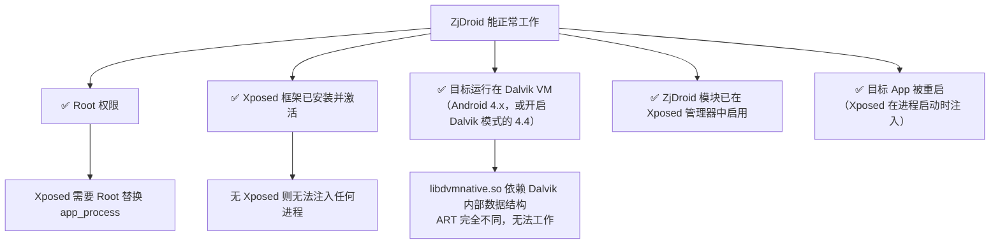
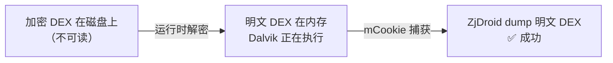
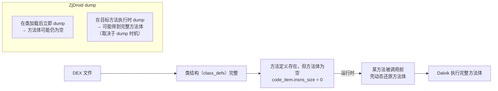
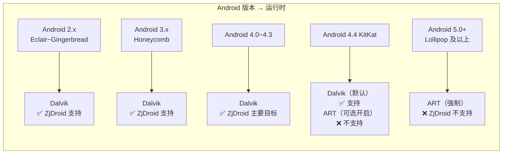
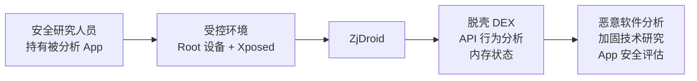
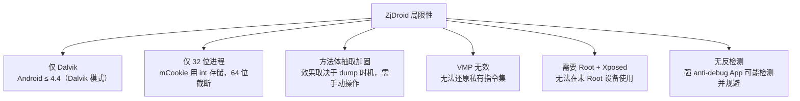

# 🛡️ 能力边界与安全模型

ZjDroid 是一把精准的手术刀，同时也有明确的局限性。本篇从安全模型的角度梳理 ZjDroid 能做什么、不能做什么，以及在对抗现代加固时的原理与局限。

## 前置条件：ZjDroid 需要什么



::: warning Dalvik-Only 约束
ZjDroid 的核心能力（内存 DEX 读取）通过 `libdvmnative.so` 直接操作 Dalvik 的 C++ 内部结构。ART（Android 5.0+ 默认，部分 4.4 设备支持）的运行时数据结构与 Dalvik 完全不同，`mCookie` 的含义在 ART 中也发生了根本变化。ZjDroid **不支持 ART 运行时**。
:::

## 能力矩阵

| 能力 | 支持程度 | 原理 |
|------|---------|------|
| 整 DEX 加密（加壳） | ✅ 完全支持 | 壳加载时触发 `openDexFileNative` Hook，mCookie 记录 |
| 多 DEX 分包加载 | ✅ 支持 | 每次 `openDexFileNative` 调用都被记录，`dump_dexinfo` 列出全部 |
| 主 DEX 脱壳 | ✅ 支持 | 通过反射读取 PathClassLoader 中的 mCookie |
| 任意内存 dump | ✅ 支持 | `dump_mem(startaddr, length)` 通过 JNI 直接读任意内存 |
| 堆分析（hprof） | ✅ 支持 | `dump_heap` 调用 Android 内置 hprof dump |
| API 行为监控 | ✅ 支持 | 17 类敏感 API 的 `before/afterHookedMethod` |
| Lua 脚本交互 | ✅ 支持 | luajava 桥，Lua 脚本可直接操控 Java 层 |
| 方法体抽取加固 | ⚠️ 部分支持 | dump 时可能得到方法体为空的 DEX，需配合时机 |
| VMP（虚拟机保护） | ❌ 不支持 | 自定义指令集，标准 baksmali 无法识别 |
| ART 环境脱壳 | ❌ 不支持 | libdvmnative.so 不适配 ART 运行时 |
| 64 位进程 | ❌ 不支持 | mCookie 用 int 存储指针，64 位指针溢出 |

## 攻防模型：加固如何对抗 ZjDroid

### 加固 1：整 DEX 文件加密（ZjDroid 可破）



**原理**：加固无论怎样加密，只要 Dalvik 在运行代码，内存中就必须有明文 DEX。ZjDroid 的 Hook 时机（`openDexFileNative` 调用后）恰好是明文 DEX 已在内存、正被使用的时刻。

### 加固 2：方法体抽取（ZjDroid 效果有限）



方法体抽取将每个方法的字节码单独加密，在方法被调用前才还原。整体 dump DEX（`dump_dexfile`）如果在方法被调用前执行，得到的方法体为空。

**应对思路**：先触发目标方法执行（通过 App 正常使用流程）再 dump，或通过 Lua 脚本反射调用目标方法后再 dump。这不在 ZjDroid 自动化流程内，需要分析人员手动操作。

### 加固 3：VMP（ZjDroid 无效）

VMP 将 Java 字节码转换为自定义虚拟机的指令集，Dalvik 只执行 VMP 解释器（通常是一个 native 库），真实的业务逻辑以私有格式存储。ZjDroid 能 dump 出 DEX，但 DEX 中所有方法都只包含 VMP 解释器的调用，无法还原业务逻辑。

### 检测与对抗 ZjDroid

目标 App 可以检测 ZjDroid 的存在：

1. **检查 Xposed 特征**：检查 ClassLoader 中是否有 Xposed 相关类；检查调用栈中是否有 `de.robv.android.xposed.XposedBridge`。
2. **检查自身模块**：枚举已激活的 Xposed 模块列表（需要 root），检查是否有 `com.android.reverse`。
3. **检查 Hook 特征**：Hook 会在方法的 native 层修改函数指针，某些 anti-hook 技术通过检查函数指针是否被替换来检测。

ZjDroid 本身没有实现任何反检测机制——它是一个分析工具，不是恶意软件，不需要隐藏自身。

## API Level 兼容性

`Utility.getApiLevel()` 通过 `android.os.SystemProperties.getInt("ro.build.version.sdk", 14)` 获取 API Level：

```java
// Utility.java
public static int getApiLevel() {
    Class<?> mClassType = Class.forName("android.os.SystemProperties");
    Method mGetIntMethod = mClassType.getDeclaredMethod("getInt",
            String.class, int.class);
    mGetIntMethod.setAccessible(true);
    return (Integer) mGetIntMethod.invoke(null, "ro.build.version.sdk", 14);
    // 默认值 14 = Android 4.0 Ice Cream Sandwich
}
```

该 API Level 值传递给 `NativeFunction` 的 native 方法，决定读取 Dalvik `DexFile` 结构体时使用哪个字段偏移量。ZjDroid 的 `AndroidManifest.xml` 声明：

```xml
<uses-sdk
    android:minSdkVersion="8"
    android:targetSdkVersion="18" />
```

`minSdkVersion=8`（Android 2.2）到 `targetSdkVersion=18`（Android 4.3）是 ZjDroid 的官方支持范围，对应 Dalvik 虚拟机的全生命周期。



## 为什么不支持 ART

ART（Android Runtime）在 Android 5.0 起成为默认运行时，与 Dalvik 的根本差异：

| 维度 | Dalvik | ART |
|------|--------|-----|
| 执行方式 | JIT 解释执行 | AOT 预编译 + JIT |
| DEX 处理 | 运行时解释 DEX 字节码 | 安装时 dex2oat 编译为 OAT 文件 |
| `mCookie` 含义 | `DexFile*` 指针 | `long[] dexFiles` 数组（多个） |
| 类加载 | `openDexFileNative` | `openDexFileNative` 参数语义变化 |
| 内存布局 | 相对简单，结构稳定 | 更复杂，版本间变化较大 |

`libdvmnative.so` 依赖 `libdvm.so` 的内部 C++ 类布局，这套布局在 Android 5.0 起完全消失（Dalvik 被移除），无法在 ART 环境下工作。

## ZjDroid 的威胁模型

ZjDroid 是合法的安全研究工具，使用场景是：



**不适用场景**：
- 在生产设备（Root 且安装 Xposed）上对用户 App 进行未授权分析
- 绕过 ART 时代的加固（需要不同工具，如 FART、Kirin 等）
- 分析内核态或 native-only 的代码（ZjDroid 只能覆盖 Java 层）

## 能力局限总结



## 📎 交叉链接

- Dalvik mCookie 结构 → [DEX 在内存中的结构与 mCookie 原理](/architecture/dex-in-memory)
- native 层为何绑定 Dalvik → [Native 层与 JNI 桥](/architecture/native-bridge)
- API Level 在脱壳中的作用 → [脱壳全链路原理](/architecture/unpacking-pipeline)
- Xposed 注入机制 → [Xposed 注入与模块初始化生命周期](/architecture/injection-lifecycle)

## 小结

ZjDroid 的安全模型建立在一个清晰的前提上：**在 Dalvik 虚拟机还在运行的时代，运行中的进程内存对 Root 用户完全透明**。只要持有 Root 权限和 Xposed 框架，整 DEX 加密这种文件层保护在 ZjDroid 面前形同虚设。但这个能力有严格的时代约束——Android 5.0 之后 Dalvik 被淘汰，ART 的出现彻底改变了内存布局，使 ZjDroid 的核心手段失效。方法体抽取和 VMP 这两种超越"整 DEX 加密"的现代加固技术，也分别代表了 ZjDroid 能力的两条边界：时间边界（dump 时机）和结构边界（私有指令集）。
