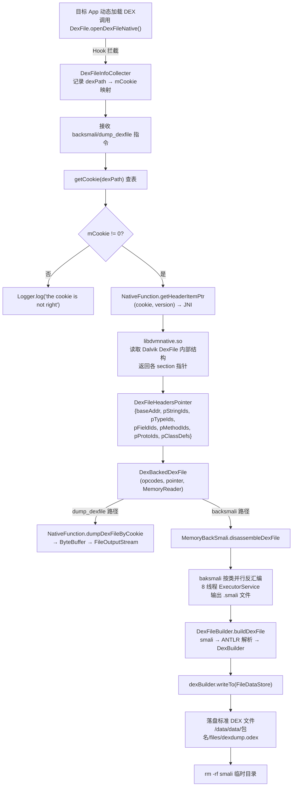
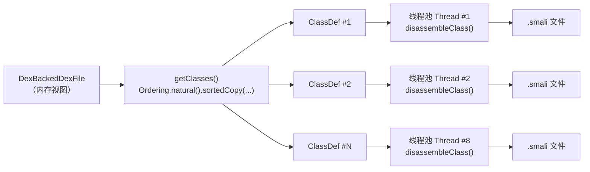

# 🔓 脱壳全链路原理

ZjDroid 的核心能力是在加固保护下仍能拿到真实 DEX。本篇完整拆解从"捕获 mCookie"到"落盘标准 DEX 文件"的每一个环节，解释为什么这条链路能绕过文件层的加密与混淆。

## 为什么文件层加固拦不住 ZjDroid

加固的基本逻辑是：把真实 DEX 加密存放，运行时在内存中解密并交给 Dalvik 加载，但对外只暴露加密后的假壳 DEX。文件系统上看不到真实 DEX，反编译工具也无从下手。

但 Dalvik 要执行代码，就必须把真实 DEX 解密到内存里。ZjDroid 不去碰磁盘上的文件——它直接读 **Dalvik 虚拟机内部的内存结构**，在加密已经被解开、Dalvik 正在愉快运行代码的那一刻，把内存里的明文 DEX 抓出来。

## 🗺️ 全链路流程图



## 第一环：mCookie 捕获

### 什么是 mCookie

`mCookie` 是 `dalvik.system.DexFile` 的一个私有 `int` 字段，本质是 Dalvik 内部 `DexFile` C++ 结构体的**指针值**（在 32 位系统上是 4 字节整数）。Dalvik 通过这个指针找到对应的内存 DEX 结构，执行类查找、方法解析等操作。

```java
// DexFile.java（Android 系统内部）
public final class DexFile {
    private int mCookie;  // 指向 native DexFile 结构体的指针
    ...
}
```

### 两种获取路径

ZjDroid 在 `DexFileInfoCollecter.start()` 里注册了两种捕获途径：

**途径 A：动态加载的 DEX（加固必经之路）**

```java
// DexFileInfoCollecter.java
Method openDexFileNativeMethod = RefInvoke.findMethodExact(
    "dalvik.system.DexFile",
    ClassLoader.getSystemClassLoader(),
    "openDexFileNative",
    String.class, String.class, int.class);

hookhelper.hookMethod(openDexFileNativeMethod, new MethodHookCallBack() {
    @Override
    public void afterHookedMethod(HookParam param) {
        String dexPath = (String) param.args[0];
        int mCookie = (Integer) param.getResult();
        if (mCookie != 0) {
            dynLoadedDexInfo.put(dexPath, new DexFileInfo(dexPath, mCookie));
        }
    }
});
```

`openDexFileNative` 是 `DexFile` 加载 DEX 文件的 native 方法，返回值就是 `mCookie`。每次加固壳加载真实 DEX 时都会调用此方法，hook `afterHookedMethod` 就能在 mCookie 生成的第一时间记录下来。

**途径 B：主 DEX（App 自身的 DEX）**

```java
// DexFileInfoCollecter.dumpDexFileInfo()
Object dexPathList = RefInvoke.getFieldOjbect(
    "dalvik.system.BaseDexClassLoader", pathClassLoader, "pathList");
Object[] dexElements = (Object[]) RefInvoke.getFieldOjbect(
    "dalvik.system.DexPathList", dexPathList, "dexElements");
for (int i = 0; i < dexElements.length; i++) {
    DexFile dexFile = (DexFile) RefInvoke.getFieldOjbect(
        "dalvik.system.DexPathList$Element", dexElements[i], "dexFile");
    int mCookie = RefInvoke.getFieldInt("dalvik.system.DexFile", dexFile, "mCookie");
    // ...
}
```

对于 App 自身通过 ClassLoader 加载的主 DEX，直接通过反射逐层读取 `pathList → dexElements → dexFile → mCookie`。

::: info mCookie 的详细结构原理
`mCookie` 背后的 Dalvik 内部数据结构解析，包括 `DexFile` C++ 类与 header_item 的关系，详见 [DEX 在内存中的结构与 mCookie 原理](/architecture/dex-in-memory)。
:::

## 第二环：NativeFunction 读取内存结构

获得 mCookie 后，将其传入 JNI 层：

```java
// NativeFunction.java
public static native ByteBuffer dumpDexFileByCookie(int cookie, int version);
private static native DexFileHeadersPointer getHeaderItemPtr(int cookie, int version);
```

`libdvmnative.so` 接收到 cookie（即指针值），将其强制转换回 C++ `DexFile*`，然后读取其内部字段，获取 DEX 各 section 在内存中的绝对地址。

`getHeaderItemPtr` 返回的 `DexFileHeadersPointer` 包含七个关键指针：

```java
// DexFileHeadersPointer.java
private int baseAddr;    // DEX 数据起始地址
private int pStringIds;  // string_id_list 起始地址
private int pTypeIds;    // type_id_list 起始地址
private int pFieldIds;   // field_id_list 起始地址
private int pMethodIds;  // method_id_list 起始地址
private int pProtoIds;   // proto_id_list 起始地址
private int pClassDefs;  // class_def_list 起始地址
private int classCount;  // 类的总数
```

这七个指针对应 DEX 格式中的七大 section，是 dexlib2 解析内存 DEX 的基础。

## 第三环：dexlib2 构建内存视图

ZjDroid 扩展了 dexlib2 的 `DexBackedDexFile`，将 `NativeFunction` 作为 `MemoryReader` 接口的实现传入：

```java
// MemoryBackSmali.java
MemoryReader reader = new NativeFunction();
MemoryDexFileItemPointer pointer = NativeFunction.queryDexFileItemPointer(mCookie);
DexBackedDexFile mmDexFile = new DexBackedDexFile(opcodes, pointer, reader);
```

`NativeFunction` 实现了 `MemoryReader` 接口：

```java
// NativeFunction.java
public byte[] readBytes(int arg0, int arg1) {
    ByteBuffer data = dumpMemory(arg0, arg1);  // JNI 读取任意内存区间
    data.order(ByteOrder.LITTLE_ENDIAN);
    byte[] buffer = new byte[data.capacity()];
    data.get(buffer, 0, data.capacity());
    return buffer;
}
```

这样 dexlib2 每次需要读取某个 DEX 数据项时，调用 `reader.readBytes(address, length)`，实际上是通过 JNI 调用 `dumpMemory()`，直接从目标进程的内存地址空间读取字节——完全绕过文件系统。

## 第四环：baksmali 并行反汇编



baksmali 使用 8 线程并发反汇编，每个类独立处理，输出到 `<files_dir>/smali/` 目录：

```java
// MemoryBackSmali.java
ExecutorService executor = Executors.newFixedThreadPool(options.jobs); // jobs=8
for (final ClassDef classDef : classDefs) {
    tasks.add(executor.submit(new Callable<Boolean>() {
        @Override
        public Boolean call() throws Exception {
            return disassembleClass(classDef, fileNameHandler, options);
        }
    }));
}
```

`disassembleClass()` 做了防御性检查：仅处理 `isValid()` 为 true 的类，且类描述符必须以 `L` 开头、`;` 结尾（标准 Dalvik 类描述符格式），否则跳过并记录日志。

### baksmali 配置项

```java
baksmaliOptions options = new baksmaliOptions();
options.apiLevel = ModuleContext.getInstance().getApiLevel();
options.allowOdex = true;   // 允许处理 ODEX 格式
options.deodex = true;       // 将 ODEX 中的内联指令还原
options.jobs = 8;            // 8 线程并发
options.registerInfo = 128;  // 输出寄存器信息
options.useLocalsDirective = true;
options.useSequentialLabels = true;
options.outputDebugInfo = true;
```

`deodex=true` 配合 `CustomInlineMethodResolver` 还原 Dalvik 对 `invoke-virtual` 的优化内联，保证反汇编结果的语义完整性：

```java
String inlineString = NativeFunction.getInlineOperation();
options.inlineResolver = new CustomInlineMethodResolver(
    options.classPath, inlineString);
```

## 第五环：DexFileBuilder 重组 DEX

`MemoryBackSmali.disassembleDexFile()` 结束后，紧接着调用 `DexFileBuilder.buildDexFile()`：

```java
// DexFileBuilder.java
final DexBuilder dexBuilder = DexBuilder.makeDexBuilder(apiLevel);
ExecutorService executor = Executors.newFixedThreadPool(jobs); // 同样 8 线程

for (final File file : filesToProcess) {  // 遍历所有 .smali 文件
    tasks.add(executor.submit(() -> assembleSmaliFile(
        file, dexBuilder, verboseErrors, printTokens, allowOdex, apiLevel)));
}

dexBuilder.writeTo(new FileDataStore(new File(dexFileName)));
```

`assembleSmaliFile()` 使用 ANTLR 驱动的 smali 语法解析器，将 `.smali` 文本重新编码为 DEX 字节码，并交由 dexlib2 的 `DexBuilder` 序列化为标准 DEX 格式写入磁盘。

```java
// assembleSmaliFile 核心流程
smaliFlexLexer lexer = new smaliFlexLexer(reader); // ANTLR 词法分析
smaliParser parser = new smaliParser(tokens);       // ANTLR 语法分析
smaliTreeWalker dexGen = new smaliTreeWalker(treeStream);
dexGen.setDexBuilder(dexBuilder);
dexGen.smali_file();  // 生成 DEX 条目
```

## 第六环：清理与落盘

```java
// MemoryBackSmali.java
boolean result = DexFileBuilder.buildDexFile(options.outputDirectory, outDexName);
Logger.log("end build the smali files to dex: cost time = "
        + ((System.currentTimeMillis() - startTime) / 1000) + "s");
if (result) {
    Runtime.getRuntime().exec("rm -rf " + options.outputDirectory); // 清理 smali 临时文件
}
```

最终落盘路径（以 `DumpDexFileCommandHandler` 为例）：

```
/data/data/<目标包名>/files/dexdump.odex
```

通过 root 或 adb pull 获取该文件后即可用 jadx、apktool 等工具进一步分析。

## 两条执行路径对比

| 功能 | 指令 | 执行路径 | 输出 |
|------|------|---------|------|
| 直接 dump DEX 字节 | `dump_dexfile` | `dumpDexFileByCookie` → `ByteBuffer` → `FileOutputStream` | 可能带 odex 优化的二进制 DEX |
| 脱壳并重组标准 DEX | `backsmali` | `getHeaderItemPtr` → dexlib2 → baksmali → DexFileBuilder | 标准格式 DEX，所有内联已还原 |

::: tip 选哪条路？
`dump_dexfile` 速度更快但输出可能是 ODEX 格式（含 Dalvik 内联优化），部分反编译工具难以直接处理。`backsmali` 慢但输出是经过 deodex 处理的标准 DEX，工具兼容性最好。对抗强加固时推荐使用 `backsmali`。
:::

## 📎 交叉链接

- mCookie 背后的内存结构 → [DEX 在内存中的结构与 mCookie 原理](/architecture/dex-in-memory)
- JNI 桥的实现细节 → [Native 层与 JNI 桥](/architecture/native-bridge)
- 脱壳入口指令参数 → [dex-dump 功能原理](/features/dex-dump)、[backsmali 功能原理](/features/backsmali)
- DexFileInfoCollecter 逐类讲解 → [DexFileInfoCollecter](/source/collecter/DexFileInfoCollecter)
- MemoryBackSmali 逐类讲解 → [MemoryBackSmali](/source/smali/MemoryBackSmali)

## 小结

ZjDroid 的脱壳链路由六个有序环节构成：mCookie 捕获（Hook 层）→ native 读指针（JNI 层）→ dexlib2 构建内存视图（解析层）→ baksmali 并行反汇编（反汇编层）→ DexFileBuilder 重组（组装层）→ 落盘（持久化层）。整条链路的核心洞见是：**加固能保护文件，但无法保护执行中的内存**。只要 Dalvik 在跑，mCookie 就在那里，ZjDroid 就能抓住它。
