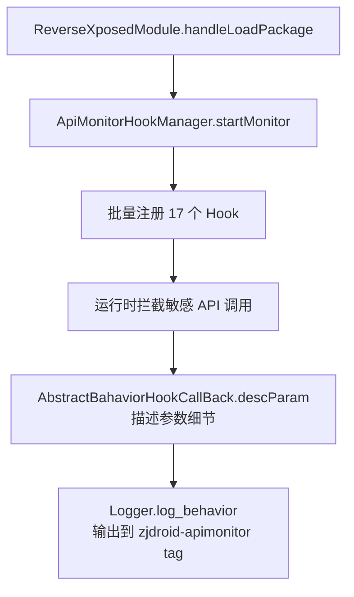

# 敏感 API 监控（api-monitor）

API 监控是 ZjDroid 唯一一个**不需要发指令**就生效的能力——模块一注入就自动开启。它会 hook 一大批敏感 API，把调用记录打到 logcat，让你看清 App 在运行时到底做了什么"敏感动作"。

## 不需要指令

API 监控在 [`ReverseXposedModule`](https://github.com/android-security-engineer/ZjDroid-skills/blob/master/src/com/android/reverse/mod/ReverseXposedModule.java) 启动时就开启了：

```java
ApiMonitorHookManager.getInstance().startMonitor();
```

之后你正常使用目标 App，敏感调用会自动被记录。只需看日志：

```bash
adb shell logcat -s zjdroid-apimonitor-<目标包名>
```

## 它解决什么问题

静态分析能看出"代码里**可能**调用发短信"，但看不出"App 运行时**实际**有没有发、发给谁、内容是什么"。API 监控补上这个缺口：

- 这个 App 真的发了短信吗？发给哪个号码？内容是什么？
- 它真的偷偷联网了吗？请求了哪个 URL？POST 了什么数据？
- 它在偷拍吗？在读通讯录吗？在录音吗？

这些都是**恶意行为分析**和**隐私合规审计**的核心问题。

## 实现原理

### 1. 统一管理：ApiMonitorHookManager

[`ApiMonitorHookManager`](https://github.com/android-security-engineer/ZjDroid-skills/blob/master/src/com/android/reverse/apimonitor/ApiMonitorHookManager.java) 持有 17 个 Hook 实例，`startMonitor()` 一次性全部启动：

```java
public void startMonitor() {
    this.smsManagerHook.startHook();
    this.telephonyManagerHook.startHook();
    this.mediaRecorderHook.startHook();
    // ... 共 17 个
    this.networkHook.startHook();
    this.processBuilderHook.startHook();
}
```

17 个 Hook 分别覆盖一类敏感能力（完整清单见 [API 监控清单](../reference/api-hooks)）。

### 2. 统一形态：ApiMonitorHook 抽象基类

每个 Hook 都继承 [`ApiMonitorHook`](https://github.com/android-security-engineer/ZjDroid-skills/blob/master/src/com/android/reverse/apimonitor/ApiMonitorHook.java)，只需实现 `startHook()`：

```java
public abstract class ApiMonitorHook {
    protected HookHelperInterface hookhelper = HookHelperFacktory.getHookHelper();
    public abstract void startHook();
}
```

### 3. 统一回调：AbstractBahaviorHookCallBack

每个 Hook 内部都用 `AbstractBahaviorHookCallBack` 作为回调，它做了两件通用的事：

```java
public abstract class AbstractBahaviorHookCallBack extends MethodHookCallBack {
    @Override
    public void beforeHookedMethod(HookParam param) {
        // 1. 自动记录"谁调了什么方法"
        Logger.log_behavior("Invoke " + param.method.getDeclaringClass().getName()
                            + "->" + param.method.getName());
        // 2. 调用子类实现的参数描述
        this.descParam(param);
    }

    // 子类实现：描述本次调用的参数细节
    public abstract void descParam(HookParam param);
}
```

所以每个具体 Hook 只需写 `descParam`，把关心的参数 log 出来即可。框架自动补上"调用了哪个方法"。

整个监控链路（从注入到日志输出）：



> **关于 Hook 数量的说明**：源码目录 `apimonitor/` 下有 20 个文件，但真正启用的 Hook 类是 **17 个**——其余 3 个为基础设施：`AbstractBahaviorHookCallBack`（通用回调基类）、`ApiMonitorHook`（Hook 抽象基类）、`ApiMonitorHookManager`（管理器）。这 17 类 Hook 覆盖：SmsManager、TelephonyManager、MediaRecorder、AccountManager、ActivityManager、AlarmManager、ConnectivityManager、ContentResolver、ContextImpl、PackageManager、Runtime、ActivityThread、AudioRecord、Camera、NetWork、NotificationManager、ProcessBuilder。

## 一个完整示例：SmsManagerHook

以短信监控为例，看一个 Hook 怎么写：

```java
public class SmsManagerHook extends ApiMonitorHook {
    @Override
    public void startHook() {
        // 找到发短信的方法
        Method sendTextMessagemethod = RefInvoke.findMethodExact(
            "android.telephony.SmsManager", ClassLoader.getSystemClassLoader(),
            "sendTextMessage", String.class, String.class, String.class,
            PendingIntent.class, PendingIntent.class);

        hookhelper.hookMethod(sendTextMessagemethod, new AbstractBahaviorHookCallBack() {
            @Override
            public void descParam(HookParam param) {
                Logger.log_behavior("Send SMS ->");
                String dstNumber = (String) param.args[0];   // 目标号码
                String content = (String) param.args[2];      // 短信内容
                Logger.log_behavior("SMS DestNumber:" + dstNumber);
                Logger.log_behavior("SMS Content:" + content);
            }
        });

        // 还 hook 了 getAllMessagesFromIcc、sendDataMessage、sendMultipartTextMessage ...
    }
}
```

当 App 调用 `sendTextMessage` 时，logcat 里就会出现：

```
Invoke android.telephony.SmsManager->sendTextMessage
Send SMS ->
SMS DestNumber:10086
SMS Content:你好
```

这样"App 偷发短信给 10086，内容是'你好'"就被完整记录下来了。

## 另一个示例：NetWorkHook（含返回值监控）

网络 Hook 不仅记录请求，还在 `afterHookedMethod` 里记录**响应**：

```java
// 监控 HttpClient 的 execute
hookhelper.hookMethod(executeRequest, new AbstractBahaviorHookCallBack() {
    @Override
    public void descParam(HookParam param) {
        // 请求阶段：记录方法、URL、headers、POST body
        HttpPost httpPost = (HttpPost) param.args[1];
        Logger.log_behavior("HTTP URL : " + httpPost.getURI().toString());
        // ... 还会读出 POST 的内容
    }

    @Override
    public void afterHookedMethod(HookParam param) {
        super.afterHookedMethod(param);
        // 响应阶段：记录状态码和响应头
        HttpResponse resp = (HttpResponse) param.getResult();
        Logger.log_behavior("Status Code = " + resp.getStatusLine().getStatusCode());
    }
});
```

这是少数同时监控"调用前参数"和"调用后返回值"的 Hook，能完整还原一次 HTTP 交互。

## 监控了哪些 API

完整 17 类，详见 [API 监控清单](../reference/api-hooks)。覆盖：

- 通信：短信、电话状态、网络请求
- 隐私数据：通讯录、账号、定位、设备号
- 多媒体：摄像头、录音、录像
- 系统：进程创建、广播注册、通知、闹钟、包管理、Activity 启动

## 输出示例

正常使用 App 后，`zjdroid-apimonitor-<包名>` tag 下会持续滚动类似日志：

```
Invoke android.telephony.TelephonyManager->getLine1Number
Read PhoneNumber ->
Invoke java.net.URL->openConnection
Connect to URL ->
The URL = http://api.example.com/track
Invoke android.hardware.Camera->takePicture
Camera take a picture->
Invoke java.lang.Runtime->exec
Create New Process ->
Command0 = /system/bin/su
```

从这些日志就能勾勒出 App 的行为画像：读了手机号、联网上报、拍了照、还尝试提权（执行 su）。

## 小结

| 要点 | 说明 |
|------|------|
| 启用方式 | 自动（注入即开启），无需指令 |
| 输出 tag | `zjdroid-apimonitor-<包名>` |
| 框架 | `ApiMonitorHook` 基类 + `AbstractBahaviorHookCallBack` 通用回调 |
| 覆盖范围 | 17 类敏感 API |
| 价值 | 恶意行为分析、隐私合规审计 |

---

至此八大功能点讲完。接下来看 [命令参考](../reference/commands) 或 [API 监控清单](../reference/api-hooks)。
