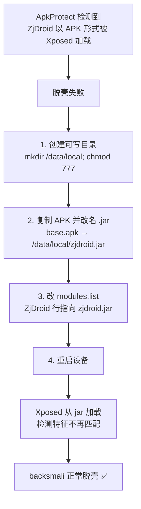

# ApkProtect 特殊处理

大部分加固方案，ZjDroid 用 `backsmali` 指令即可直接脱壳。但 **ApkProtect** 这一种加固有**防修改检测**，需要额外步骤才能破解。

### ApkProtect 特殊处理流程



## 问题

ApkProtect 会检测自身是否被修改。ZjDroid 作为 Xposed 模块以 APK 形式安装时，常规加载方式会触发它的检测，导致脱壳失败。

## 解法

思路是：把 ZjDroid 伪装成一个 **jar** 而非 apk 来加载，绕过检测。步骤如下：

### 1. 创建可写目录

在设备上创建一个特定目录，并赋予 777 权限：

```bash
adb shell su -c "mkdir /data/local"
adb shell su -c "chmod 777 /data/local"
```

> README 示例目录是 `/data/local`，你也可以用别的可写路径。

### 2. 复制并改名 APK 为 jar

把 ZjDroid 的 APK 复制到该目录，并**把扩展名改为 `.jar`**：

```bash
adb shell su -c "cp /data/app/com.android.reverse-*/base.apk /data/local/zjdroid.jar"
```

### 3. 修改 Xposed 模块列表

编辑 Xposed 的模块配置文件，把 ZjDroid 的模块代码文件改为这个 jar 路径：

```bash
adb shell su -c "cat /data/data/de.robv.android.xposed.installer/conf/modules.list"
# 找到 com.android.reverse 对应的那一行，把 APK 路径改成 /data/local/zjdroid.jar
```

即让 `modules.list` 中 ZjDroid 那一行的内容变为：

```
/data/local/zjdroid.jar
```

### 4. 重启设备

```bash
adb shell su -c "reboot"
```

重启后 Xposed 会从 `zjdroid.jar` 加载 ZjDroid，从而绕过 ApkProtect 的检测，即可正常 `backsmali` 脱壳。

## 为什么这样能绕过

ApkProtect 的检测逻辑通常针对"以 apk 形式安装并被 Xposed 加载"这一典型特征。把模块文件改名为 `.jar` 放在非标准目录、并在 `modules.list` 中指向它，改变了加载路径与文件形态，使其检测特征不再匹配，从而绕过。

::: warning 适用范围有限
这是针对 ApkProtect **当时版本**的对策。加固方若更新检测逻辑，此方法可能失效，需根据实际情况调整。
:::

---

回到 [快速开始](./getting-started)，或继续看 [功能实现原理](../features/dex-dump)。
