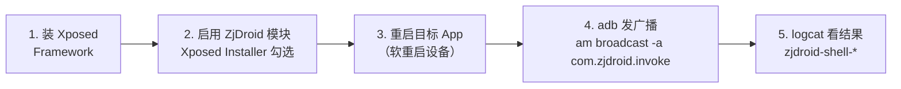

# 环境准备

使用 ZjDroid 前，你需要准备好以下环境。

### 上手 5 步流程



## 设备侧

::: warning 时代要求
ZjDroid 是 Dalvik 时代工具。要发挥其脱壳能力，你需要一台运行 **Android 4.4 或更低版本**（Dalvik 运行时）的设备或模拟器。在 ART 设备上核心脱壳功能不可用，详见 [局限说明](../intro/limitations)。
:::

你需要：

- 一台已 **root** 的 Android 设备（真机或模拟器均可）；
- 安装 [Xposed Framework](https://github.com/rovo89/Xposed)（通过 Xposed Installer 安装）；
- 安装 ZjDroid 模块 APK（编译本仓库源码得到）。

## 电脑侧

- **ADB**（Android Debug Bridge）：用于和设备通信、发送广播、查看 logcat；
- 一个能阅读 smali / Java 的反编译工具（如 [jadx](https://github.com/skylot/jadx)），用于分析 dump 出来的 DEX。

## 验证 ADB

```bash
adb devices
```

能列出你的设备即可：

```
List of devices attached
xxxxxxxx    device
```

## 编译 ZjDroid APK

本仓库是 Eclipse 时代的 Android 工程（含 `.project`、`.classpath`、`project.properties`），不是 Gradle 工程。你可以：

1. 用 Eclipse + ADT 直接导入并编译；
2. 或参考 `.classpath` 与 `libs/`、`lib/` 目录，自行迁移到 Gradle 工程编译。

编译产物为 ZjDroid 的 APK（包名 `com.android.reverse`）。

::: tip 需要的依赖
- `XposedBridgeApi-54.jar`（仓库根目录已附带）
- `libs/` 下的 guava、android-support-v4、antlr、commons-cli
- `lib/full_framework_15.jar`（完整 framework，用于编译）
- `libs/armeabi/` 下的 `libdvmnative.so`、`libluajava.so`（native 库，已附带）
:::

---

环境就绪后，进入 [安装与启用模块](./install)。
