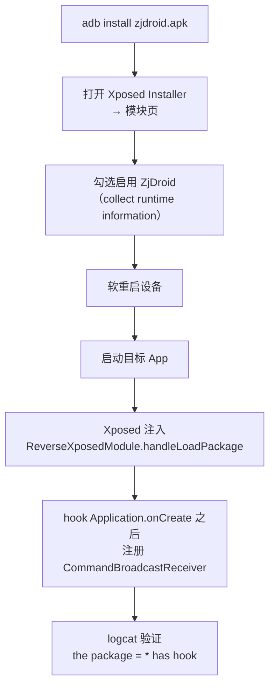

# 安装与启用模块

### 安装启用流程



## 1. 安装 ZjDroid APK

把编译好的 ZjDroid APK 安装到设备上：

```bash
adb install zjdroid.apk
```

## 2. 在 Xposed 中启用模块

1. 打开设备上的 **Xposed Installer**；
2. 进入 **模块**（Modules）页面；
3. 找到 **ZjDroid**（描述为 "collect the runtime information of the applications"），勾选启用它；
4. **重启设备**（软重启即可）。

重启后，ZjDroid 就会随每个非系统 App 的启动而注入。

## 3. 模块的工作方式

ZjDroid 的入口是 [`ReverseXposedModule`](https://github.com/android-security-engineer/ZjDroid-skills/blob/master/src/com/android/reverse/mod/ReverseXposedModule.java)，它实现了 `IXposedHookLoadPackage`。关键逻辑：

```java
public void handleLoadPackage(LoadPackageParam lpparam) throws Throwable {
    // 跳过系统应用
    if (lpparam.appInfo == null ||
        (lpparam.appInfo.flags & (FLAG_SYSTEM | FLAG_UPDATED_SYSTEM_APP)) != 0) {
        return;
    }
    // 只处理第一个 Application，且排除自身
    else if (lpparam.isFirstApplication && !ZJDROID_PACKAGENAME.equals(lpparam.packageName)) {
        Logger.PACKAGENAME = lpparam.packageName;        // 记录目标包名（用于 logcat tag）
        PackageMetaInfo pminfo = PackageMetaInfo.fromXposed(lpparam);
        ModuleContext.getInstance().initModuleContext(pminfo);
        DexFileInfoCollecter.getInstance().start();       // 开始 hook DEX 加载
        LuaScriptInvoker.getInstance().start();           // 准备 Lua 环境
        ApiMonitorHookManager.getInstance().startMonitor(); // 开始 API 监控
    }
}
```

注意三点：

- **跳过系统应用**（`FLAG_SYSTEM`），只 hook 第三方 App；
- **每个进程只初始化一次**（`isFirstApplication`）；
- **排除自身**（`com.android.reverse`），避免 hook 自己。

## 4. 延迟注册广播接收器

ZjDroid 不是一注入就立即监听广播，而是 hook 了目标 App 的 `Application.onCreate`，**在 `onCreate` 执行后才注册** `CommandBroadcastReceiver`：

```java
// ModuleContext.ApplicationOnCreateHook
public void afterHookedMethod(HookParam param) {
    if (!HAS_REGISTER_LISENER) {
        fristApplication = (Application) param.thisObject;
        IntentFilter filter = new IntentFilter(CommandBroadcastReceiver.INTENT_ACTION);
        fristApplication.registerReceiver(new CommandBroadcastReceiver(), filter);
        HAS_REGISTER_LISENER = true;
    }
}
```

::: tip 为什么延迟到 onCreate 之后
注入时机很早，那时 Application 的 Context 还没完全就绪，无法注册 BroadcastReceiver。等 `Application.onCreate` 跑完，Context 已可用，注册才安全。
:::

## 5. 验证模块已生效

启动一个目标 App，然后查看 logcat：

```bash
adb shell logcat -s zjdroid-shell-com.example.target
```

如果看到类似下面的日志，说明 ZjDroid 已成功注入：

```
the package = com.example.target has hook
the app target id = 12345
```

---

模块就绪后，进入 [发送第一条指令](./first-command)。
