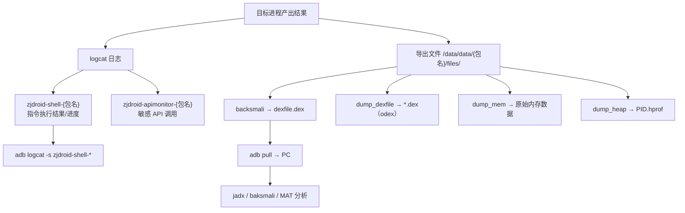

# 查看执行结果

ZjDroid 的输出分两部分：**logcat 日志**和**导出的文件**。

### 结果查看流程



## 1. 查看日志

ZjDroid 用两个 logcat tag 区分指令结果和 API 监控：

```bash
# 指令执行结果（dump 文件路径、状态等）
adb shell logcat -s zjdroid-shell-<目标包名>

# 敏感 API 监控输出
adb shell logcat -s zjdroid-apimonitor-<目标包名>
```

例如目标包名是 `com.example.target`：

```bash
adb shell logcat -s zjdroid-shell-com.example.target
```

::: tip tag 的构成
tag 是在代码里拼出来的，`Logger` 类用注入时记录的 `PACKAGENAME` 拼接：

```java
public static String LOGTAG_COMMAN  = "zjdroid-shell-";
public static String LOGTAG_WORKFLOW = "zjdroid-apimonitor-";

public static void log(String message)          { Log.d(LOGTAG_COMMAN + PACKAGENAME, message); }
public static void log_behavior(String message) { Log.d(LOGTAG_WORKFLOW + PACKAGENAME, message); }
```
:::

以 `dump_dexinfo` 为例，你会看到类似：

```
the cmd = dump_dexinfo
the dexinfo = ...  (各 DEX 的路径与 mCookie)
```

执行 `backsmali` 时会看到进度日志：

```
start disassemble the mCookie 12345678
end disassemble the mCookie: cost time = 12s
start build the smali files to dex
end build the smali files to dex: cost time = 5s
the dexfile data save to = /data/data/com.example.target/files/dexfile.dex
```

最后一行就是**导出文件的路径**。

## 2. 取出导出的文件

所有 dump 出来的文件都存在目标 App 的私有目录：

```
/data/data/<目标包名>/files/
```

| 操作 | 输出文件 |
|------|---------|
| `backsmali` | `dexfile.dex`（重组后的 dex） |
| `dump_dexfile` | `<dexpath 相关名>.dex`（odex 格式） |
| `dump_mem` | `<起始地址>`（原始内存数据） |
| `dump_heap` | `<PID>.hprof`（Java 堆快照） |

由于是 App 私有目录，需要 root 才能取出：

```bash
# root 设备直接拷出
adb shell su -c "cp /data/data/com.example.target/files/dexfile.dex /sdcard/"
adb pull /sdcard/dexfile.dex .

# 或用 run-as（debuggable App）
adb shell run-as com.example.target cat files/dexfile.dex > dexfile.dex
```

## 3. 分析导出的文件

- **dex 文件**：用 [jadx](https://github.com/skylot/jadx) 或 baksmali 反编译阅读，这就是脱壳拿到的真实代码；
- **hprof 文件**：用 [MAT](https://eclipse.org/mat/) 或 Android Studio 的 Profiler 分析 Java 堆；
- **内存数据**：用 hex 编辑器或 010 Editor 查看，按需解析结构。

---

至此你已掌握 ZjDroid 的完整使用闭环。接下来可以看 [工作流程总览](./workflow) 理清全局，或直接进入 [功能实现原理](../features/dex-dump) 深入细节。
