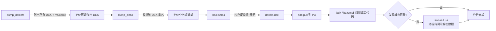

# 工作流程总览

把前面分散的内容串起来，从全局视角看 ZjDroid 一次完整调用经历了哪些环节。

### 完整脱壳工作流



## 生命周期

```
设备启动
   │
   ▼
用户打开目标 App
   │
   ▼  (Xposed 注入 ZjDroid)
ReverseXposedModule.handleLoadPackage()
   │  - 跳过系统应用 / 自身
   │  - 记录目标包名
   ▼
ModuleContext.initModuleContext()
   │  - hook Application.onCreate（延迟注册广播）
   ▼
DexFileInfoCollecter.start()       ← hook openDexFileNative 等
LuaScriptInvoker.start()           ← hook findLibrary（准备 Lua so）
ApiMonitorHookManager.startMonitor() ← hook 17 类敏感 API
   │
   ▼  (Application.onCreate 执行完毕)
注册 CommandBroadcastReceiver
   │  - 监听 com.zjdroid.invoke
   ▼
==================== 等待用户指令 ====================
   │
   ▼  (adb 发来广播)
CommandBroadcastReceiver.onReceive()
   │  - 校验 target PID == 本进程 PID
   │  - 解析 cmd JSON
   ▼
CommandHandlerParser.parserCommand()  ← 分发到具体 Handler
   │
   ▼  (新线程)
XxxCommandHandler.doAction()
   │  - 执行脱壳 / dump / Lua ...
   ▼
Logger.log()  →  logcat(zjdroid-shell-<包名>)
导出文件      →  /data/data/<包名>/files/
```

## 三大子系统

整个 ZjDroid 可以拆成三个职责清晰的子系统：

### 1. 指令通道子系统

负责"接收指令 → 解析 → 分发 → 执行"。

| 类 | 职责 |
|----|------|
| `CommandBroadcastReceiver` | 接收广播，按 PID 路由 |
| `CommandHandlerParser` | 把 JSON 解析成具体 `CommandHandler` |
| `CommandHandler`（接口） | 统一的 `doAction()` 执行入口 |
| `DumpDexInfoCommandHandler` 等 8 个实现 | 各功能的具体执行者 |

详见 [指令协议](../reference/protocol)。

### 2. DEX/内存子系统

负责"知道加载了什么 DEX → 拿到内存指针 → 导出/反编译"。这是脱壳的核心。

| 类 | 职责 |
|----|------|
| `DexFileInfoCollecter` | hook `openDexFileNative`，记录每个 DEX 的 `mCookie` |
| `DexFileInfo` | 封装单个 DEX 的路径、mCookie、ClassLoader |
| `NativeFunction` | JNI 桥梁，调用 `libdvmnative.so` 读写内存 |
| `MemoryBackSmali` | 基于内存指针跑 baksmali 反汇编 + 重组 |
| `DexFileBuilder` | 把 smali 重新组装成 dex |
| `MemDump` / `HeapDump` | 内存区域 dump / Java 堆 dump |

详见 [BackSmali 脱壳原理](../features/backsmali) 等功能章节。

### 3. 行为监控子系统

负责"hook 敏感 API → 记录调用"。

| 类 | 职责 |
|----|------|
| `ApiMonitorHookManager` | 统一管理 17 个 Hook 的启停 |
| `ApiMonitorHook`（抽象基类） | 定义 Hook 的统一形态 |
| `AbstractBahaviorHookCallBack` | 通用回调：记录"谁调了什么方法"+ 参数 |
| `SmsManagerHook` / `NetWorkHook` / ... | 17 类敏感 API 的具体 Hook |

详见 [敏感 API 监控原理](../features/api-monitor)。

## 关键设计决策

阅读源码时，有几个设计值得留意：

1. **单例遍布**：`ModuleContext`、`DexFileInfoCollecter`、`LuaScriptInvoker`、`ApiMonitorHookManager` 都是单例。因为每个目标进程里 ZjDroid 只有一份实例，单例最自然。

2. **Hook 框架抽象**：ZjDroid 没有直接调用 Xposed API，而是包了一层 `HookHelperInterface` / `HookHelperFacktory`（实际实现 `XposeHookHelperImpl`）。这样如果将来要换 Hook 后端（如换 ART 时代的框架），只需替换实现。可惜这一层最终没有为 ART 适配。

3. **`findLibrary` 劫持**：ZjDroid 自己的 native 库（`libdvmnative.so`、`libluajava.so`）装在自身私有目录，目标进程默认找不到。它通过 hook `BaseDexClassLoader.findLibrary`，当目标找 `dvmnative`/`luajava` 时把自己的库路径塞回去——巧妙的库加载方式。

4. **结果走 logcat**：不依赖额外的 IPC 通道，logcat 通用、好抓、好过滤，是简单有效的输出方式。

---

理解了全局，接下来深入每个功能点的实现细节，从 [DEX 内存 Dump](../features/dex-dump) 开始。
