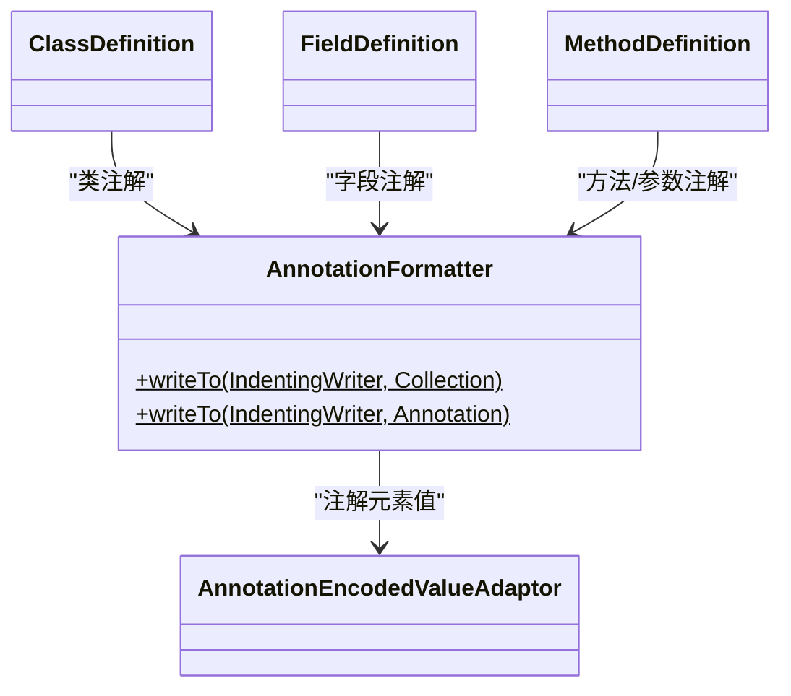

# 📎 AnnotationFormatter

> 将 dexlib2 `Annotation` 对象渲染为 smali `.annotation` / `.end annotation` 块的格式化工具。

| 属性 | 值 |
|---|---|
| 完整类名 | `org.jf.baksmali.Adaptors.AnnotationFormatter` |
| 源码链接 | [Adaptors/AnnotationFormatter.java](https://github.com/android-security-engineer/ZjDroid-skills/blob/master/src/org/jf/baksmali/Adaptors/AnnotationFormatter.java) |
| 类型 | 工具类（纯静态方法） |

---

## 🎯 职责

`AnnotationFormatter` 处理 DEX 中三种位置的注解输出：

1. **类注解**（`ClassDefinition.writeAnnotations()`）
2. **字段注解**（`FieldDefinition.writeTo()` 末尾）
3. **方法/参数注解**（`MethodDefinition.writeParameters()`）

---

## 🧠 关键实现

**批量输出（Collection 重载）**

```java
public static void writeTo(IndentingWriter writer,
                           Collection<? extends Annotation> annotations) throws IOException {
    boolean first = true;
    for (Annotation annotation: annotations) {
        if (!first) {
            writer.write('\n');  // 多个注解之间空一行
        }
        first = false;
        writeTo(writer, annotation);
    }
}
```

**单个注解输出**

```java
public static void writeTo(IndentingWriter writer, Annotation annotation) throws IOException {
    writer.write(".annotation ");
    writer.write(AnnotationVisibility.getVisibility(annotation.getVisibility()));
    writer.write(' ');
    writer.write(annotation.getType());
    writer.write('\n');

    AnnotationEncodedValueAdaptor.writeElementsTo(writer, annotation.getElements());

    writer.write(".end annotation\n");
}
```

输出示例：
```smali
.annotation system Ldalvik/annotation/Throws;
    value = {
        Ljava/io/IOException;
        Ljava/lang/RuntimeException;
    }
.end annotation

.annotation build Ljunit/runner/Description;
    displayName = "testFoo(com.example.FooTest)"
.end annotation
```

**注解可见性**（`AnnotationVisibility`）：

| 值 | smali 关键字 | 含义 |
|---|---|---|
| `0x00` | `build` | 仅编译时可见（proguard mapping 等） |
| `0x01` | `runtime` | 运行时可见（`@Runtime`/`@Retention(RUNTIME)`） |
| `0x02` | `system` | ART/Dalvik 系统注解（throw、signature 等） |

---

## 🔗 关系



---

## 📌 小结

`AnnotationFormatter` 是 baksmali 输出层中被调用次数最多的工具类之一，被类、字段、方法三个层次的 Adaptor 共同复用。注解在 Android 中扮演重要角色（系统注解携带签名、异常、内部类关系等元数据），正确输出注解是 smali 文件可被重汇编的必要条件。
