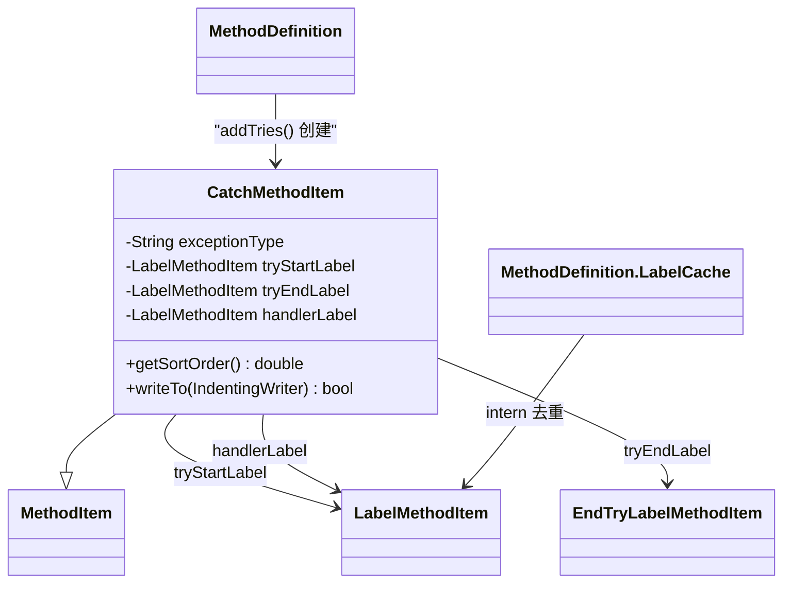

# 🪤 CatchMethodItem

> 将 DEX TryBlock 中的异常处理信息渲染为 smali `.catch` / `.catchall` 指令的类。

| 属性 | 值 |
|---|---|
| 完整类名 | `org.jf.baksmali.Adaptors.CatchMethodItem` |
| 源码链接 | [Adaptors/CatchMethodItem.java](https://github.com/android-security-engineer/ZjDroid-skills/blob/master/src/org/jf/baksmali/Adaptors/CatchMethodItem.java) |
| sortOrder | `102`（在指令 100 和 EndTryLabel 之后） |

---

## 🎯 职责

`CatchMethodItem` 封装单个异常处理器的 smali 输出，包括：

1. 通过 `LabelCache` 内化三个标签引用：`try_start_`、`try_end_`（EndTryLabel）、`catch_`/`catchall_`
2. `writeTo()` 输出 `.catch` 或 `.catchall` 指令（取决于 `exceptionType` 是否为 null）

---

## 🧠 关键实现

**构造函数：标签内化**

```java
public CatchMethodItem(@Nonnull baksmaliOptions options, @Nonnull MethodDefinition.LabelCache labelCache,
                       int codeAddress, @Nullable String exceptionType, int startAddress, int endAddress,
                       int handlerAddress) {
    super(codeAddress);
    this.exceptionType = exceptionType;

    tryStartLabel = labelCache.internLabel(new LabelMethodItem(options, startAddress, "try_start_"));

    // use the address from the last covered instruction, but make the label
    // name refer to the address of the next instruction
    tryEndLabel = labelCache.internLabel(new EndTryLabelMethodItem(options, codeAddress, endAddress));

    if (exceptionType == null) {
        handlerLabel = labelCache.internLabel(new LabelMethodItem(options, handlerAddress, "catchall_"));
    } else {
        handlerLabel = labelCache.internLabel(new LabelMethodItem(options, handlerAddress, "catch_"));
    }
}
```

注意 `tryEndLabel` 使用的是 `codeAddress`（最后被覆盖的指令地址），但 `EndTryLabelMethodItem` 内部使用 `endAddress`（下一条指令地址）来生成标签名称，这个微妙区别保证了标签位置正确但名称指向 try 块结束后的位置。

**writeTo：生成 .catch 指令**

```java
@Override
public boolean writeTo(IndentingWriter writer) throws IOException {
    if (exceptionType == null) {
        writer.write(".catchall");
    } else {
        writer.write(".catch ");
        writer.write(exceptionType);
    }
    writer.write(" {");
    tryStartLabel.writeTo(writer);
    writer.write(" .. ");
    tryEndLabel.writeTo(writer);
    writer.write("} ");
    handlerLabel.writeTo(writer);
    return true;
}
```

输出示例：
```smali
.catch Ljava/lang/Exception; {:try_start_0 .. :try_end_0} :catch_0
.catchall {:try_start_0 .. :try_end_0} :catchall_0
```

---

## 🔗 关系



---

## 📌 小结

`CatchMethodItem` 是 try/catch 块在 smali 层的完整表示。它持有三个 `LabelMethodItem` 引用（通过 `LabelCache` 内化），当 `MethodDefinition` 把所有 `MethodItem` 一起排序输出时，这三个标签会出现在正确的代码位置，而 `CatchMethodItem` 本身（sortOrder=102）则出现在 try 块最后一条指令之后。

::: warning 空 catch 块
`exceptionType == null` 对应 DEX 中的 catch-all（可捕获任何 `Throwable`），在 smali 中用 `.catchall` 表示。这在加固代码中常见于防止调试器附加。
:::
