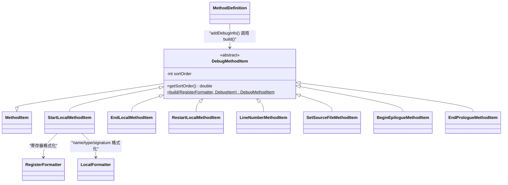

# 🐛 DebugMethodItem

> 调试信息渲染的抽象基类 + 工厂，负责将 dexlib2 的 `DebugItem` 分发到对应的渲染子类。

| 属性 | 值 |
|---|---|
| 完整类名 | `org.jf.baksmali.Adaptors.Debug.DebugMethodItem` |
| 源码链接 | [Adaptors/Debug/DebugMethodItem.java](https://github.com/android-security-engineer/ZjDroid-skills/blob/master/src/org/jf/baksmali/Adaptors/Debug/DebugMethodItem.java) |
| 子类 | 7 个（StartLocal、EndLocal、RestartLocal、LineNumber、SetSourceFile、BeginEpilogue、EndPrologue） |

---

## 🎯 职责

`DebugMethodItem` 是 Debug 子包的枢纽：

1. **抽象基类**：继承 `MethodItem`，固定 `sortOrder` 由构造参数传入（通常为负值，保证 debug 先于指令输出）
2. **静态工厂**：`build()` 方法根据 `DebugItemType` 枚举值创建对应子类实例

---

## 🧠 关键实现

**静态工厂 build()**

```java
public static DebugMethodItem build(RegisterFormatter registerFormatter, DebugItem debugItem) {
    int codeAddress = debugItem.getCodeAddress();
    switch (debugItem.getDebugItemType()) {
        case DebugItemType.START_LOCAL:
            return new StartLocalMethodItem(codeAddress, -1, registerFormatter, (StartLocal)debugItem);
        case DebugItemType.END_LOCAL:
            return new EndLocalMethodItem(codeAddress, -1, registerFormatter, (EndLocal)debugItem);
        case DebugItemType.RESTART_LOCAL:
            return new RestartLocalMethodItem(codeAddress, -1, registerFormatter, (RestartLocal)debugItem);
        case DebugItemType.EPILOGUE_BEGIN:
            return new BeginEpilogueMethodItem(codeAddress, -4);
        case DebugItemType.PROLOGUE_END:
            return new EndPrologueMethodItem(codeAddress, -4);
        case DebugItemType.SET_SOURCE_FILE:
            return new SetSourceFileMethodItem(codeAddress, -3, (SetSourceFile)debugItem);
        case DebugItemType.LINE_NUMBER:
            return new LineNumberMethodItem(codeAddress, -2, (LineNumber)debugItem);
        default:
            throw new ExceptionWithContext("Invalid debug item type: %d", debugItem.getDebugItemType());
    }
}
```

**StartLocalMethodItem.writeTo() — 代表子类**

```java
@Override
public boolean writeTo(IndentingWriter writer) throws IOException {
    writer.write(".local ");
    registerFormatter.writeTo(writer, startLocal.getRegister());

    String name = startLocal.getName();
    String type = startLocal.getType();
    String signature = startLocal.getSignature();

    if (name != null || type != null || signature != null) {
        writer.write(", ");
        LocalFormatter.writeLocal(writer, name, type, signature);
    }
    return true;
}
```

输出示例：`.local p1, "count":I` 或 `.local v0, "list":Ljava/util/List;, "Ljava/util/List<Ljava/lang/String;>;"` （含泛型签名时）

---

## 📋 子类清单

| 子类 | sortOrder | 输出示例 |
|---|---|---|
| `StartLocalMethodItem` | -1 | `.local p0, "this":Lcom/Foo;` |
| `EndLocalMethodItem` | -1 | `.end local p0    # "this":Lcom/Foo;` |
| `RestartLocalMethodItem` | -1 | `.restart local p0    # "count":I` |
| `LineNumberMethodItem` | -2 | `.line 42` |
| `SetSourceFileMethodItem` | -3 | `.source "Foo.java"` |
| `BeginEpilogueMethodItem` | -4 | `.epilogue` |
| `EndPrologueMethodItem` | -4 | `.prologue`（标准 baksmali 不输出此行） |

---

## 🔗 关系



---

## 📌 小结

`DebugMethodItem` 的设计让调试信息渲染完全插件化——新增一种 `DebugItemType` 只需要新增子类并在 `build()` 中加一个 case。`sortOrder` 的负值设计保证了 `.line`、`.local` 等 debug 指令在同地址指令之前输出，这对于调试器正确映射源码行至关重要。

::: info 脱壳场景
ZjDroid 通过 `options.outputDebugInfo = false` 可以跳过所有 debug 信息输出，这在脱壳时大幅减少 smali 文件体积，但会损失源码行号和变量名等信息。
:::
