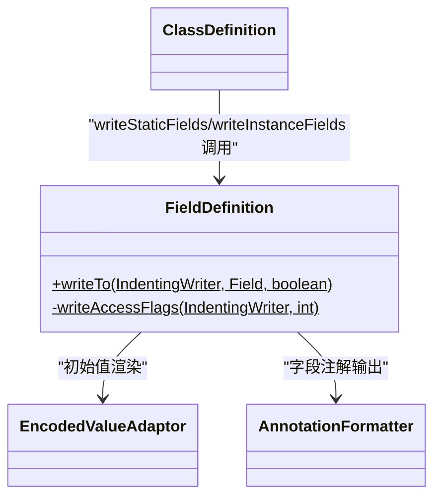

# 🗃️ FieldDefinition

> 将 dexlib2 `Field` 对象渲染为 smali `.field` 定义文本，并智能处理静态最终字段的初始值。

| 属性 | 值 |
|---|---|
| 完整类名 | `org.jf.baksmali.Adaptors.FieldDefinition` |
| 源码链接 | [Adaptors/FieldDefinition.java](https://github.com/android-security-engineer/ZjDroid-skills/blob/master/src/org/jf/baksmali/Adaptors/FieldDefinition.java) |
| 类型 | 工具类（纯静态方法） |

---

## 🎯 职责

`FieldDefinition` 处理 `.field` 声明的输出，包含一个关键的业务逻辑：**static final 字段初始值处理**。

在 Java 编译器输出的 DEX 中，`static final` 字段可能同时有两处初始化：
1. DEX 字段表中的 `initialValue`（编码值）
2. `<clinit>` 静态构造器中的 `sput` 指令

若两处都存在，反汇编时同时输出会导致重汇编的 smali 产生语义错误。`FieldDefinition` 通过 `setInStaticConstructor` 参数（由 `ClassDefinition.findFieldsSetInStaticConstructor()` 预计算）来决定是否输出 `= value` 初始值。

---

## 🧠 关键实现

**完整 writeTo 方法**

```java
public static void writeTo(IndentingWriter writer, Field field, boolean setInStaticConstructor) throws IOException {
    EncodedValue initialValue = field.getInitialValue();
    int accessFlags = field.getAccessFlags();

    if (setInStaticConstructor &&
            AccessFlags.STATIC.isSet(accessFlags) &&
            AccessFlags.FINAL.isSet(accessFlags) &&
            initialValue != null) {
        if (!EncodedValueUtils.isDefaultValue(initialValue)) {
            // 非默认值（如 static final int FOO = 42）：加注释提醒
            writer.write("# The value of this static final field might be set in the static constructor\n");
        } else {
            // 默认值（如 static final int FOO = 0）：直接不输出，避免重复
            initialValue = null;
        }
    }

    writer.write(".field ");
    writeAccessFlags(writer, field.getAccessFlags());
    writer.write(field.getName());
    writer.write(':');
    writer.write(field.getType());
    if (initialValue != null) {
        writer.write(" = ");
        EncodedValueAdaptor.writeTo(writer, initialValue);
    }
    writer.write('\n');

    // 字段注解
    Collection<? extends Annotation> annotations = field.getAnnotations();
    if (annotations.size() > 0) {
        writer.indent(4);
        AnnotationFormatter.writeTo(writer, annotations);
        writer.deindent(4);
        writer.write(".end field\n");
    }
}
```

输出示例：
```smali
.field public static final TAG:Ljava/lang/String; = "MyActivity"

.field private mCount:I
    .annotation system Ldalvik/annotation/Throws;
        value = {
            Ljava/lang/IllegalArgumentException;
        }
    .end annotation
.end field
```

---

## 🔗 关系



---

## 📌 小结

`FieldDefinition` 展示了反汇编中需要处理"双重初始化"这个 Java 语义问题。通过 `ClassDefinition` 预扫描 `<clinit>` 指令并传入 `setInStaticConstructor` 标志，`FieldDefinition` 能够生成可被 smali 正确重汇编的 `.field` 声明，而不产生歧义或错误。
