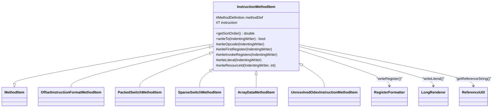

# ⚡ InstructionMethodItem

> 将单条 Dalvik/ART 指令渲染为 smali 文本的核心类，覆盖 30+ 种指令格式。

| 属性 | 值 |
|---|---|
| 完整类名 | `org.jf.baksmali.Adaptors.Format.InstructionMethodItem<T extends Instruction>` |
| 源码链接 | [Adaptors/Format/InstructionMethodItem.java](https://github.com/android-security-engineer/ZjDroid-skills/blob/master/src/org/jf/baksmali/Adaptors/Format/InstructionMethodItem.java) |
| 泛型参数 | `T extends Instruction`（dexlib2 接口） |
| sortOrder | `100`（指令在 label 之后，catch 之前） |

---

## 🎯 职责

`InstructionMethodItem` 是 baksmali 指令层的核心渲染器：

1. **格式分支**：`writeTo()` 通过 `instruction.getOpcode().format` 进行大 switch，为每种 DEX 指令格式输出正确的操作数组合
2. **引用解析**：处理 `ReferenceInstruction`，将索引转为字符串描述（如 `Ljava/lang/String;->valueOf(I)Ljava/lang/String;`）
3. **odex 过滤**：检测 odex-only 指令，在不允许时注释掉该指令并补一个 `nop`
4. **异常容错**：引用索引越界时不崩溃，改为在指令前写注释并注释掉该指令

---

## 🧠 关键实现

**writeTo 的核心结构（节选关键格式）**

```java
@Override
public boolean writeTo(IndentingWriter writer) throws IOException {
    Opcode opcode = instruction.getOpcode();
    // ... 引用解析与错误处理 ...

    switch (instruction.getOpcode().format) {
        case Format10t:                    // goto :label
            writeOpcode(writer);
            writer.write(' ');
            writeTargetLabel(writer);
            break;
        case Format21c:                    // const-string v0, "hello"
        case Format31c:
            writeOpcode(writer);
            writer.write(' ');
            writeFirstRegister(writer);
            writer.write(", ");
            writer.write(referenceString);
            break;
        case Format35c:                    // invoke-virtual {v0, v1}, Method
            writeOpcode(writer);
            writer.write(' ');
            writeInvokeRegisters(writer);
            writer.write(", ");
            writer.write(referenceString);
            break;
        // ... 30+ 格式分支 ...
    }
    return true;
}
```

**odex 过滤逻辑**

```java
private boolean isAllowedOdex(@Nonnull Opcode opcode) {
    baksmaliOptions options = methodDef.classDef.options;
    if (options.allowOdex) {
        return true;
    }
    if (methodDef.classDef.options.apiLevel >= 14) {
        return false;
    }
    return opcode.isOdexedInstanceVolatile() || opcode.isOdexedStaticVolatile() ||
        opcode == Opcode.THROW_VERIFICATION_ERROR;
}
```

`apiLevel < 14` 的老系统允许部分 odex 指令；`>= 14` 的系统（ICS 以上）一律注释。

**invoke 系列寄存器格式化**

```java
protected void writeInvokeRegisters(IndentingWriter writer) throws IOException {
    FiveRegisterInstruction instruction = (FiveRegisterInstruction)this.instruction;
    final int regCount = instruction.getRegisterCount();
    writer.write('{');
    switch (regCount) {
        case 1: writeRegister(writer, instruction.getRegisterC()); break;
        case 2:
            writeRegister(writer, instruction.getRegisterC());
            writer.write(", ");
            writeRegister(writer, instruction.getRegisterD());
            break;
        // ... 3/4/5 类似 ...
    }
    writer.write('}');
}
```

**资源 ID 注释**

```java
protected void writeResourceId(IndentingWriter writer, int val) throws IOException {
    Map<Integer,String> resourceIds = methodDef.classDef.options.resourceIds;
    String resource = resourceIds.get(Integer.valueOf(val));
    if (resource != null) {
        writer.write("    # ");
        writer.write(resource);
    }
}
```

当指令操作数是资源 ID（来自 `public.xml`）时，自动在行尾追加 `# R.layout.main` 形式的注释。

---

## 🔗 关系



---

## 📌 小结

`InstructionMethodItem` 是 baksmali 中代码量最大的输出类，覆盖了 DEX 规范中所有指令格式的文本序列化。其设计将格式分支（`switch format`）、引用解析、错误容忍集中在 `writeTo()` 一处，子类（如 `PackedSwitchMethodItem`）则覆盖特定方法来处理结构化的 payload 指令。

::: tip 脱壳常见问题
脱壳获得的 DEX 有时含有损坏的引用索引（InvalidItemIndex），`InstructionMethodItem` 会将这类指令注释掉并补 `nop`，使 smali 文件仍可被 smali 汇编器处理，这是 ZjDroid 脱壳结果可用性的重要保障。
:::
