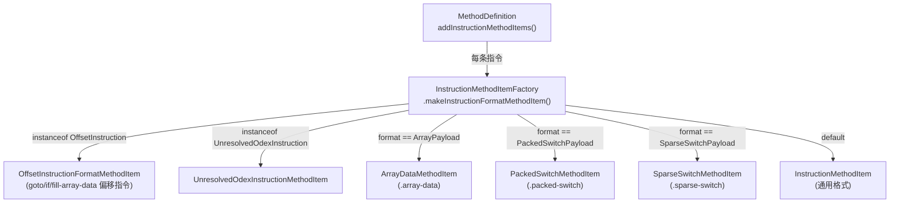

# 🏭 InstructionMethodItemFactory

> 根据指令类型分发到对应 MethodItem 子类的静态工厂，避免 `MethodDefinition` 直接依赖所有指令格式类。

| 属性 | 值 |
|---|---|
| 完整类名 | `org.jf.baksmali.Adaptors.Format.InstructionMethodItemFactory` |
| 源码链接 | [Adaptors/Format/InstructionMethodItemFactory.java](https://github.com/android-security-engineer/ZjDroid-skills/blob/master/src/org/jf/baksmali/Adaptors/Format/InstructionMethodItemFactory.java) |
| 设计模式 | 静态工厂方法，私有构造函数防止实例化 |

---

## 🎯 职责

`InstructionMethodItemFactory` 是一个纯静态工厂，屏蔽了 `MethodDefinition` 对各种 `InstructionMethodItem` 子类的直接依赖：

- 优先通过接口判断（`instanceof OffsetInstruction`、`instanceof UnresolvedOdexInstruction`）
- 其次通过 opcode format 枚举分发（payload 类型）
- 默认返回通用 `InstructionMethodItem`

---

## 🧠 关键实现

**完整工厂方法**

```java
public static InstructionMethodItem makeInstructionFormatMethodItem(
        MethodDefinition methodDef, int codeAddress, Instruction instruction) {

    if (instruction instanceof OffsetInstruction) {
        return new OffsetInstructionFormatMethodItem(methodDef.classDef.options, methodDef, codeAddress,
                (OffsetInstruction)instruction);
    }

    if (instruction instanceof UnresolvedOdexInstruction) {
        return new UnresolvedOdexInstructionMethodItem(methodDef, codeAddress,
                (UnresolvedOdexInstruction)instruction);
    }

    switch (instruction.getOpcode().format) {
        case ArrayPayload:
            return new ArrayDataMethodItem(methodDef, codeAddress, (ArrayPayload)instruction);
        case PackedSwitchPayload:
            return new PackedSwitchMethodItem(methodDef, codeAddress, (PackedSwitchPayload)instruction);
        case SparseSwitchPayload:
            return new SparseSwitchMethodItem(methodDef, codeAddress, (SparseSwitchPayload)instruction);
        default:
            return new InstructionMethodItem<Instruction>(methodDef, codeAddress, instruction);
    }
}
```

---

## 🔗 关系



---

## 📌 小结

工厂的分发逻辑体现了一个优先级：**接口检查 > opcode format 检查 > 默认**。`OffsetInstruction` 优先级最高，因为带偏移的指令需要将数字偏移解析为 label 引用（这是 `OffsetInstructionFormatMethodItem` 的专职），而不同 payload 类型则需要完全不同的多行格式输出。
