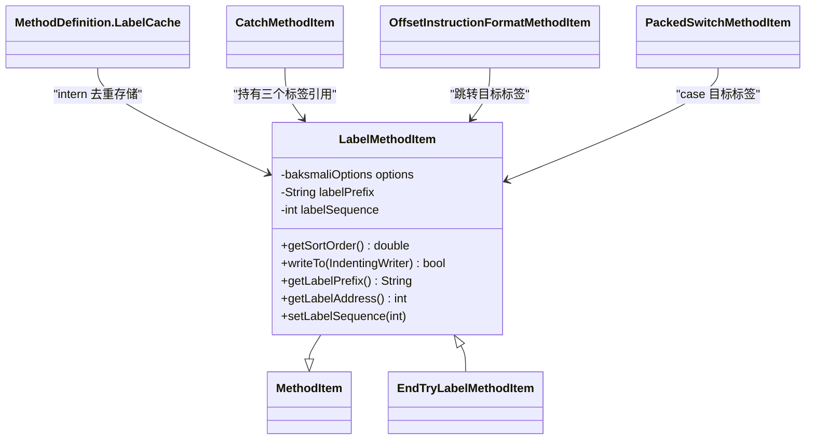

# 🏷️ LabelMethodItem

> 方法体内所有标签（`:goto_0`、`:try_start_0`、`:catch_0` 等）的统一表示，通过 `LabelCache` 去重内化。

| 属性 | 值 |
|---|---|
| 完整类名 | `org.jf.baksmali.Adaptors.LabelMethodItem` |
| 源码链接 | [Adaptors/LabelMethodItem.java](https://github.com/android-security-engineer/ZjDroid-skills/blob/master/src/org/jf/baksmali/Adaptors/LabelMethodItem.java) |
| 继承 | `MethodItem` |
| sortOrder | `0`（在 debug 信息之后，指令之前） |

---

## 🎯 职责

`LabelMethodItem` 代表 smali 中的跳转标签（`:` 开头的行）。它有以下特性：

1. **去重内化**：通过 `MethodDefinition.LabelCache.internLabel()` 保证同地址同前缀只有一个实例
2. **两种编号模式**：`useSequentialLabels` 为 false 时用 code address 的十六进制（`:goto_4`），为 true 时用从 0 开始的序号（`:goto_0`）
3. **equals/hashCode 重写**：基于 `(codeAddress, labelPrefix)` 实现内化的 key 语义

---

## 🧠 关键实现

**writeTo — 标签输出**

```java
public boolean writeTo(IndentingWriter writer) throws IOException {
    writer.write(':');
    writer.write(labelPrefix);
    if (options.useSequentialLabels) {
        writer.printUnsignedLongAsHex(labelSequence);
    } else {
        writer.printUnsignedLongAsHex(this.getLabelAddress());
    }
    return true;
}
```

输出示例（`useSequentialLabels=false`）：`:goto_4`、`:try_start_a`、`:catch_1e`、`:pswitch_0`

**equals/hashCode 保证去重**

```java
public boolean equals(Object o) {
    if (!(o instanceof LabelMethodItem)) {
        return false;
    }
    return this.compareTo((MethodItem)o) == 0;
}

public int hashCode() {
    return getCodeAddress();  // 同地址的标签强制走 equals 比较
}
```

**内化流程**

```java
// 在 CatchMethodItem、InstructionMethodItem（offset 指令）、PackedSwitchMethodItem 中：
LabelMethodItem label = methodDef.getLabelCache().internLabel(
    new LabelMethodItem(options, targetAddress, "goto_"));
```

所有引用同一 `(address, prefix)` 的调用都会得到同一个 `LabelMethodItem` 对象，确保在输出列表中只出现一次。

---

## 📋 标签前缀清单

| 前缀 | 来源 | 示例 |
|---|---|---|
| `goto_` | goto/if 跳转目标 | `:goto_4` |
| `cond_` | 条件跳转（备用） | `:cond_0` |
| `try_start_` | try 块开始 | `:try_start_0` |
| `try_end_` | try 块结束 | `:try_end_8` |
| `catch_` | 异常处理器入口 | `:catch_c` |
| `catchall_` | catch-all 入口 | `:catchall_0` |
| `pswitch_` | packed-switch case 目标 | `:pswitch_14` |
| `sswitch_` | sparse-switch case 目标 | `:sswitch_0` |

---

## 🔗 关系



---

## 📌 小结

`LabelMethodItem` 是 smali 方法体控制流可读性的核心——它将 DEX 中的字节码偏移转换为有意义的标签名称。`LabelCache` 的内化机制保证了多个引用同一目标的指令（如多个 `if-*` 指向同一处）在输出中只产生一个标签行，而不是重复的同名标签。
