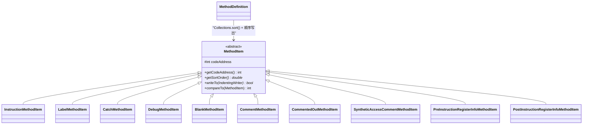

# 🔩 MethodItem

> 方法体内所有可渲染元素的抽象基类，通过排序机制保证 smali 文本的正确顺序。

| 属性 | 值 |
|---|---|
| 完整类名 | `org.jf.baksmali.Adaptors.MethodItem` |
| 源码链接 | [Adaptors/MethodItem.java](https://github.com/android-security-engineer/ZjDroid-skills/blob/master/src/org/jf/baksmali/Adaptors/MethodItem.java) |
| 类型 | `abstract class implements Comparable<MethodItem>` |
| 直接子类 | 15+ 个（InstructionMethodItem、LabelMethodItem、CatchMethodItem 等） |

---

## 🎯 职责

`MethodItem` 定义了方法体内所有"可渲染行元素"的公共协议：

1. **位置信息**：`codeAddress` 字段记录该元素对应的字节码偏移
2. **排序协议**：`getSortOrder()` 返回 `double` 值，与 `codeAddress` 共同决定输出顺序
3. **渲染协议**：`writeTo(IndentingWriter)` 将自身内容写入输出流，返回 `boolean` 指示是否需要在后面加换行

---

## 🧠 关键实现

**完整类体**

```java
public abstract class MethodItem implements Comparable<MethodItem> {
    protected final int codeAddress;

    protected MethodItem(int codeAddress) {
        this.codeAddress = codeAddress;
    }

    public int getCodeAddress() {
        return codeAddress;
    }

    // 返回 double，决定同地址元素的相对顺序
    public abstract double getSortOrder();

    public int compareTo(MethodItem methodItem) {
        int result = ((Integer) codeAddress).compareTo(methodItem.codeAddress);
        if (result == 0){
            return ((Double)getSortOrder()).compareTo(methodItem.getSortOrder());
        }
        return result;
    }

    public abstract boolean writeTo(IndentingWriter writer) throws IOException;
}
```

**排序设计的精妙之处**

`sortOrder` 使用 `double` 类型是刻意的——这允许未来在已有顺序之间插入新类型而无需修改现有值。当前各子类的典型值：

| sortOrder | 谁用它 | 产生的 smali 行 |
|---|---|---|
| -4 | `BeginEpilogueMethodItem` / `EndPrologueMethodItem` | `.epilogue` / (prologue end) |
| -3 | `SetSourceFileMethodItem` | `.source "Foo.java"` |
| -2 | `LineNumberMethodItem` | `.line 42` |
| -1 | `StartLocalMethodItem` / `EndLocalMethodItem` | `.local p0, "this":Lcom/Foo;` |
| 0 | `LabelMethodItem` | `:goto_0` |
| 100 | `InstructionMethodItem` | `invoke-virtual {p0}, ...` |
| 102 | `CatchMethodItem` | `.catch Ljava/lang/Exception; {:try_start_0 .. :try_end_0} :catch_0` |

这确保了 smali 文件中 debug 信息先于指令、catch 指令紧跟指令之后的正确顺序。

---

## 🔗 关系



---

## 📌 小结

`MethodItem` 的设计体现了"策略模式 + 排序聚合"的思想：所有方法内元素（无论是指令、标签还是调试信息）都通过同一个接口管理，`MethodDefinition` 只需要收集、排序、线性输出，不需要关心每种元素的具体格式。这使得添加新的输出元素类型（如寄存器注释）只需要新增 `MethodItem` 子类，不需要修改核心流程。
