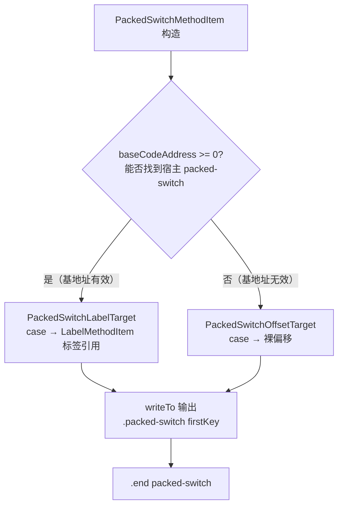

# 🔀 PackedSwitchMethodItem

> 将 `packed-switch-payload` 指令渲染为 smali `.packed-switch` 块的专用类。

| 属性 | 值 |
|---|---|
| 完整类名 | `org.jf.baksmali.Adaptors.Format.PackedSwitchMethodItem` |
| 源码链接 | [Adaptors/Format/PackedSwitchMethodItem.java](https://github.com/android-security-engineer/ZjDroid-skills/blob/master/src/org/jf/baksmali/Adaptors/Format/PackedSwitchMethodItem.java) |
| 继承 | `InstructionMethodItem<PackedSwitchPayload>` |

---

## 🎯 职责

`packed-switch` 是 Dalvik 中针对连续整数 case（Java switch 语句的常见编译结果）的优化指令。`PackedSwitchMethodItem` 负责：

1. 通过 `methodDef.getPackedSwitchBaseAddress(codeAddress)` 反向查找宿主 `packed-switch` 指令的地址
2. 将每个 case 目标偏移转换为 `LabelMethodItem`（label 引用）或裸偏移（若基地址无效）
3. 输出完整的 `.packed-switch firstKey ... .end packed-switch` 多行块

---

## 🧠 关键实现

**构造函数：建立 case → label 映射**

```java
public PackedSwitchMethodItem(MethodDefinition methodDef, int codeAddress, PackedSwitchPayload instruction) {
    super(methodDef, codeAddress, instruction);

    int baseCodeAddress = methodDef.getPackedSwitchBaseAddress(codeAddress);

    targets = new ArrayList<PackedSwitchTarget>();
    boolean first = true;
    int firstKey = 0;
    if (baseCodeAddress >= 0) {
        for (SwitchElement switchElement: instruction.getSwitchElements()) {
            if (first) {
                firstKey = switchElement.getKey();
                first = false;
            }
            LabelMethodItem label = methodDef.getLabelCache().internLabel(
                    new LabelMethodItem(methodDef.classDef.options,
                            baseCodeAddress + switchElement.getOffset(), "pswitch_"));
            targets.add(new PackedSwitchLabelTarget(label));
        }
    } else {
        // 无法找到宿主指令时，退化为原始偏移输出
        for (SwitchElement switchElement: instruction.getSwitchElements()) {
            // ...
            targets.add(new PackedSwitchOffsetTarget(switchElement.getOffset()));
        }
    }
    this.firstKey = firstKey;
}
```

**writeTo：多行输出**

```java
@Override
public boolean writeTo(IndentingWriter writer) throws IOException {
    writer.write(".packed-switch ");
    IntegerRenderer.writeTo(writer, firstKey);
    writer.indent(4);
    writer.write('\n');
    int key = firstKey;
    for (PackedSwitchTarget target: targets) {
        target.writeTargetTo(writer);
        writeResourceId(writer, key);  // 如果 key 是资源 ID，追加注释
        writer.write('\n');
        key++;
    }
    writer.deindent(4);
    writer.write(".end packed-switch");
    return true;
}
```

输出示例：
```smali
.packed-switch 0x1
    :pswitch_14
    :pswitch_1a
    :pswitch_22
.end packed-switch
```

---

## 📌 小结

`PackedSwitchMethodItem` 展示了 payload 指令渲染的典型模式：构造时通过逆向映射（`packedSwitchMap`）找到宿主指令，从而将裸偏移转换为有意义的标签引用。内部使用策略模式（`PackedSwitchLabelTarget` vs `PackedSwitchOffsetTarget`）处理基地址有效/无效两种情况。

### 渲染流程与策略选择


