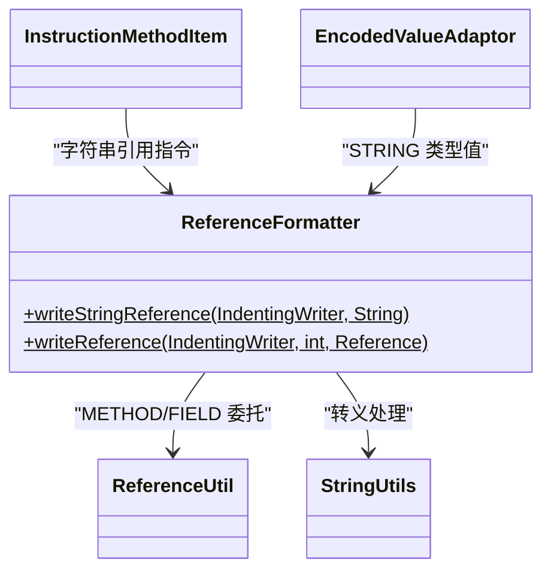

# 🔗 ReferenceFormatter

> 将 DEX 中各类引用（字符串、类型、方法、字段）格式化为 smali 文本表示的工具类，并负责字符串字面量的转义处理。

| 属性 | 值 |
|---|---|
| 完整类名 | `org.jf.baksmali.Adaptors.ReferenceFormatter` |
| 源码链接 | [Adaptors/ReferenceFormatter.java](https://github.com/android-security-engineer/ZjDroid-skills/blob/master/src/org/jf/baksmali/Adaptors/ReferenceFormatter.java) |
| 类型 | 工具类（纯静态方法） |

---

## 🎯 职责

DEX 中有四种引用类型（`ReferenceType` 枚举）：字符串、类型、方法、字段。`ReferenceFormatter` 提供：

1. **`writeStringReference`**：输出带引号的转义字符串字面量（`"hello\nworld"`）
2. **`writeReference`**：根据引用类型分发到对应的格式化方法

---

## 🧠 关键实现

**字符串引用（转义处理）**

```java
public static void writeStringReference(IndentingWriter writer, String item) throws IOException {
    writer.write('"');
    StringUtils.writeEscapedString(writer, item);
    writer.write('"');
}
```

`StringUtils.writeEscapedString()` 处理 `\n`、`\t`、`\\`、`\uXXXX` 等转义，确保包含特殊字符的字符串在 smali 中合法。

**通用引用分发**

```java
public static void writeReference(IndentingWriter writer, int referenceType,
                                  Reference reference) throws IOException {
    switch (referenceType) {
        case ReferenceType.STRING:
            writeStringReference(writer, ((StringReference)reference).getString());
            return;
        case ReferenceType.TYPE:
            writer.write(((TypeReference)reference).getType());
            return;
        case ReferenceType.METHOD:
            ReferenceUtil.writeMethodDescriptor(writer, (MethodReference)reference);
            return;
        case ReferenceType.FIELD:
            ReferenceUtil.writeFieldDescriptor(writer, (FieldReference)reference);
            return;
        default:
            throw new IllegalStateException("Unknown reference type");
    }
}
```

各引用类型的输出格式：

| 类型 | 输出示例 |
|---|---|
| STRING | `"Hello, World!"` |
| TYPE | `Ljava/lang/String;` |
| METHOD | `Ljava/lang/String;->valueOf(I)Ljava/lang/String;` |
| FIELD | `Lcom/example/Foo;->mCount:I` |

---

## 🔗 关系



---

## 📌 小结

`ReferenceFormatter` 是引用类型序列化的统一入口。字符串引用需要转义处理（由 `StringUtils` 完成），类型引用直接写 descriptor，方法和字段引用委托给 dexlib2 的 `ReferenceUtil`。这种分层设计使各种引用格式的输出逻辑高度内聚。
