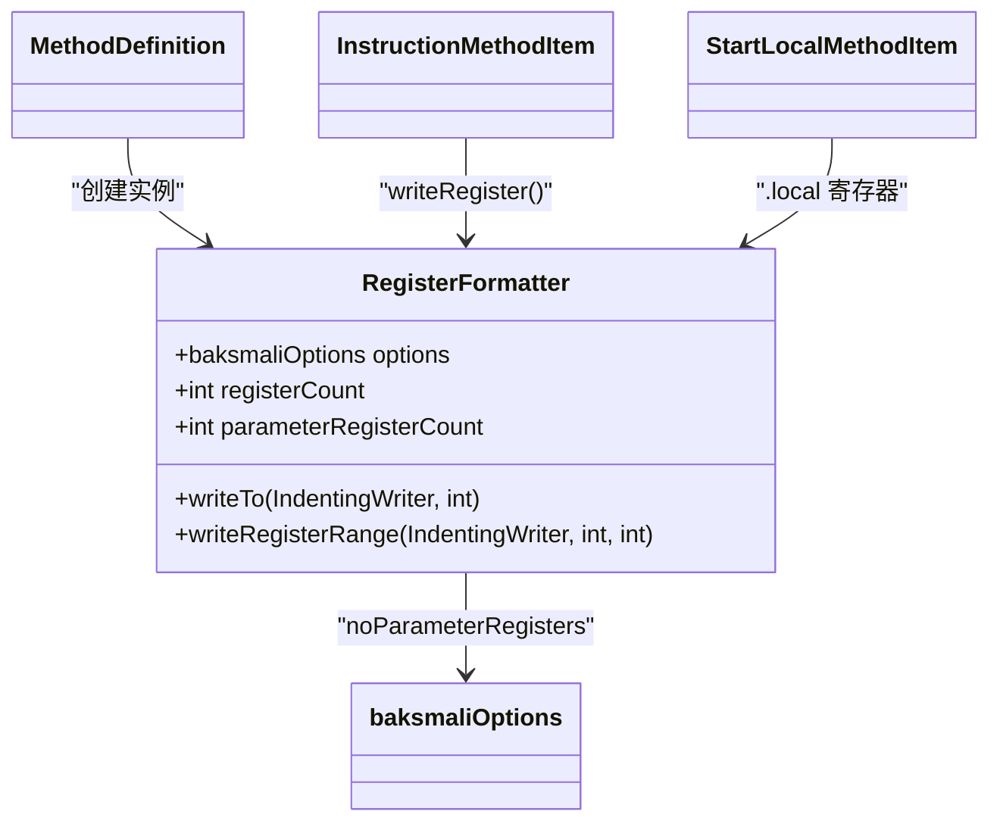

# 🏷️ RegisterFormatter

> 将 Dalvik 寄存器编号转换为 `v0`/`p0` 格式文本的格式化工具类。

| 属性 | 值 |
|---|---|
| 完整类名 | `org.jf.baksmali.Adaptors.RegisterFormatter` |
| 源码链接 | [Adaptors/RegisterFormatter.java](https://github.com/android-security-engineer/ZjDroid-skills/blob/master/src/org/jf/baksmali/Adaptors/RegisterFormatter.java) |
| 实例模型 | 每个 `MethodDefinition` 创建一个实例 |

---

## 🎯 职责

Dalvik 中寄存器以绝对编号（`v0`、`v1`...`vN`）存储，但 smali 语法支持用 `p0`、`p1` 表示参数寄存器（更可读）。`RegisterFormatter` 负责在两种表示之间切换：

- **`v<n>` 模式**：始终使用绝对编号（当 `noParameterRegisters == true` 时）
- **`p<n>` 模式**：参数寄存器用 `p` 前缀（当 `noParameterRegisters == false` 时，默认）

---

## 🧠 关键实现

**关键字段**

```java
public final int registerCount;           // 方法总寄存器数
public final int parameterRegisterCount;  // 参数寄存器数（含 this 指针）
```

**writeTo — 单寄存器输出**

```java
public void writeTo(IndentingWriter writer, int register) throws IOException {
    if (!options.noParameterRegisters) {
        if (register >= registerCount - parameterRegisterCount) {
            writer.write('p');
            writer.printSignedIntAsDec((register - (registerCount - parameterRegisterCount)));
            return;
        }
    }
    writer.write('v');
    writer.printSignedIntAsDec(register);
}
```

设方法有 5 个总寄存器（`registerCount=5`），2 个参数寄存器（`parameterRegisterCount=2`）：
- `v0`、`v1`、`v2` → 局部寄存器（编号 0-2）
- `v3` → `p0`（编号 `5-2=3` 以上）
- `v4` → `p1`

**writeRegisterRange — 范围指令（Format3rc）**

```java
public void writeRegisterRange(IndentingWriter writer, int startRegister, int lastRegister) throws IOException {
    if (!options.noParameterRegisters) {
        assert startRegister <= lastRegister;
        if (startRegister >= registerCount - parameterRegisterCount) {
            writer.write("{p");
            writer.printSignedIntAsDec(startRegister - (registerCount - parameterRegisterCount));
            writer.write(" .. p");
            writer.printSignedIntAsDec(lastRegister - (registerCount - parameterRegisterCount));
            writer.write('}');
            return;
        }
    }
    writer.write("{v");
    writer.printSignedIntAsDec(startRegister);
    writer.write(" .. v");
    writer.printSignedIntAsDec(lastRegister);
    writer.write('}');
}
```

注意：仅当 **起始寄存器也是参数寄存器** 时才使用 `p` 格式，否则即使末尾是参数寄存器也用 `v` 格式，避免 `{v20 .. p1}` 这种混合格式带来歧义。

---

## 🔗 关系



---

## 📌 小结

`RegisterFormatter` 是 baksmali 中少数几个同时被"方法层"（`MethodDefinition`）和"指令层"（`InstructionMethodItem`）都直接引用的共享服务类。`p0` 表示法在逆向工程中极其重要——它让分析师一眼看出哪些寄存器是方法入参，而不必手动计算偏移。
