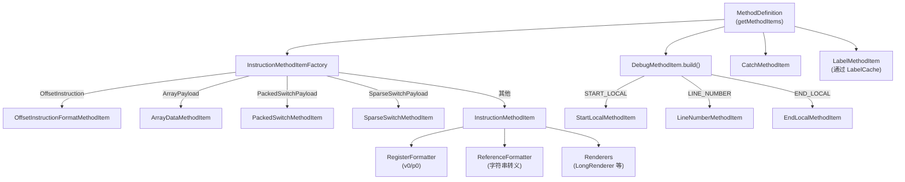

# 🧩 Adaptors — smali 文本生成层

`Adaptors` 包是 baksmali 的核心输出层，包含所有负责将 dexlib2 数据结构转换为 smali 文本的"适配器"类。

---

## 📦 包结构

```
Adaptors/
├── MethodItem.java                   # 抽象基类（所有 smali 行元素）
├── LabelMethodItem.java              # :label_xxxx
├── BlankMethodItem.java              # 空行分隔
├── CommentMethodItem.java            # # 注释行
├── CommentedOutMethodItem.java       # 整块注释（包裹另一个 MethodItem）
├── CatchMethodItem.java              # .catch / .catchall
├── EndTryLabelMethodItem.java        # :try_end_xxxx
├── SyntheticAccessCommentMethodItem  # 访问器注释
├── PreInstructionRegisterInfoMethodItem  # 寄存器分析前注释
├── PostInstructionRegisterInfoMethodItem # 寄存器分析后注释
├── ClassDefinition.java              # 类级别输出
├── MethodDefinition.java             # 方法级别输出（含 LabelCache）
├── FieldDefinition.java              # 字段定义
├── AnnotationFormatter.java          # .annotation 块
├── RegisterFormatter.java            # v0 / p0 格式转换
├── ReferenceFormatter.java           # 字符串引用转义
├── CommentingIndentingWriter.java    # 将输出包装为注释
├── Format/                           # 指令格式子包
│   ├── InstructionMethodItem.java        # 核心（30+ 格式分支）
│   ├── InstructionMethodItemFactory.java # 分发工厂
│   ├── OffsetInstructionFormatMethodItem # 带偏移指令（goto/if）
│   ├── PackedSwitchMethodItem.java       # .packed-switch
│   ├── SparseSwitchMethodItem.java       # .sparse-switch
│   ├── ArrayDataMethodItem.java          # .array-data
│   └── UnresolvedOdexInstructionMethodItem
├── Debug/                            # 调试信息子包
│   ├── DebugMethodItem.java          # 工厂基类
│   ├── StartLocalMethodItem.java     # .local
│   ├── EndLocalMethodItem.java       # .end local
│   ├── RestartLocalMethodItem.java   # .restart local
│   ├── LineNumberMethodItem.java     # .line
│   ├── SetSourceFileMethodItem.java  # .source（运行时覆盖）
│   ├── BeginEpilogueMethodItem.java  # .epilogue
│   ├── EndPrologueMethodItem.java    # .prologue（结束）
│   └── LocalFormatter.java           # 变量名/类型格式化
└── EncodedValue/                     # 编码常量值子包
    ├── EncodedValueAdaptor.java          # 分发路由
    ├── AnnotationEncodedValueAdaptor.java # 注解值（嵌套）
    └── ArrayEncodedValueAdaptor.java      # 数组值
```

---

## 🏛️ 核心抽象：MethodItem

所有方法体内的文本元素（指令、标签、catch、debug info）都继承自 `MethodItem`：

```java
public abstract class MethodItem implements Comparable<MethodItem> {
    protected final int codeAddress;   // 字节码偏移（用于排序）

    public abstract double getSortOrder();  // 同地址时的次级排序键
    public abstract boolean writeTo(IndentingWriter writer) throws IOException;

    public int compareTo(MethodItem methodItem) {
        int result = ((Integer) codeAddress).compareTo(methodItem.codeAddress);
        if (result == 0){
            return ((Double)getSortOrder()).compareTo(methodItem.getSortOrder());
        }
        return result;
    }
}
```

各子类的 `sortOrder` 值设计：

| 类型 | sortOrder | 含义 |
|---|---|---|
| `BeginEpilogueMethodItem` | -4 | 在大多数元素之前 |
| `EndPrologueMethodItem` | -4 | 同上 |
| `SetSourceFileMethodItem` | -3 | 源文件指令 |
| `LineNumberMethodItem` | -2 | 行号 |
| `StartLocalMethodItem` | -1 | 局部变量开始 |
| `LabelMethodItem` | 0 | 标签 |
| `CommentMethodItem` | 负数 | 注释（可配置） |
| `InstructionMethodItem` | 100 | 普通指令 |
| `CatchMethodItem` | 102 | catch 指令（在指令之后） |

---

## 🗺️ 调用关系图



---

## 📋 子页面导航

| 页面 | 说明 |
|---|---|
| [MethodItem](./MethodItem) | 所有方法体元素的抽象基类 |
| [InstructionMethodItem](./InstructionMethodItem) | 核心指令渲染，覆盖 30+ DEX 格式 |
| [InstructionMethodItemFactory](./InstructionMethodItemFactory) | 按指令类型分发到具体 Item |
| [DebugMethodItem](./DebugMethodItem) | 调试信息工厂与各 debug Item |
| [CatchMethodItem](./CatchMethodItem) | try/catch 块渲染 |
| [RegisterFormatter](./RegisterFormatter) | 寄存器格式转换器 |
| [EncodedValueAdaptor](./EncodedValueAdaptor) | 常量/注解值渲染路由 |

---

::: info 与 ZjDroid 的连接
ZjDroid 的 [`DexFileBuilder`](/source/smali/DexFileBuilder) 在重新汇编修改后的 smali 时，生成的文本格式就由这套 Adaptors 决定。理解 Adaptors 输出格式，有助于排查脱壳后 smali 无法重汇编的问题。
:::
