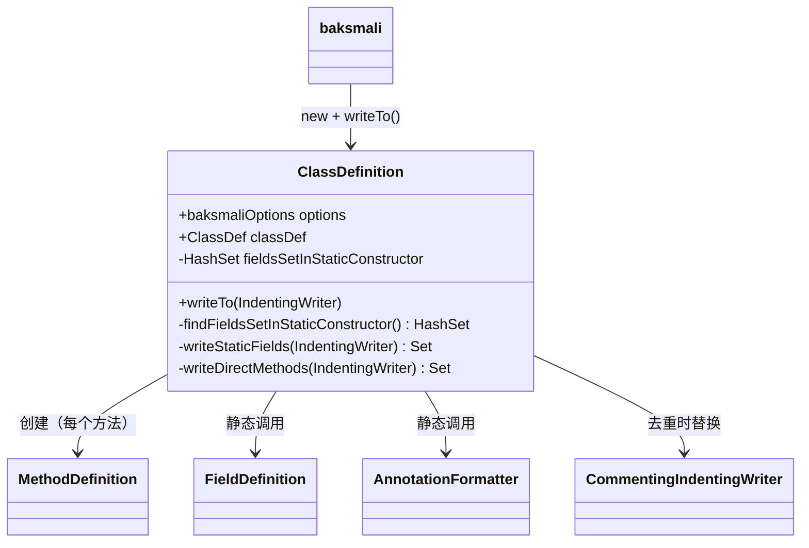

# 📦 ClassDefinition

> 单个 DEX 类的 smali 文本生成器，负责从类头到最后一个方法体的完整输出。

| 属性 | 值 |
|---|---|
| 完整类名 | `org.jf.baksmali.Adaptors.ClassDefinition` |
| 源码链接 | [Adaptors/ClassDefinition.java](https://github.com/android-security-engineer/ZjDroid-skills/blob/master/src/org/jf/baksmali/Adaptors/ClassDefinition.java) |
| 依赖 | `baksmaliOptions`、`ClassDef`（dexlib2 接口）、`MethodDefinition` |
| 生命周期 | 每个 ClassDef 创建一个实例，写出后丢弃 |

---

## 🎯 职责

`ClassDefinition` 是 smali 文件层次的顶层 Adaptor：

1. **解析静态构造器**（`<clinit>`）中的 `sput*` 指令，收集"在静态构造器中赋值"的字段集合，供字段定义渲染时标注 `:` 提示
2. **按顺序输出** 类头 → 父类 → 源文件 → 接口 → 注解 → 静态字段 → 实例字段 → 直接方法 → 虚方法
3. **去重保护**：遇到重名字段/方法时，将重复项包裹进 `CommentingIndentingWriter` 注释掉，而不是崩溃

---

## 🧠 关键实现

**构造函数中的静态字段预扫描**

```java
public ClassDefinition(@Nonnull baksmaliOptions options, @Nonnull ClassDef classDef) {
    this.options = options;
    this.classDef = classDef;
    fieldsSetInStaticConstructor = findFieldsSetInStaticConstructor();
}
```

`findFieldsSetInStaticConstructor()` 遍历 `<clinit>` 方法的所有指令，收集 `SPUT*` 系列操作码引用的字段名称，帮助后续字段渲染时判断是否需要输出 `= value` 初始值。

**writeTo 的输出顺序**

```java
public void writeTo(IndentingWriter writer) throws IOException {
    writeClass(writer);         // .class public Lcom/example/Foo;
    writeSuper(writer);         // .super Ljava/lang/Object;
    writeSourceFile(writer);    // .source "Foo.java"
    writeInterfaces(writer);    // .implements Ljava/io/Serializable;
    writeAnnotations(writer);   // .annotation ...
    Set<String> staticFields = writeStaticFields(writer);
    writeInstanceFields(writer, staticFields);
    Set<String> directMethods = writeDirectMethods(writer);
    writeVirtualMethods(writer, directMethods);
}
```

**去重注释机制**

```java
IndentingWriter fieldWriter = writer;
String fieldString = ReferenceUtil.getShortFieldDescriptor(field);
if (!writtenFields.add(fieldString)) {
    writer.write("# duplicate field ignored\n");
    fieldWriter = new CommentingIndentingWriter(writer);
    // ...
}
FieldDefinition.writeTo(fieldWriter, field, setInStaticConstructor);
```

通过将 `writer` 替换为 `CommentingIndentingWriter`，重复项的所有输出行都会被自动加上 `#` 前缀，而不影响后续正常内容。

**方法分派**

```java
MethodImplementation methodImpl = method.getImplementation();
if (methodImpl == null) {
    MethodDefinition.writeEmptyMethodTo(methodWriter, method, options);
} else {
    MethodDefinition methodDefinition = new MethodDefinition(this, method, methodImpl);
    methodDefinition.writeTo(methodWriter);
}
```

没有实现体（抽象方法/native 方法）时直接调用静态工具方法，否则创建 `MethodDefinition` 实例完整渲染。

---

## 🔗 关系



---

## 📌 小结

`ClassDefinition` 是 smali 文件的"骨架构建者"——它不生成指令文本，而是负责类级别结构（头部声明、字段、方法列表）的正确顺序与去重保护。方法内部的指令细节委托给 [`MethodDefinition`](./MethodDefinition) 处理。

::: tip 脱壳关注点
脱壳生成的 DEX 有时包含重名字段（混淆或 dex 损坏），`ClassDefinition` 的去重注释机制使生成的 smali 文件仍可被 smali 重新汇编，而不是直接报错失败。
:::
