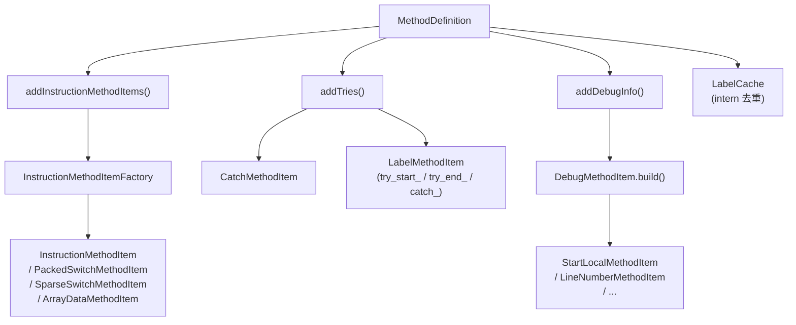

# 🔬 MethodDefinition

> 单个方法体的 smali 文本生成器，是 baksmali 最复杂的核心类。

| 属性 | 值 |
|---|---|
| 完整类名 | `org.jf.baksmali.Adaptors.MethodDefinition` |
| 源码链接 | [Adaptors/MethodDefinition.java](https://github.com/android-security-engineer/ZjDroid-skills/blob/master/src/org/jf/baksmali/Adaptors/MethodDefinition.java) |
| 代码行数 | ~558 行 |
| 内部类 | `LabelCache`、`InvalidSwitchPayload` |

---

## 🎯 职责

`MethodDefinition` 负责将 `MethodImplementation`（dexlib2 接口，封装指令列表、TryBlock、DebugItem）转换为完整的 smali 方法文本：

1. **预处理**：构建 `packedSwitchMap`/`sparseSwitchMap`（payload 偏移 → switch 指令偏移的逆向映射）
2. **收集 MethodItem**：将指令、标签、try/catch、调试信息统一表示为 `MethodItem` 列表
3. **排序输出**：按 `(codeAddress, sortOrder)` 对所有 `MethodItem` 排序后依序写出
4. **label 内化缓存**：`LabelCache` 保证同地址同前缀的 label 只创建一个实例

---

## 🧠 关键实现

**构造函数预处理 switch payload**

```java
for (int i=0; i<instructions.size(); i++) {
    Instruction instruction = instructions.get(i);
    Opcode opcode = instruction.getOpcode();
    if (opcode == Opcode.PACKED_SWITCH) {
        int codeOffset = instructionOffsetMap.getInstructionCodeOffset(i);
        int targetOffset = codeOffset + ((OffsetInstruction)instruction).getCodeOffset();
        try {
            targetOffset = findSwitchPayload(targetOffset, Opcode.PACKED_SWITCH_PAYLOAD);
        } catch (InvalidSwitchPayload ex) {
            valid = false;
        }
        if (valid) {
            packedSwitchMap.append(targetOffset, codeOffset);
        }
    }
    // 同理处理 SPARSE_SWITCH ...
}
```

提前建立 payload → 宿主指令的逆向映射，让 `PackedSwitchMethodItem` 渲染时能找到正确的基地址。

**getMethodItems — 核心调度方法**

```java
private List<MethodItem> getMethodItems() {
    ArrayList<MethodItem> methodItems = new ArrayList<MethodItem>();

    if ((classDef.options.registerInfo != 0) || (classDef.options.deodex && needsAnalyzed())) {
        addAnalyzedInstructionMethodItems(methodItems);  // 带寄存器分析
    } else {
        addInstructionMethodItems(methodItems);           // 普通路径
    }

    addTries(methodItems);                               // try/catch 标签
    if (classDef.options.outputDebugInfo) {
        addDebugInfo(methodItems);                       // .local/.line 等
    }

    // 顺序标签编号
    if (classDef.options.useSequentialLabels) {
        setLabelSequentialNumbers();
    }
    for (LabelMethodItem labelMethodItem: labelCache.getLabels()) {
        methodItems.add(labelMethodItem);
    }

    Collections.sort(methodItems);
    return methodItems;
}
```

**writeTo — 输出方法签名与体**

```java
public void writeTo(IndentingWriter writer) throws IOException {
    writer.write(".method ");
    writeAccessFlags(writer, method.getAccessFlags());
    writer.write(method.getName());
    writer.write("(");
    for (MethodParameter parameter: methodParameters) {
        writer.write(parameter.getType());
        // ...
    }
    writer.write(")");
    writer.write(method.getReturnType());
    // ...
    if (classDef.options.useLocalsDirective) {
        writer.write(".locals ");
        writer.printSignedIntAsDec(methodImpl.getRegisterCount() - parameterRegisterCount);
    } else {
        writer.write(".registers ");
        writer.printSignedIntAsDec(methodImpl.getRegisterCount());
    }
    // ...
    List<MethodItem> methodItems = getMethodItems();
    for (MethodItem methodItem: methodItems) {
        if (methodItem.writeTo(writer)) {
            writer.write('\n');
        }
    }
    writer.write(".end method\n");
}
```

**LabelCache 内化机制**

```java
public static class LabelCache {
    protected HashMap<LabelMethodItem, LabelMethodItem> labels = new HashMap<>();

    public LabelMethodItem internLabel(LabelMethodItem labelMethodItem) {
        LabelMethodItem internedLabelMethodItem = labels.get(labelMethodItem);
        if (internedLabelMethodItem != null) {
            return internedLabelMethodItem;
        }
        labels.put(labelMethodItem, labelMethodItem);
        return labelMethodItem;
    }
}
```

`LabelMethodItem` 重写了 `equals/hashCode`（基于 `codeAddress + labelPrefix`），保证同一位置同类型的标签全局只有一个对象，CatchMethodItem 和 InstructionMethodItem 都引用同一个实例。

---

## 🔗 关系



---

## 📌 小结

`MethodDefinition` 的精妙之处在于将所有方法内元素（指令、标签、try/catch、调试信息）统一抽象为 `MethodItem`，通过 `(codeAddress, sortOrder)` 双键排序后线性输出，避免了复杂的嵌套条件逻辑。`sortOrder` 的设计尤为巧妙：标签 `0`、调试 `-1~-4`、指令 `100`、catch `102`，精确控制同地址时的输出顺序。

::: warning deodex 路径
当 `classDef.options.deodex == true` 且方法含 odex-only 指令时，会走 `addAnalyzedInstructionMethodItems()` 路径，通过 `MethodAnalyzer` 进行类型推断来还原虚表调用，计算代价较高。脱壳时建议仅在必要时启用。
:::
