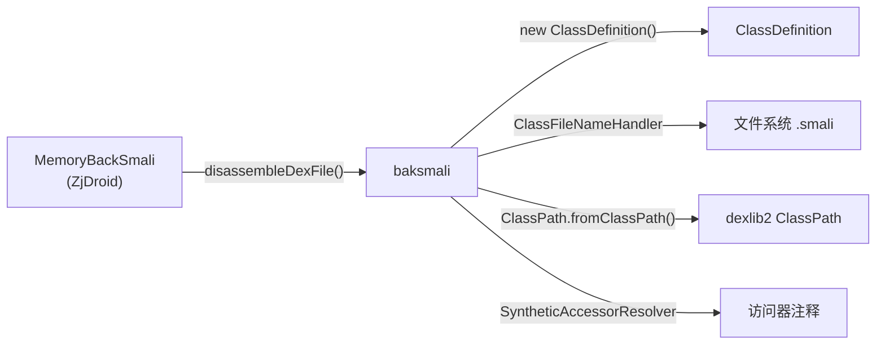

# ⚙️ baksmali

> 反汇编入口类，负责线程池调度与单文件输出逻辑。

| 属性 | 值 |
|---|---|
| 完整类名 | `org.jf.baksmali.baksmali` |
| 源码链接 | [baksmali.java](https://github.com/android-security-engineer/ZjDroid-skills/blob/master/src/org/jf/baksmali/baksmali.java) |
| 方法数 | 2（均为 static） |
| 线程模型 | `ExecutorService` 固定线程池 |

---

## 🎯 职责

`baksmali` 类只有两个静态方法，构成反汇编的顶层控制流：

1. **`disassembleDexFile`** — 接受 `DexFile` + `baksmaliOptions`，完成以下步骤：
   - 若启用寄存器分析（`registerInfo`）或 deodex，构建 `ClassPath`
   - 解析 `resourceIdFileEntries`（Android public.xml，用于注释资源 ID）
   - 按字典序排列所有 `ClassDef`（保证多次处理名称一致）
   - 创建线程池，每个类提交一个 `Callable<Boolean>`
2. **`disassembleClass`** — 处理单个 `ClassDef`：
   - 校验类描述符格式（`L...;`）
   - 通过 `ClassFileNameHandler` 获取去重后的文件路径
   - 创建 `ClassDefinition` 并调用 `writeTo(IndentingWriter)`

---

## 🧠 关键实现

**线程池调度**

```java
ExecutorService executor = Executors.newFixedThreadPool(options.jobs);
List<Future<Boolean>> tasks = Lists.newArrayList();

for (final ClassDef classDef: classDefs) {
    tasks.add(executor.submit(new Callable<Boolean>() {
        @Override public Boolean call() throws Exception {
            return disassembleClass(classDef, fileNameHandler, options);
        }
    }));
}
```

> `options.jobs` 默认为 `-1`，ZjDroid 通过 `baksmaliOptions` 设置。线程池数量应与 CPU 核心数匹配，脱壳场景通常在受限的 ART 环境中运行，建议设置为 `1` 或 `2`。

**类描述符校验与文件写出**

```java
// validate that the descriptor is formatted like we expect
if (classDescriptor.charAt(0) != 'L' ||
        classDescriptor.charAt(classDescriptor.length()-1) != ';') {
    System.err.println("Unrecognized class descriptor - " + classDescriptor + " - skipping class");
    return false;
}
// ...
ClassDefinition classDefinition = new ClassDefinition(options, classDef);
Writer writer = new IndentingWriter(bufWriter);
classDefinition.writeTo((IndentingWriter)writer);
```

**排序保证幂等性**

```java
List<? extends ClassDef> classDefs = Ordering.natural().sortedCopy(dexFile.getClasses());
```

在大小写不敏感的文件系统上，多次 baksmali/smali 循环中类名冲突处理结果一致。

---

## 🔗 关系



---

## 📌 小结

`baksmali` 是无状态的协调者——它不直接生成任何 smali 文本，只负责：组织 class 列表、驱动线程池、创建 `ClassDefinition` 并将结果写入文件。ZjDroid 的 [`MemoryBackSmali`](/source/smali/MemoryBackSmali) 直接调用 `disassembleDexFile()`，绕过 `main.java` 的命令行解析逻辑。

::: info ZjDroid 适配点
ZjDroid 在调用 `disassembleDexFile` 前会设置 `options.outputDirectory` 为 SD 卡路径，`options.jobs = 1`（避免多线程竞争 ART 内部锁），并禁用 `outputDebugInfo` 以减少输出体积。
:::
