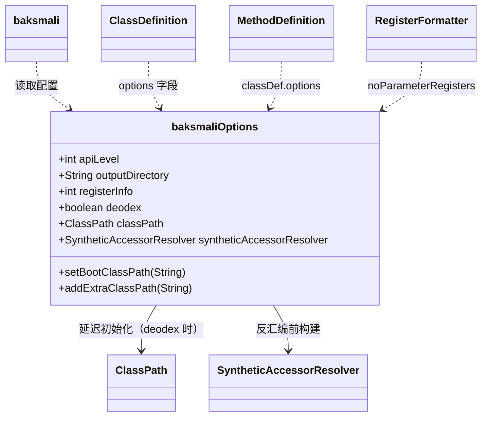

# 🗂️ baksmaliOptions

> 反汇编过程的全局参数容器，相当于 baksmali 的"控制台"。

| 属性 | 值 |
|---|---|
| 完整类名 | `org.jf.baksmali.baksmaliOptions` |
| 源码链接 | [baksmaliOptions.java](https://github.com/android-security-engineer/ZjDroid-skills/blob/master/src/org/jf/baksmali/baksmaliOptions.java) |
| 实例模型 | 普通 POJO，每次反汇编任务一个实例 |
| ZjDroid 使用 | [`MemoryBackSmali`](/source/smali/MemoryBackSmali) 构建并传入 |

---

## 🎯 职责

`baksmaliOptions` 是一个纯数据类（POJO），承担所有反汇编参数的传递：

- **基础输出控制**：输出目录、API 级别、任务数
- **寄存器信息**：是否打印前/后寄存器分析（调试模式）
- **Classpath**：启动类路径（用于 deodex）
- **资源 ID 映射**：`public.xml` → 资源名注释
- **辅助解析器**：`SyntheticAccessorResolver`、`InlineMethodResolver`

---

## 🧠 关键实现

**registerInfo 位标志**

```java
public static final int ALL      = 1;
public static final int ALLPRE   = 2;
public static final int ALLPOST  = 4;
public static final int ARGS     = 8;
public static final int DEST     = 16;
public static final int MERGE    = 32;
public static final int FULLMERGE = 64;

public int registerInfo = 0;
```

通过位掩码组合控制在 smali 注释中打印哪些寄存器状态。正常脱壳流程不需要此功能，设为 `0` 即可。

**关键字段一览**

```java
public int apiLevel = 15;              // 默认 ICS
public String outputDirectory = "out"; // smali 输出目录
public boolean noParameterRegisters = false; // false → 使用 p0/p1 格式
public boolean useLocalsDirective = false;   // false → .registers N
public boolean outputDebugInfo = true;       // 是否输出 .local/.line
public boolean addCodeOffsets = false;       // 是否在注释中加指令偏移
public boolean noAccessorComments = false;   // 是否注释 synthetic accessor
public boolean deodex = false;              // 是否 deodex
public int jobs = -1;                        // -1 = CPU 核心数
public ClassPath classPath = null;           // deodex 时构建
public SyntheticAccessorResolver syntheticAccessorResolver = null;
```

**工具方法**

```java
public void setBootClassPath(String bootClassPath) {
    bootClassPathEntries = Lists.newArrayList(bootClassPath.split(":"));
}

public void addExtraClassPath(String extraClassPath) {
    if (extraClassPath.startsWith(":")) {
        extraClassPath = extraClassPath.substring(1);
    }
    extraClassPathEntries.addAll(Arrays.asList(extraClassPath.split(":")));
}
```

---

## 🔗 关系



---

## 📌 小结

`baksmaliOptions` 是整个反汇编管道的"配置总线"——从入口 `baksmali` 一路传递到最底层的 `RegisterFormatter`。ZjDroid 的 [`MemoryBackSmali`](/source/smali/MemoryBackSmali) 会在调用 `disassembleDexFile` 之前构建该对象，重点设置 `outputDirectory`（SD 卡路径）和 `apiLevel`（目标 ROM 版本），其余参数保持默认即可完成基本脱壳任务。

::: warning 注意 jobs 参数
在 Android ART 环境中，多线程访问 dexlib2 的部分数据结构可能存在竞争。ZjDroid 通常将 `jobs` 设为 `1` 以确保稳定性。
:::
