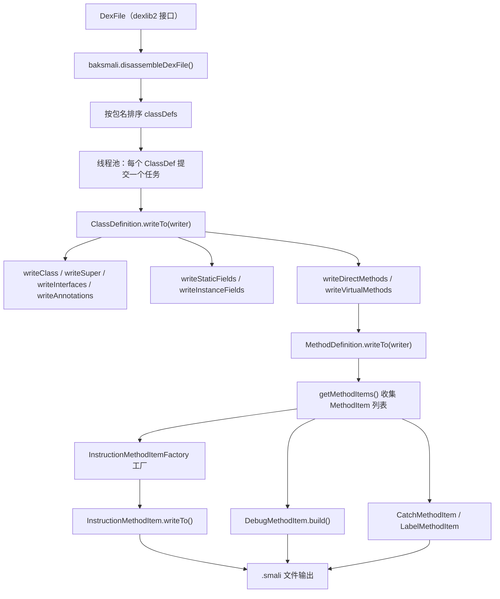
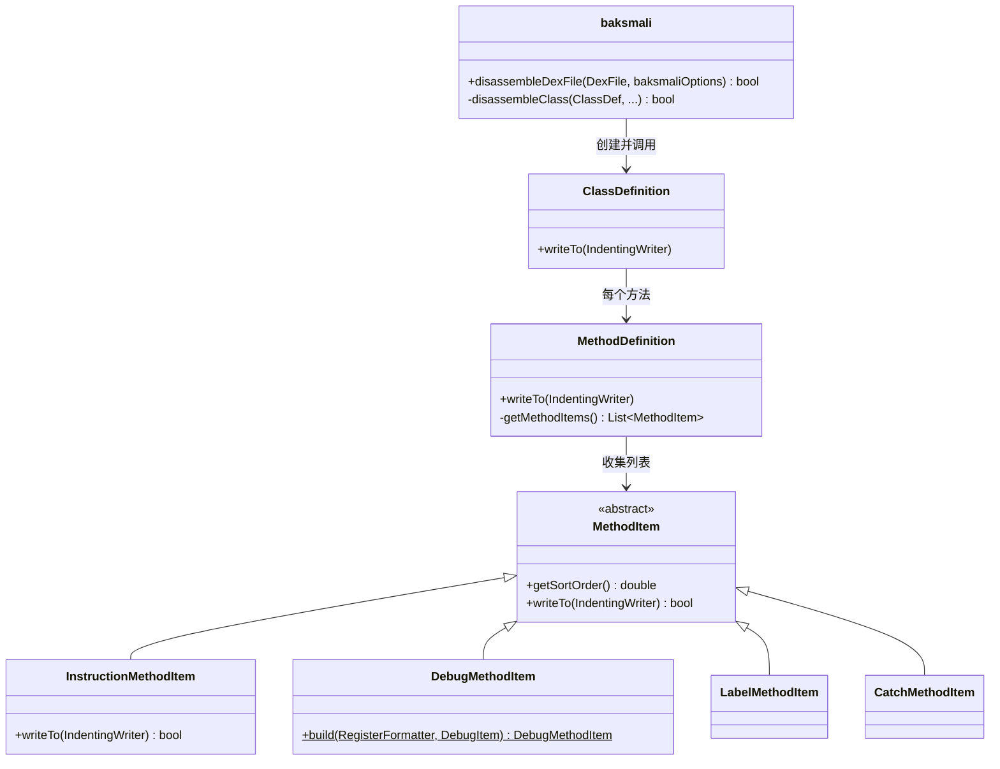

# 🔧 baksmali — DEX 反汇编器内部原理

baksmali 是 ZjDroid 内嵌的 DEX → smali 反汇编引擎，由 Ben Gruver（JesusFreke）开发并以 BSD 协议发布。ZjDroid 在脱壳流程中通过 [`MemoryBackSmali`](/source/smali/MemoryBackSmali) 直接在内存中调用 `baksmali.disassembleDexFile()`，将从内存 dump 出的 DEX 字节流即时转换为可阅读的 smali 文本。

---

## 📦 包结构

```
org.jf.baksmali/
├── baksmali.java            # 反汇编入口，线程池调度
├── baksmaliOptions.java     # 全局配置（apiLevel、classpath 等）
├── main.java                # 命令行前端（ZjDroid 不直接使用）
├── dump.java                # DEX dump 辅助
└── Adaptors/                # 各层级"适配器"——真正负责生成 smali 文本
    ├── ClassDefinition.java
    ├── MethodDefinition.java
    ├── FieldDefinition.java
    ├── MethodItem.java          # 抽象基类（排序 + 写出）
    ├── LabelMethodItem.java
    ├── CatchMethodItem.java
    ├── AnnotationFormatter.java
    ├── RegisterFormatter.java
    ├── ReferenceFormatter.java
    ├── ...
    ├── Format/                  # 指令格式渲染
    │   ├── InstructionMethodItem.java        # 核心指令渲染
    │   ├── InstructionMethodItemFactory.java # 工厂分发
    │   ├── PackedSwitchMethodItem.java
    │   ├── SparseSwitchMethodItem.java
    │   ├── ArrayDataMethodItem.java
    │   └── ...
    ├── Debug/                   # 调试信息渲染
    │   ├── DebugMethodItem.java  # 抽象工厂
    │   ├── StartLocalMethodItem.java
    │   ├── EndLocalMethodItem.java
    │   ├── LineNumberMethodItem.java
    │   └── ...
    └── EncodedValue/            # 常量/注解值渲染
        ├── EncodedValueAdaptor.java
        ├── AnnotationEncodedValueAdaptor.java
        └── ArrayEncodedValueAdaptor.java
└── Renderers/               # 基础类型文字量渲染
    ├── LongRenderer.java
    ├── IntegerRenderer.java
    ├── FloatRenderer.java
    └── ...（共 8 个）
```

---

## 🔄 反汇编流水线



::: tip ZjDroid 脱壳调用点
`MemoryBackSmali.backSmali()` 将内存中的 DEX 字节数组包装为 `DexFile`，再调用 `baksmali.disassembleDexFile(dexFile, options)` 完成反汇编，生成的 smali 文件保存到 SD 卡指定目录。
:::

---

## 📋 关键类清单

| 类名 | 所在文件 | 职责 |
|---|---|---|
| `baksmali` | [baksmali.java](https://github.com/android-security-engineer/ZjDroid-skills/blob/master/src/org/jf/baksmali/baksmali.java) | 入口，线程池调度反汇编 |
| `baksmaliOptions` | [baksmaliOptions.java](https://github.com/android-security-engineer/ZjDroid-skills/blob/master/src/org/jf/baksmali/baksmaliOptions.java) | 全局配置参数容器 |
| `ClassDefinition` | [Adaptors/ClassDefinition.java](https://github.com/android-security-engineer/ZjDroid-skills/blob/master/src/org/jf/baksmali/Adaptors/ClassDefinition.java) | 单个 class 的 smali 头 + 字段 + 方法输出 |
| `MethodDefinition` | [Adaptors/MethodDefinition.java](https://github.com/android-security-engineer/ZjDroid-skills/blob/master/src/org/jf/baksmali/Adaptors/MethodDefinition.java) | 单个方法体：指令 + label + try/catch + debug |
| `MethodItem` | [Adaptors/MethodItem.java](https://github.com/android-security-engineer/ZjDroid-skills/blob/master/src/org/jf/baksmali/Adaptors/MethodItem.java) | 方法体元素抽象基类，支持排序 |
| `InstructionMethodItem` | [Adaptors/Format/InstructionMethodItem.java](https://github.com/android-security-engineer/ZjDroid-skills/blob/master/src/org/jf/baksmali/Adaptors/Format/InstructionMethodItem.java) | 单条 Dalvik 指令渲染（覆盖 30+ 格式） |
| `InstructionMethodItemFactory` | [Adaptors/Format/InstructionMethodItemFactory.java](https://github.com/android-security-engineer/ZjDroid-skills/blob/master/src/org/jf/baksmali/Adaptors/Format/InstructionMethodItemFactory.java) | 根据指令类型分发到对应 Item 子类 |
| `DebugMethodItem` | [Adaptors/Debug/DebugMethodItem.java](https://github.com/android-security-engineer/ZjDroid-skills/blob/master/src/org/jf/baksmali/Adaptors/Debug/DebugMethodItem.java) | 调试信息工厂（local/line/prologue 等） |
| `RegisterFormatter` | [Adaptors/RegisterFormatter.java](https://github.com/android-security-engineer/ZjDroid-skills/blob/master/src/org/jf/baksmali/Adaptors/RegisterFormatter.java) | 寄存器编号 → `v0`/`p0` 格式转换 |
| `EncodedValueAdaptor` | [Adaptors/EncodedValue/EncodedValueAdaptor.java](https://github.com/android-security-engineer/ZjDroid-skills/blob/master/src/org/jf/baksmali/Adaptors/EncodedValue/EncodedValueAdaptor.java) | 所有编码值类型的统一分发渲染 |
| `LongRenderer` | [Renderers/LongRenderer.java](https://github.com/android-security-engineer/ZjDroid-skills/blob/master/src/org/jf/baksmali/Renderers/LongRenderer.java) | long/int 字面量输出为十六进制文本 |

---

## 🏗️ 层次关系



---

## 🔗 相关文档

- [baksmaliOptions 详解](./baksmaliOptions)
- [ClassDefinition 详解](./ClassDefinition)
- [MethodDefinition 详解](./MethodDefinition)
- [Adaptors 子系统总览](./Adaptors/index)
- [smali 汇编器概览](../smali/)
- [dexlib2 工具链](/internals/dexlib2/)
- [ZjDroid 脱壳流水线](/architecture/unpacking-pipeline)
