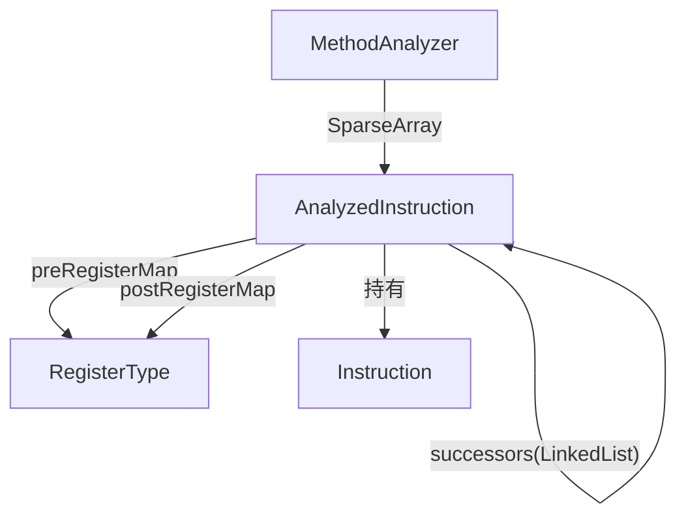

# 📊 AnalyzedInstruction

`AnalyzedInstruction` 是 `MethodAnalyzer` 构建的**控制流图节点**，每个节点对应方法体中的一条指令，持有该指令执行前（pre）和执行后（post）的全寄存器类型图，以及前驱/后继关系。

| 属性 | 值 |
|---|---|
| 源码 | [analysis/AnalyzedInstruction.java](https://github.com/android-security-engineer/ZjDroid-skills/blob/master/src/org/jf/dexlib2/analysis/AnalyzedInstruction.java) |
| 包名 | `org.jf.dexlib2.analysis` |
| 类型 | `public class AnalyzedInstruction implements Comparable<AnalyzedInstruction>` |

## 🎯 职责

1. 持有原始指令（`instruction`）和分析期间可能替换的指令（deodex 结果）
2. 维护**前驱**（`predecessors: TreeSet`）和**后继**（`successors: LinkedList`）列表
3. 持有执行前（`preRegisterMap`）和执行后（`postRegisterMap`）的寄存器类型数组

## 🧠 关键实现

### 字段定义

```java
public class AnalyzedInstruction implements Comparable<AnalyzedInstruction> {
    protected Instruction instruction;         // 当前（可能已 deodex 的）指令
    protected final int instructionIndex;      // 在方法体中的索引（-1 = 起始虚节点）

    // 控制流图边
    protected final TreeSet<AnalyzedInstruction> predecessors = new TreeSet<>();
    protected final LinkedList<AnalyzedInstruction> successors = new LinkedList<>();

    // 寄存器类型图（大小 = registerCount）
    protected final RegisterType[] preRegisterMap;
    protected final RegisterType[] postRegisterMap;

    // deodex 时需要保存原始指令，以便重新 deodex（当新的类型信息到达时）
    protected final Instruction originalInstruction;

    public AnalyzedInstruction(Instruction instruction, int instructionIndex, int registerCount) {
        this.instruction = instruction;
        this.originalInstruction = instruction;
        this.instructionIndex = instructionIndex;
        this.preRegisterMap = new RegisterType[registerCount];
        this.postRegisterMap = new RegisterType[registerCount];
        Arrays.fill(preRegisterMap, RegisterType.UNKNOWN_TYPE);
        Arrays.fill(postRegisterMap, RegisterType.UNKNOWN_TYPE);
    }
}
```

### 与 Comparable 的关系

```java
@Override public int compareTo(@Nonnull AnalyzedInstruction other) {
    return Integer.compare(instructionIndex, other.instructionIndex);
}
```

`predecessors` 使用 `TreeSet` 确保前驱集合按指令索引有序，方便 worklist 算法按拓扑顺序处理。

## 🔗 关系



## 📌 小结

`AnalyzedInstruction` 是 CFG（控制流图）和数据流分析的核心节点。`MethodAnalyzer` 将所有节点存在 `SparseArray<AnalyzedInstruction>`（以 code offset 为键），分析完成后可通过 `getAnalyzedInstructions()` 获取完整 CFG，用于 deodex、寄存器类型查询或字节码验证。
