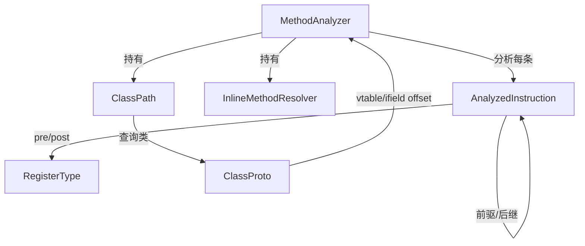

# 🔬 MethodAnalyzer

`MethodAnalyzer` 是 dexlib2 中最复杂的类，实现了对单个方法字节码的**数据流分析**（推断每条指令执行前后各寄存器的类型）、**odex 指令还原**（deodex）和可选的**字节码验证**。

| 属性 | 值 |
|---|---|
| 源码 | [analysis/MethodAnalyzer.java](https://github.com/android-security-engineer/ZjDroid-skills/blob/master/src/org/jf/dexlib2/analysis/MethodAnalyzer.java) |
| 包名 | `org.jf.dexlib2.analysis` |
| 类型 | `public class MethodAnalyzer` |

## 🎯 职责

1. **构建控制流图（CFG）**：为每条指令建立 `AnalyzedInstruction` 节点，链接前驱/后继关系
2. **传播寄存器类型**：从方法入口参数类型出发，沿控制流传播，在汇合点 merge 类型
3. **deodex**：将 `iget-quick`、`invoke-virtual-quick` 等 ODEX_ONLY 指令还原为标准引用指令
4. **两遍设计**：第一遍分析（可能多次），第二遍验证（只执行一次）

## 🧠 关键实现

### 构造函数与初始化

```java
public MethodAnalyzer(@Nonnull ClassPath classPath, @Nonnull Method method,
                       @Nullable InlineMethodResolver inlineResolver) {
    this.classPath = classPath;
    this.inlineResolver = inlineResolver;
    this.method = method;
    MethodImplementation methodImpl = method.getImplementation();
    if (methodImpl == null) throw new IllegalArgumentException("The method has no implementation");
    this.methodImpl = methodImpl;

    // 虚拟起始节点：用于初始化参数寄存器类型
    startOfMethod = new AnalyzedInstruction(null, -1, methodImpl.getRegisterCount()) {
        public boolean setsRegister() { return false; }
        @Override public boolean setsWideRegister() { return false; }
        // ...
    };
}
```

### 分析核心：参数类型初始化

```java
// 参数寄存器从方法签名初始化类型：
// - this 指针 → UNINIT_THIS（在 <init> 中）或 REFERENCE(类型)
// - 基本类型参数 → INTEGER/FLOAT/LONG_LO/DOUBLE_LO 等
// - 引用类型参数 → REFERENCE(对应 ClassProto)
```

### deodex 示例：iget-quick → iget-object

当遇到 `iget-quick` 时，`MethodAnalyzer` 通过对象寄存器的当前类型查询 `ClassProto.getFieldByOffset()`，将 vtable/ifield 偏移转换为实际的 `FieldReference`，然后替换为对应的 `iget-object`/`iget-int` 等标准指令。

### 控制流分析（worklist 算法）

```
初始化 worklist = {startOfMethod}
while (worklist 非空) {
    取出 instruction
    分析该指令，更新 postRegisterMap
    对所有 successor：
        merge(successor.preRegisterMap, instruction.postRegisterMap)
        如果发生变化 → 将 successor 加入 worklist
}
```

## 🔗 关系



## 📌 小结

`MethodAnalyzer` 是 ZjDroid 处理 odex 优化内容的关键组件。当内存 dump 出的 DEX 包含 `iget-quick` 等 ODEX 指令时，必须先通过 `MethodAnalyzer.analyze()` 还原为标准指令，再写出合法 DEX。其双遍设计（分析 + 验证分离）使得 deodex 过程中寄存器类型不确定时可以多次分析同一指令直到类型收敛。

::: warning ClassPath 初始化要求
`MethodAnalyzer` 要求 `ClassPath` 已正确加载所有依赖的类定义，包括系统类（`java.lang.Object` 等）。ZjDroid 在使用时需提供包含 `android.jar` 和目标 APK 的 DEX 文件列表。
:::
