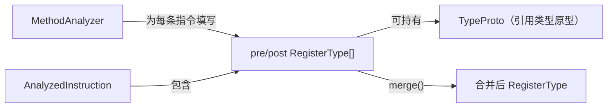

# 🏷️ RegisterType

`RegisterType` 是 dexlib2 分析层的**寄存器类型值对象**，枚举了 Dalvik 虚拟机中所有可能的寄存器类型类别（category），并定义了控制流汇合时的 merge 规则。

| 属性 | 值 |
|---|---|
| 源码 | [analysis/RegisterType.java](https://github.com/android-security-engineer/ZjDroid-skills/blob/master/src/org/jf/dexlib2/analysis/RegisterType.java) |
| 包名 | `org.jf.dexlib2.analysis` |
| 类型 | `public class RegisterType` |

## 🎯 职责

1. 表示单个寄存器在某条指令执行前/后的类型
2. 通过 `mergeTable` 矩阵定义两种类型取最小上确界（least upper bound）的规则
3. 提供常用类型单例（`UNKNOWN_TYPE`、`NULL_TYPE`、`INTEGER_TYPE` 等）

## 🧠 关键实现

### 类型类别定义（20 种）

```java
public static final byte UNKNOWN   = 0;   // 尚未分析
public static final byte UNINIT    = 1;   // 未初始化（非参数寄存器初始状态）
public static final byte NULL      = 2;   // null 引用
public static final byte ONE       = 3;   // 字面值 1（boolean/byte/short/int 兼容）
public static final byte BOOLEAN   = 4;
public static final byte BYTE      = 5;
public static final byte POS_BYTE  = 6;   // 非负 byte（0~127）
public static final byte SHORT     = 7;
public static final byte POS_SHORT = 8;
public static final byte CHAR      = 9;
public static final byte INTEGER   = 10;
public static final byte FLOAT     = 11;
public static final byte LONG_LO   = 12;  // 64-bit long 低 32 位
public static final byte LONG_HI   = 13;  // 64-bit long 高 32 位
public static final byte DOUBLE_LO = 14;
public static final byte DOUBLE_HI = 15;
public static final byte UNINIT_REF  = 16; // new-instance 后、<init> 调用前
public static final byte UNINIT_THIS = 17; // <init> 方法中的 this，super.<init> 调用前
public static final byte REFERENCE   = 18; // 已初始化的引用
public static final byte CONFLICTED  = 19; // 不兼容路径汇合，永远无效
```

### merge 表（部分）

```java
// mergeTable[UNKNOWN][X] = X（UNKNOWN 与任何类型合并，结果为另一方）
// mergeTable[UNINIT][X]  = CONFLICTED（除 UNINIT 自身）
// mergeTable[NULL][REFERENCE] = REFERENCE（null 可合并为引用类型）
// mergeTable[INTEGER][FLOAT]  = INTEGER（历史原因：float 与 int 可以互换）
// mergeTable[LONG_LO][DOUBLE_LO] = LONG_LO（wide 类型之间的特殊 merge）
```

### 实例创建（工厂方法）

```java
public static RegisterType getRegisterType(byte category, @Nullable TypeProto type) {
    // 基本类型从预建单例取
    // REFERENCE/UNINIT_REF/UNINIT_THIS 附带 TypeProto
    ...
}
```

## 🔗 关系



## 📌 小结

`RegisterType` 的 merge 表是 Dalvik 字节码验证规范的数学化表达：在控制流汇合点，两条路径上同一寄存器的类型必须取公共上界，不兼容时标记为 `CONFLICTED`。ZjDroid 的 deodex 功能依赖寄存器类型确定 `iget-quick` 操作的目标字段类型，因此 merge 表的正确性直接影响 deodex 结果。
