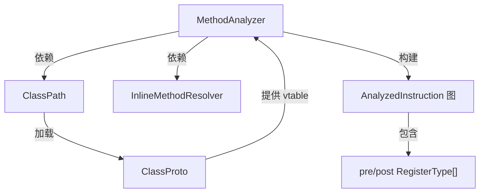

# 🔭 analysis — 寄存器类型分析与 deodex

`org.jf.dexlib2.analysis` 是 dexlib2 中最复杂的子包，实现了对 Dalvik 字节码的**数据流分析**（寄存器类型推断）和 **odex 指令还原**（deodex）。ZjDroid 依赖此包来处理从内存中提取的经过 odex 优化的方法体，将其还原为标准 DEX 格式。

## 🗺️ 在流水线中的位置

```
DexBackedMethodImplementation（含 ODEX_ONLY 指令）
          ↓ ClassPath.loadClassDef()（加载类型信息）
     MethodAnalyzer.analyze()
          ↓ 数据流分析（前驱/后继传播）
     RegisterType 推断（UNKNOWN → 具体类型）
          ↓ deodex（iget-quick → iget-object 等）
     标准化 Instruction 序列
          ↓ 传入 ImmutableMethodImplementation
     DexPool 写出
```

## 📦 关键类清单

| 类 | 职责 |
|---|---|
| [MethodAnalyzer](./MethodAnalyzer) | 核心分析器，数据流分析 + deodex + 字节码验证 |
| [AnalyzedInstruction](./AnalyzedInstruction) | 单条指令的分析结果节点，含前驱/后继和寄存器类型图 |
| [RegisterType](./RegisterType) | 寄存器类型枚举 + merge 表（用于控制流汇合） |
| [ClassPath](./ClassPath) | 类型解析上下文，加载 DEX 文件中的类定义 |
| `ClassProto` | 类原型，缓存 vtable 和 ifield 偏移（deodex 依赖） |
| `InlineMethodResolver` | 解析 `execute-inline` 内联方法（odex 特有） |

## 🔗 整体结构



::: warning deodex 场景
ZjDroid 脱壳时遇到 Art/Dalvik 优化的 `.odex` 内容（如从内存中直接 dump 的 DEX 区域），其中大量 `iget-quick`、`invoke-virtual-quick` 等 ODEX_ONLY 指令必须由 `MethodAnalyzer` deodex 后才能写入合法 `.dex`。
:::

::: tip 仅分析，不修改
`analysis` 包的所有类都是**只读分析**，不修改原始指令列表。分析结果存储在 `AnalyzedInstruction` 对象中，重建方法体时需手动将分析后的标准指令写入 `ImmutableMethodImplementation`。
:::
