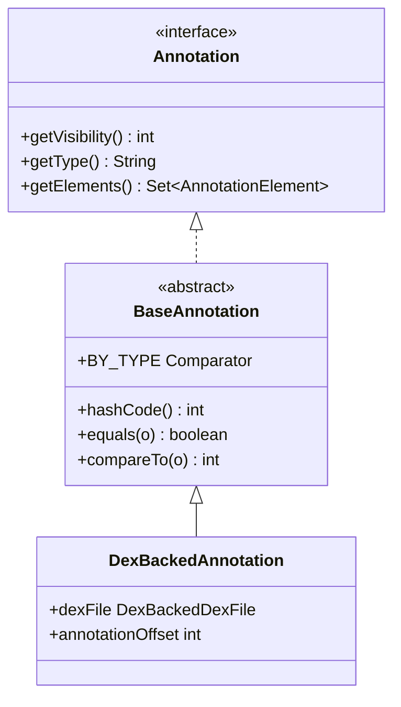

# 🏷️ BaseAnnotation

`Annotation` 接口的抽象骨架实现，提供标准的 `equals`、`hashCode`、`compareTo` 实现。

| 属性 | 值 |
|------|----|
| 包名 | `org.jf.dexlib2.base` |
| 类型 | `abstract class implements Annotation` |
| 源码 | [BaseAnnotation.java](https://github.com/android-security-engineer/ZjDroid-skills/blob/master/src/org/jf/dexlib2/base/BaseAnnotation.java) |
| 子类 | `DexBackedAnnotation`、`ImmutableAnnotation` |

## 🎯 职责

为所有注解实现类统一提供：

- **hashCode**：基于 `visibility + type + elements` 的标准哈希
- **equals**：三字段全等比较
- **compareTo**：先 visibility，再 type 字典序，再 elements 集合比较
- **BY_TYPE 比较器**：按 type 字符串排序的工具 Comparator

## 🧠 关键实现

```java
public abstract class BaseAnnotation implements Annotation {

    @Override
    public int hashCode() {
        int hashCode = getVisibility();
        hashCode = hashCode * 31 + getType().hashCode();
        return hashCode * 31 + getElements().hashCode();
    }

    @Override
    public boolean equals(Object o) {
        if (o instanceof Annotation) {
            Annotation other = (Annotation) o;
            return (getVisibility() == other.getVisibility())
                && getType().equals(other.getType())
                && getElements().equals(other.getElements());
        }
        return false;
    }

    @Override
    public int compareTo(Annotation o) {
        int res = Ints.compare(getVisibility(), o.getVisibility());
        if (res != 0) return res;
        res = getType().compareTo(o.getType());
        if (res != 0) return res;
        return CollectionUtils.compareAsSet(getElements(), o.getElements());
    }

    // 按类型字符串排序的工具比较器（用于注解集合去重排序）
    public static final Comparator<? super Annotation> BY_TYPE =
        (a1, a2) -> a1.getType().compareTo(a2.getType());
}
```

::: tip BY_TYPE 的用途
`BY_TYPE` 比较器被注解集合的底层实现用于排序和二分查找，确保同类型注解唯一，也用于在合并注解集合时去重。
:::

## 🔗 关系



## 📌 小结

`BaseAnnotation` 是 base/ 包设计价值的最佳体现：消除了每个注解实现类都要重复编写的 30+ 行样板代码，同时确保所有实现的 equals/hashCode 语义一致，避免集合操作时出现不一致行为。
