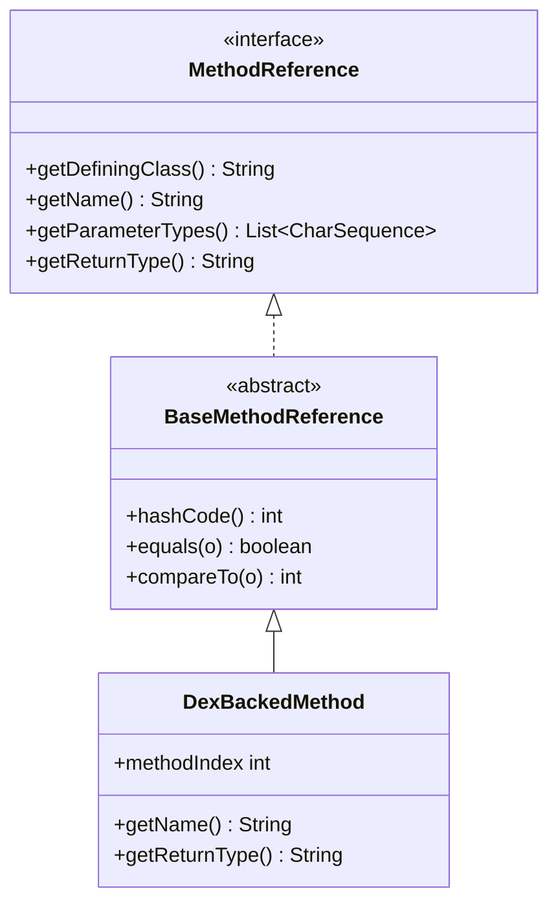

# 🔑 BaseMethodReference

`MethodReference` 接口的抽象骨架实现，提供基于四元组（definingClass + name + returnType + parameterTypes）的标准比较逻辑。

| 属性 | 值 |
|------|----|
| 包名 | `org.jf.dexlib2.base.reference` |
| 类型 | `abstract class implements MethodReference` |
| 源码 | [BaseMethodReference.java](https://github.com/android-security-engineer/ZjDroid-skills/blob/master/src/org/jf/dexlib2/base/reference/BaseMethodReference.java) |
| 子类 | `DexBackedMethod`、`ImmutableMethod`、`ImmutableMethodReference` |

## 🎯 职责

为所有方法引用实现类提供：

- **hashCode**：`definingClass + name + returnType + parameterTypes` 四元组哈希
- **equals**：四元组全等比较（参数列表用 `CharSequenceUtils.listEquals` 支持泛型比较）
- **compareTo**：按顺序比较四个字段，字典序

## 🧠 关键实现

```java
public abstract class BaseMethodReference implements MethodReference {

    @Override
    public int hashCode() {
        int hashCode = getDefiningClass().hashCode();
        hashCode = hashCode * 31 + getName().hashCode();
        hashCode = hashCode * 31 + getReturnType().hashCode();
        return hashCode * 31 + getParameterTypes().hashCode();
    }

    @Override
    public boolean equals(@Nullable Object o) {
        if (o != null && o instanceof MethodReference) {
            MethodReference other = (MethodReference) o;
            return getDefiningClass().equals(other.getDefiningClass())
                && getName().equals(other.getName())
                && getReturnType().equals(other.getReturnType())
                && CharSequenceUtils.listEquals(getParameterTypes(), other.getParameterTypes());
        }
        return false;
    }

    @Override
    public int compareTo(@Nonnull MethodReference o) {
        int res = getDefiningClass().compareTo(o.getDefiningClass());
        if (res != 0) return res;
        res = getName().compareTo(o.getName());
        if (res != 0) return res;
        res = getReturnType().compareTo(o.getReturnType());
        if (res != 0) return res;
        return CollectionUtils.compareAsIterable(
            Ordering.usingToString(), getParameterTypes(), o.getParameterTypes());
    }
}
```

::: info CharSequenceUtils.listEquals 的作用
参数类型列表的元素类型是 `CharSequence` 而非 `String`，这允许不同实现类使用不同的字符串表示（`String`、`StringBuilder` 等）。`CharSequenceUtils.listEquals` 进行内容比较而非引用比较，确保跨实现的方法引用能正确判等。
:::

**在 ZjDroid 脱壳中的作用：**

`DexBackedMethod` 继承 `BaseMethodReference`，当 `DexBackedClassDef` 遍历方法时，使用 `ImmutableMethodReference.of(item)` 创建快照，通过 `currentMethod.equals(nextMethod)` 检测重复方法（`skipDuplicates` 逻辑），确保脱壳输出的 smali 不包含重复方法定义。

## 🔗 关系



## 📌 小结

`BaseMethodReference` 统一了方法引用的比较语义，使 `DexBackedMethod`、`ImmutableMethodReference` 等不同实现可以互相 `equals` 比较，这是 dexlib2 集合操作（去重、查找）正确性的基础保障。
