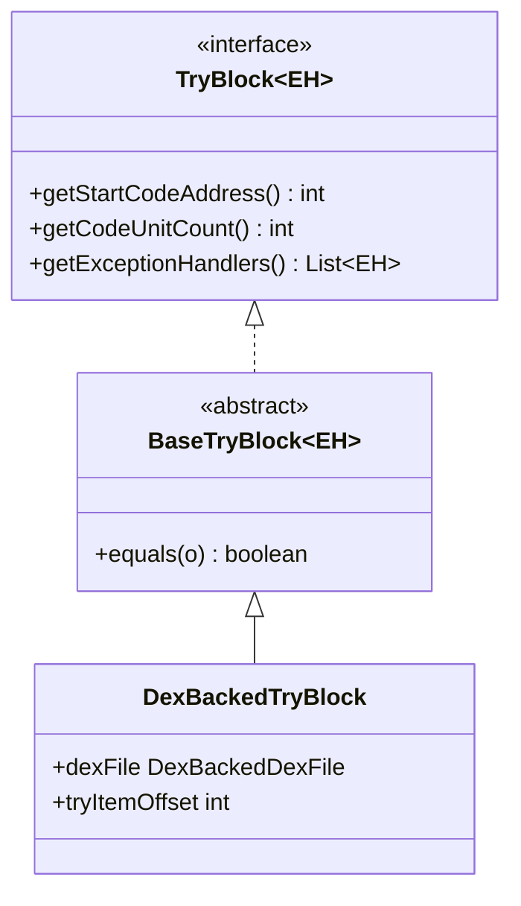

# 🛡️ BaseTryBlock

`TryBlock` 接口的抽象骨架实现，提供 try 块的 `equals` 逻辑。

| 属性 | 值 |
|------|----|
| 包名 | `org.jf.dexlib2.base` |
| 类型 | `abstract class<EH extends ExceptionHandler> implements TryBlock<EH>` |
| 源码 | [BaseTryBlock.java](https://github.com/android-security-engineer/ZjDroid-skills/blob/master/src/org/jf/dexlib2/base/BaseTryBlock.java) |
| 子类 | `DexBackedTryBlock`、`ImmutableTryBlock` |

## 🎯 职责

为所有 try 块实现类提供基于三元组的 equals 判断：

- `startCodeAddress`：try 块起始代码地址
- `codeUnitCount`：覆盖的 code unit 数量
- `exceptionHandlers`：异常处理器列表

## 🧠 关键实现

```java
public abstract class BaseTryBlock<EH extends ExceptionHandler>
        implements TryBlock<EH> {

    @Override
    public boolean equals(Object o) {
        if (o instanceof TryBlock) {
            TryBlock other = (TryBlock) o;
            return getStartCodeAddress() == other.getStartCodeAddress()
                && getCodeUnitCount() == other.getCodeUnitCount()
                && getExceptionHandlers().equals(other.getExceptionHandlers());
        }
        return false;
    }
}
```

::: info 注意：未实现 hashCode
`BaseTryBlock` 只实现了 `equals` 而未实现 `hashCode`，这在 Java 中违反了"equals 与 hashCode 必须同时一致"的契约。这是 dexlib2 原版的一个小缺陷，在实践中通过 try 块始终存储在 `List` 而非 `Set` 中来规避（List 不依赖 hashCode）。
:::

**在 ZjDroid 脱壳中的意义：**

try/catch 块信息是 smali 文件中 `.catch` 指令的来源。完整还原 try 块使脱壳后的 smali 能正确重新编译。`BaseTryBlock.equals` 确保了在合并/去重 try 块列表时的正确行为。

## 🔗 关系



## 📌 小结

`BaseTryBlock` 是 base/ 包中最简洁的骨架实现（仅 10 行有效代码），体现了"只提供真正通用的部分，不做过度设计"的原则。对于 ZjDroid 的脱壳场景，try 块的正确解析和比较确保了异常处理代码在 smali 输出中的完整性。
