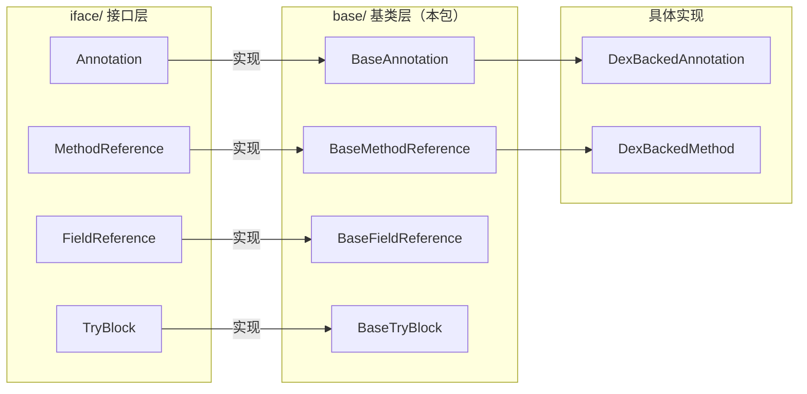

# 🔲 base —— 为接口提供行为基类

`org.jf.dexlib2.base` 包是 dexlib2 的**抽象基类层**，为 `iface/` 中定义的核心接口提供 `equals`、`hashCode`、`compareTo` 等通用方法的标准实现。

::: info 设计模式
这是典型的**骨架实现**（Skeletal Implementation）模式：接口定义契约，抽象基类实现"样板代码"，具体实现类（如 `DexBackedAnnotation`）只需继承基类并实现真正差异化的数据读取逻辑。
:::

## 📍 在 dexlib2 层次中的位置

## 📋 关键类清单

| 类 | 源码 | 职责 |
|----|------|------|
| [BaseAnnotation](./BaseAnnotation) | [源码](https://github.com/android-security-engineer/ZjDroid-skills/blob/master/src/org/jf/dexlib2/base/BaseAnnotation.java) | 注解的 equals/hashCode/compareTo |
| [BaseMethodReference](./BaseMethodReference) | [源码](https://github.com/android-security-engineer/ZjDroid-skills/blob/master/src/org/jf/dexlib2/base/reference/BaseMethodReference.java) | 方法引用的比较/哈希逻辑 |
| `BaseTryBlock` | [源码](https://github.com/android-security-engineer/ZjDroid-skills/blob/master/src/org/jf/dexlib2/base/BaseTryBlock.java) | try 块的 equals 实现 |
| `BaseAnnotationElement` | [源码](https://github.com/android-security-engineer/ZjDroid-skills/blob/master/src/org/jf/dexlib2/base/BaseAnnotationElement.java) | 注解元素的比较逻辑 |
| `base/reference/BaseFieldReference` | [源码](https://github.com/android-security-engineer/ZjDroid-skills/blob/master/src/org/jf/dexlib2/base/reference/BaseFieldReference.java) | 字段引用的 equals/hashCode |
| `base/reference/BaseTypeReference` | [源码](https://github.com/android-security-engineer/ZjDroid-skills/blob/master/src/org/jf/dexlib2/base/reference/BaseTypeReference.java) | 类型引用的比较逻辑 |

## 🔗 相关文档

- [iface/ 接口层](../iface/)
- [dexbacked/ 实现层](../dexbacked/)
