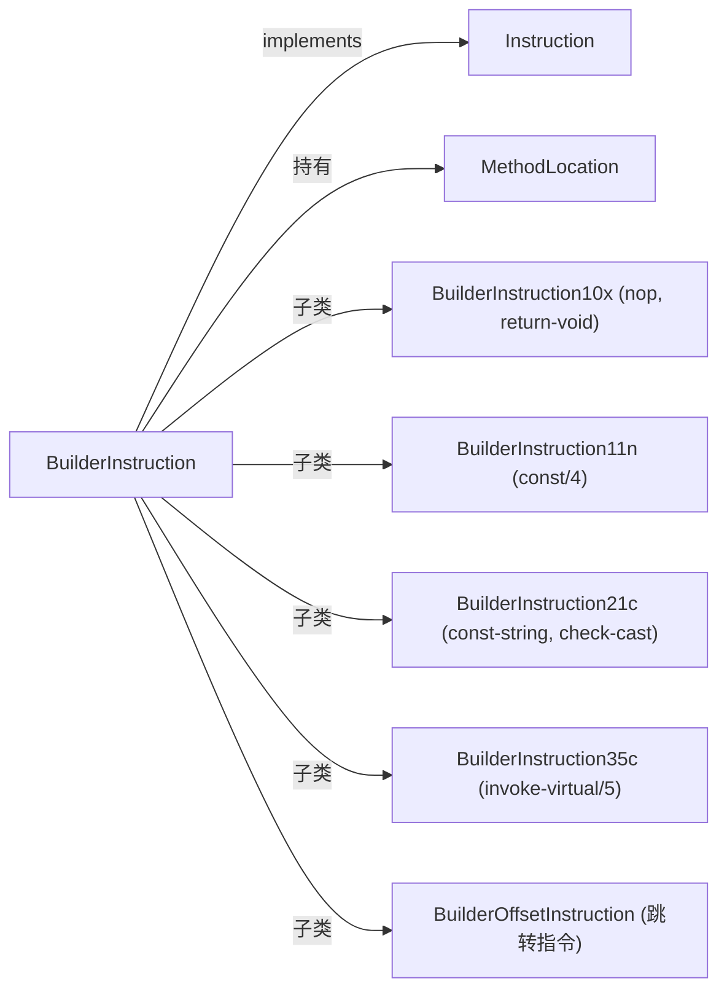

# 📝 BuilderInstruction

`BuilderInstruction` 是 builder 层所有具体指令类的**抽象基类**，在实现 `Instruction` 接口的同时，额外持有指令在方法体中的位置引用（`MethodLocation`）。

| 属性 | 值 |
|---|---|
| 源码 | [builder/BuilderInstruction.java](https://github.com/android-security-engineer/ZjDroid-skills/blob/master/src/org/jf/dexlib2/builder/BuilderInstruction.java) |
| 包名 | `org.jf.dexlib2.builder` |
| 类型 | `public abstract class BuilderInstruction implements Instruction` |
| 直接子类 | `BuilderInstruction10x`, `BuilderInstruction11n`, `BuilderInstruction21c`, `BuilderInstruction35c`, `BuilderOffsetInstruction`（跳转）等 30+ 类 |

## 🎯 职责

1. 持有 `Opcode` 并验证格式合法性（`Preconditions.checkFormat`）
2. 通过 `getFormat().size / 2` 计算指令占用的 code unit 数量
3. 持有 `MethodLocation` 引用，知道自己在方法体中的位置

## 🧠 关键实现

```java
public abstract class BuilderInstruction implements Instruction {
    @Nonnull protected final Opcode opcode;
    @Nullable MethodLocation location;  // 由 MutableMethodImplementation 设置

    protected BuilderInstruction(@Nonnull Opcode opcode) {
        Preconditions.checkFormat(opcode, getFormat());  // 验证 opcode 对应正确格式
        this.opcode = opcode;
    }

    @Nonnull public Opcode getOpcode() { return opcode; }

    public abstract Format getFormat();  // 子类实现，返回对应的 Format 枚举值

    public int getCodeUnits() {
        return getFormat().size / 2;  // Format.size 是字节数，code unit 是 2 字节
    }

    @Nonnull public MethodLocation getLocation() {
        if (location == null) {
            throw new IllegalStateException("Cannot get the location of an instruction " +
                    "that hasn't been added to a method.");
        }
        return location;
    }
}
```

### 具体子类示例：BuilderInstruction21c

```java
// 格式 21c：1 寄存器 + 16 位常量池引用（如 const-string, check-cast）
public class BuilderInstruction21c extends BuilderInstruction
        implements Instruction21c {
    private final int registerA;
    private final BuilderReference reference;

    public BuilderInstruction21c(@Nonnull Opcode opcode, int registerA,
                                  @Nonnull BuilderReference reference) {
        super(opcode);
        this.registerA = registerA;
        this.reference = reference;
    }

    @Override public Format getFormat() { return Format.Format21c; }
    @Override public int getRegisterA() { return registerA; }
    @Override @Nonnull public Reference getReference() { return reference; }
    @Override public int getReferenceType() { return reference.getReferenceType(); }
}
```

## 🔗 关系



## 📌 小结

`BuilderInstruction` 通过 `Format.size / 2` 统一计算 code unit 数量，使 `MutableMethodImplementation` 能准确维护每个 `MethodLocation` 的 `codeAddress`。子类只需实现 `getFormat()` 和各操作数 getter，框架自动处理位置管理和写出。
