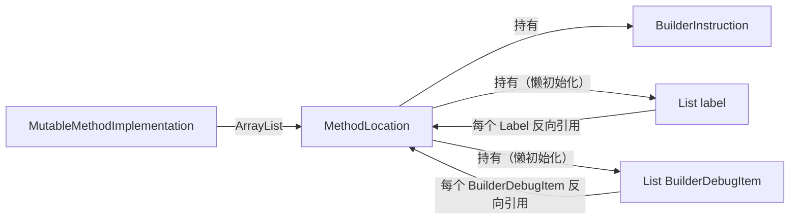

# 📍 MethodLocation

`MethodLocation` 是 builder 层方法体链表中的**每个节点**，聚合了一条指令、该位置关联的跳转标签（`Label`）以及调试信息（`BuilderDebugItem`）。

| 属性 | 值 |
|---|---|
| 源码 | [builder/MethodLocation.java](https://github.com/android-security-engineer/ZjDroid-skills/blob/master/src/org/jf/dexlib2/builder/MethodLocation.java) |
| 包名 | `org.jf.dexlib2.builder` |
| 类型 | `public class MethodLocation` |

## 🎯 职责

1. 持有当前位置的指令（`BuilderInstruction`，可为 null——方法末尾哨兵节点）
2. 持有 `codeAddress`（该指令的字节偏移，单位 code unit * 2）和 `index`（在 ArrayList 中的索引）
3. 持有此位置关联的所有 `Label`（懒初始化）
4. 持有此位置关联的所有 `BuilderDebugItem`（懒初始化）
5. 提供便捷方法：`addLineNumber`、`addStartLocal`、`addEndLocal` 等直接向此位置附加调试信息

## 🧠 关键实现

### 字段定义

```java
public class MethodLocation {
    @Nullable BuilderInstruction instruction;
    int codeAddress;
    int index;

    // 懒初始化：大量 MethodLocation 对象存在时，只在实际需要时创建列表
    @Nullable private List<Label> labels = null;
    @Nullable private List<BuilderDebugItem> debugItems = null;

    MethodLocation(@Nullable BuilderInstruction instruction, int codeAddress, int index) {
        this.instruction = instruction;
        this.codeAddress = codeAddress;
        this.index = index;
    }
}
```

### mergeInto — 合并两个位置（删除指令时使用）

```java
void mergeInto(@Nonnull MethodLocation other) {
    if (this.labels != null || other.labels != null) {
        List<Label> otherLabels = other.getLabels(true);
        for (Label label : this.getLabels(false)) {
            label.location = other;
            otherLabels.add(label);
        }
        this.labels = null;
    }
    if (this.debugItems != null || other.labels != null) {
        List<BuilderDebugItem> debugItems = getDebugItems(true);
        for (BuilderDebugItem debugItem : debugItems) {
            debugItem.location = other;
        }
        debugItems.addAll(other.getDebugItems(false));
        other.debugItems = debugItems;
        this.debugItems = null;
    }
}
```

删除一条指令时，该位置的标签和调试信息会被合并到下一个位置，确保不丢失。

### 添加调试信息的便捷方法

```java
public void addLineNumber(int lineNumber) {
    getDebugItems().add(new BuilderLineNumber(lineNumber));
}
public void addStartLocal(int registerNumber, @Nullable StringReference name,
                          @Nullable TypeReference type, @Nullable StringReference signature) {
    getDebugItems().add(new BuilderStartLocal(registerNumber, name, type, signature));
}
public void addEndLocal(int registerNumber) {
    getDebugItems().add(new BuilderEndLocal(registerNumber));
}
```

## 🔗 关系



## 📌 小结

`MethodLocation` 的懒初始化策略（`labels` 和 `debugItems` 默认 null）在构建大型 DEX 时显著节省内存——大多数指令位置不需要 Label 也没有调试信息。`mergeInto` 方法确保删除指令时不会破坏跳转和调试结构的一致性。
