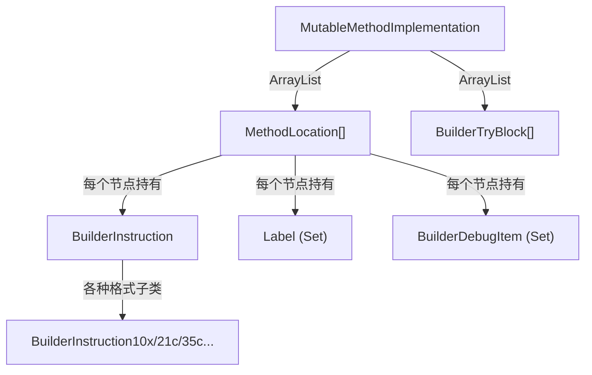

# 🔩 MutableMethodImplementation

`MutableMethodImplementation` 是 dexlib2 中**唯一可变的 `MethodImplementation` 实现**，提供指令级别的增、删、改操作，是方法体重建与插桩的核心数据结构。

| 属性 | 值 |
|---|---|
| 源码 | [builder/MutableMethodImplementation.java](https://github.com/android-security-engineer/ZjDroid-skills/blob/master/src/org/jf/dexlib2/builder/MutableMethodImplementation.java) |
| 包名 | `org.jf.dexlib2.builder` |
| 实现接口 | `MethodImplementation` |

## 🎯 职责

1. **从已有 `MethodImplementation` 克隆**，将不可变指令转为可变的 `BuilderInstruction`
2. **动态插入/删除指令**，自动更新所有 `MethodLocation` 的 `codeAddress`
3. **管理 Label**，跳转指令使用 `Label` 而非硬编码偏移，修改指令后跳转目标自动正确
4. **管理 TryBlock**，支持增加/修改异常处理范围

## 🧠 关键实现

### 从已有实现构造（克隆）

```java
public MutableMethodImplementation(@Nonnull MethodImplementation methodImplementation) {
    this.registerCount = methodImplementation.getRegisterCount();
    int codeAddress = 0;
    int index = 0;
    for (Instruction instruction : methodImplementation.getInstructions()) {
        codeAddress += instruction.getCodeUnits();
        index++;
        instructionList.add(new MethodLocation(null, codeAddress, index));
    }
    // 构建 codeAddress → index 映射表
    final int[] codeAddressToIndex = new int[codeAddress + 1];
    Arrays.fill(codeAddressToIndex, -1);
    for (int i = 0; i < instructionList.size(); i++) {
        codeAddressToIndex[instructionList.get(i).codeAddress] = i;
    }
    // switch payload 需最后处理（其目标标签依赖已有的 switch 指令）
    List<Task> switchPayloadTasks = Lists.newArrayList();
    index = 0;
    for (final Instruction instruction : methodImplementation.getInstructions()) {
        final MethodLocation location = instructionList.get(index);
        final Opcode opcode = instruction.getOpcode();
        if (opcode == Opcode.PACKED_SWITCH_PAYLOAD || opcode == Opcode.SPARSE_SWITCH_PAYLOAD) {
            switchPayloadTasks.add(new Task() {
                @Override public void perform() {
                    convertAndSetInstruction(location, codeAddressToIndex, instruction);
                }
            });
        } else {
            convertAndSetInstruction(location, codeAddressToIndex, instruction);
        }
        index++;
    }
    for (Task switchPayloadTask : switchPayloadTasks) switchPayloadTask.perform();
    // 复制 DebugItem 和 TryBlock
    for (DebugItem debugItem : methodImplementation.getDebugItems()) { ... }
    for (TryBlock<? extends ExceptionHandler> tryBlock : methodImplementation.getTryBlocks()) { ... }
}
```

### 插入指令

```java
public void addInstruction(int index, BuilderInstruction instruction) {
    if (index >= instructionList.size()) throw new IndexOutOfBoundsException();
    if (index == instructionList.size() - 1) {
        addInstruction(instruction);
        return;
    }
    int codeAddress = instructionList.get(index).getCodeAddress();
    instructionList.add(index, new MethodLocation(instruction, codeAddress, index));
    codeAddress += instruction.getCodeUnits();
    // 更新之后所有 location 的 codeAddress 和 index
    ...
}
```

### 获取指令列表（懒修复）

```java
@Nonnull public List<BuilderInstruction> getInstructions() {
    if (fixInstructions) {
        fixInstructions();  // 延迟修复跳转偏移
    }
    return new AbstractList<BuilderInstruction>() {
        @Override public BuilderInstruction get(int i) { ... }
        @Override public int size() {
            // 不包含末尾的 null-instruction MethodLocation
            return instructionList.size() - 1;
        }
    };
}
```

### 添加 Try-Catch 块

```java
public void addCatch(@Nullable TypeReference type, @Nonnull Label from,
                     @Nonnull Label to, @Nonnull Label handler) {
    tryBlocks.add(new BuilderTryBlock(from, to, type, handler));
}
```

所有地址用 `Label` 表达，写出时才解析为实际偏移。

## 🔗 关系



## 📌 小结

`MutableMethodImplementation` 是 dexlib2 动态修改方法体的核心。ZjDroid 在脱壳后对每个方法进行重建时，通过此类将原始字节码转换为可编辑结构，修复加密混淆，再通过 `DexBuilder` 写出合法的 DEX。

::: warning fixInstructions 延迟修复
`fixInstructions` 标志位是懒执行机制——修改指令（插入/删除）后不立即重算偏移，而是在第一次 `getInstructions()` 时统一修复。避免了频繁修改时的冗余计算。
:::
