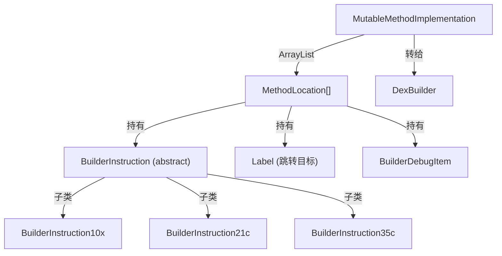

# 🔧 builder — 可变方法体构建层

`org.jf.dexlib2.builder` 提供了一套**可变（mutable）的 DEX 方法体构建 API**，允许在运行时动态插入、删除、修改指令和调试信息。这是 ZjDroid 实现**方法插桩**和**脱壳后代码修补**的核心基础设施。

## 🗺️ 在写出流水线中的位置

```
原始 MethodImplementation（来自内存 DEX 或 DexBackedMethodImplementation）
          ↓ new MutableMethodImplementation(impl)
     MutableMethodImplementation（可变方法体）
          ↓ addInstruction / removeInstruction
     内部 ArrayList<MethodLocation>（指令链表）
          ↓ 传给 DexBuilder.internMethod
     写出到 DEX code_item
```

## 📦 关键类清单

| 类 | 职责 |
|---|---|
| [MutableMethodImplementation](./MutableMethodImplementation) | 可变方法体，支持指令增删改，管理 Label 和 TryBlock |
| [BuilderInstruction](./BuilderInstruction) | 所有 Builder 指令的抽象基类，持有 `Opcode` 和 `MethodLocation` |
| [MethodLocation](./MethodLocation) | 指令在方法体中的位置节点，持有指令、标签和调试条目 |
| `Label` | 轻量级位置标记，用于跳转指令的目标绑定 |
| `MethodImplementationBuilder` | 流式 API，顺序追加指令，比 `MutableMethodImplementation` 更简洁 |
| `BuilderInstruction10x ~ 51l` | 各格式的具体 Builder 指令实现（位于 instruction/ 子包） |

## 🔗 整体结构



::: tip ZjDroid 插桩场景
ZjDroid 的 `DexFileBuilder` 在重构脱壳后的方法体时，使用 `MutableMethodImplementation` 对每个方法的指令列表进行遍历和重建，修复 nop-slide 填充、恢复被加密的常量引用。  
参见 [DexFileBuilder](/source/smali/DexFileBuilder)、[脱壳流水线](/architecture/unpacking-pipeline)。
:::

::: warning Label 与地址
Builder 层使用 `Label` 而非硬编码的字节偏移作为跳转目标。只有在写出时，`DexWriter` 才会计算实际偏移。这允许在添加/删除指令后无需手动更新跳转地址。
:::
