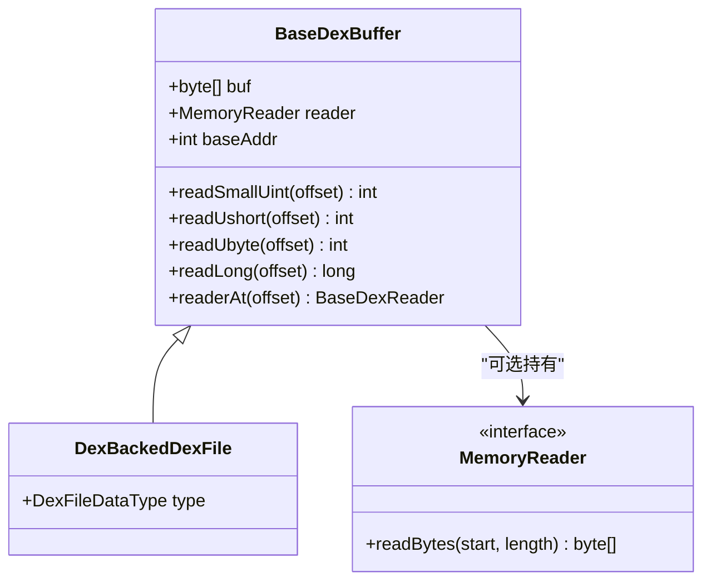

# 🗃️ BaseDexBuffer

dexbacked 层的**最底层字节读取基类**，ZjDroid 改造后支持文件字节数组和进程内存两种数据源。

| 属性 | 值 |
|------|----|
| 包名 | `org.jf.dexlib2.dexbacked` |
| 类型 | `class` |
| 源码 | [BaseDexBuffer.java](https://github.com/android-security-engineer/ZjDroid-skills/blob/master/src/org/jf/dexlib2/dexbacked/BaseDexBuffer.java) |
| 子类 | `DexBackedDexFile`、`DexBackedOdexFile` |

## 🎯 职责

`BaseDexBuffer` 是所有字节级读取操作的**统一入口**，提供：

- `readSmallUint(offset)` —— 读取小端 4 字节无符号整数（int，要求 ≥ 0）
- `readOptionalUint(offset)` —— 读取可选 uint（允许 -1 表示"无"）
- `readUshort(offset)` —— 读取小端 2 字节无符号整数
- `readUbyte(offset)` —— 读取 1 字节
- `readInt(offset)` / `readShort(offset)` / `readByte(offset)` / `readLong(offset)` —— 有符号变体

## 🧠 关键实现

### 双路构造函数（ZjDroid 改造）

```java
public class BaseDexBuffer {
    final byte[] buf;          // 文件模式用
    private MemoryReader reader; // 内存模式用（ZjDroid 新增字段）
    private int baseAddr;        // 内存模式：DEX 基地址（ZjDroid 新增字段）

    // 内存模式构造（ZjDroid 新增）
    public BaseDexBuffer(MemoryReader reader, int baseAddr) {
        this.buf = null;
        this.reader = reader;
        this.baseAddr = baseAddr;
    }

    // 文件模式构造（原版）
    public BaseDexBuffer(@Nonnull byte[] buf) {
        this.buf = buf;
        this.reader = null;
        this.baseAddr = 0;
    }
}
```

### 典型双轨读取逻辑（以 readSmallUint 为例）

```java
public int readSmallUint(int offset) {
    if (this.reader == null) {
        // ── 文件模式：直接访问 buf[] ──
        byte[] buf = this.buf;
        int result = (buf[offset] & 0xff)
                   | ((buf[offset + 1] & 0xff) << 8)
                   | ((buf[offset + 2] & 0xff) << 16)
                   | ((buf[offset + 3]) << 24);
        if (result < 0) throw new ExceptionWithContext("...", offset);
        return result;
    } else {
        // ── 内存模式：通过 MemoryReader 读取，地址 = baseAddr + offset ──
        byte[] buf = this.reader.readBytes(this.baseAddr + offset, 4);
        int result = (buf[0] & 0xff)
                   | ((buf[1] & 0xff) << 8)
                   | ((buf[2] & 0xff) << 16)
                   | ((buf[3]) << 24);
        if (result < 0) throw new ExceptionWithContext("...", offset);
        return result;
    }
}
```

::: tip 地址算术
内存模式中，`offset` 参数始终是相对于 DEX 基地址的**偏移量**（与文件模式语义一致），实际内存地址 = `baseAddr + offset`。这保证了上层解析代码完全不需要区分两种模式。
:::

::: info 所有读取方法都有双路实现
`readOptionalUint`、`readUshort`、`readUbyte`、`readLong`、`readInt`、`readShort`、`readByte` —— 共 8 个读取方法，每个都有完全对称的文件/内存双路分支，确保内存模式的完整性。
:::

## 🔗 关系



## 📌 小结

`BaseDexBuffer` 是 ZjDroid 内存化改造中**改动最多的原有类**：从原本只持有 `byte[] buf` 的单一模式，扩展为同时支持 `MemoryReader + baseAddr` 的双模式读取。这一改造使所有上层代码（DexBackedClassDef、DexBackedMethod 等）无需任何修改便能读取进程内存数据。
