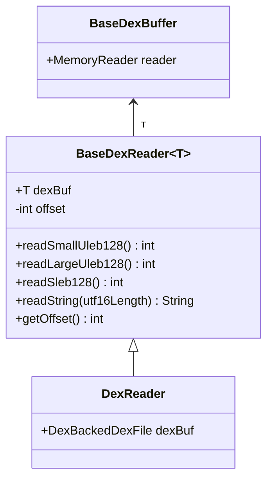

# 📖 BaseDexReader

有状态的**流式 DEX 解析器**，在 `BaseDexBuffer` 之上提供位置游标和变长编码解析能力。

| 属性 | 值 |
|------|----|
| 包名 | `org.jf.dexlib2.dexbacked` |
| 类型 | `class<T extends BaseDexBuffer>` |
| 源码 | [BaseDexReader.java](https://github.com/android-security-engineer/ZjDroid-skills/blob/master/src/org/jf/dexlib2/dexbacked/BaseDexReader.java) |
| 子类 | `DexReader`（= `BaseDexReader<DexBackedDexFile>`） |

## 🎯 职责

`BaseDexReader` 扩展了 `BaseDexBuffer` 的随机访问能力，提供**顺序流式读取**：

- 维护一个 `offset` 游标，每次读取后自动推进
- 解析 DEX 专用的变长编码格式：`ULEB128`、`SLEB128`
- 解析可变长度的有符号/无符号整数（`readSizedInt`、`readSizedSmallUint`）
- 解析 UTF-8 编码的字符串（`readString`）
- 跳过指定字节数（`skipUleb128`、`skipByte`、`moveRelative`）

## 🧠 关键实现

### ULEB128 解析的双路实现

```java
private int readUleb128(boolean allowLarge) {
    if (this.dexBuf.getReader() == null) {
        // 文件模式：直接从 byte[] buf 逐字节读取
        int end = offset;
        byte[] buf = dexBuf.buf;
        result = buf[end++] & 0xff;
        if (result > 0x7f) {
            currentByteValue = buf[end++] & 0xff;
            result = (result & 0x7f) | ((currentByteValue & 0x7f) << 7);
            // ... 最多 5 字节
        }
        offset = end;
        return result;
    } else {
        // 内存模式：每字节单独调用 MemoryReader.readBytes()
        int end = offset;
        result = dexBuf.getReader()
                       .readBytes(dexBuf.getBaseAddr() + end, 1)[0] & 0xff;
        end++;
        // ... 相同的 ULEB128 逻辑，但每次读 1 字节走 JNI
        offset = end;
        return result;
    }
}
```

::: warning 内存模式下的性能代价
内存模式中，ULEB128 解析需要**逐字节** JNI 调用，而文件模式只需内存数组访问。一个 5 字节的 ULEB128 需要 5 次 `MemoryReader.readBytes(addr, 1)`。对于脱壳场景，这个开销是可以接受的，但若需要大量解析则会比文件模式慢一个数量级。
:::

### 字符串解析

```java
public String readString(int utf16Length) {
    if (this.dexBuf.getReader() == null) {
        // 文件模式：直接传 byte[] buf 给 Utf8Utils
        String value = Utf8Utils.utf8BytesWithUtf16LengthToString(
            dexBuf.buf, offset, utf16Length, ret);
        offset += ret[0];
        return value;
    } else {
        // 内存模式：先读出足够的字节，再解码
        byte[] buf = dexBuf.getReader().readBytes(
            dexBuf.getBaseAddr() + offset, utf16Length * 4);
        String value = Utf8Utils.utf8BytesWithUtf16LengthToString(
            buf, 0, utf16Length, ret);
        offset += ret[0];
        return value;
    }
}
```

内存模式读取 `utf16Length * 4` 字节（UTF-8 最坏情况每字符 4 字节），然后调用与文件模式相同的 UTF-8 解码器。

### 关键方法一览

| 方法 | 用途 |
|------|------|
| `readSmallUleb128()` | 读 ULEB128，值 < 2^31（最常用） |
| `readLargeUleb128()` | 读 ULEB128，值可达 2^32（method index delta） |
| `readSleb128()` | 读 SLEB128（调试信息行号增量等） |
| `readSizedInt(n)` | 读 n 字节有符号整数 |
| `readSizedSmallUint(n)` | 读 n 字节无符号整数，n ∈ {1,2,3,4} |
| `readSizedRightExtendedInt(n)` | 读 n 字节，右对齐扩展（float encoded value） |
| `skipUleb128()` | 跳过一个 ULEB128（用于跳过不关心的字段） |
| `getOffset()` / `setOffset()` | 获取/设置当前读取位置 |

## 🔗 关系



## 📌 小结

`BaseDexReader` 完整实现了 DEX 格式中所有变长编码的解析，且每种解析方法都有文件/内存双路实现。它是 ZjDroid 内存化改造中**改动量最大的类**（~1000 行），也是脱壳时最频繁调用的底层组件。
