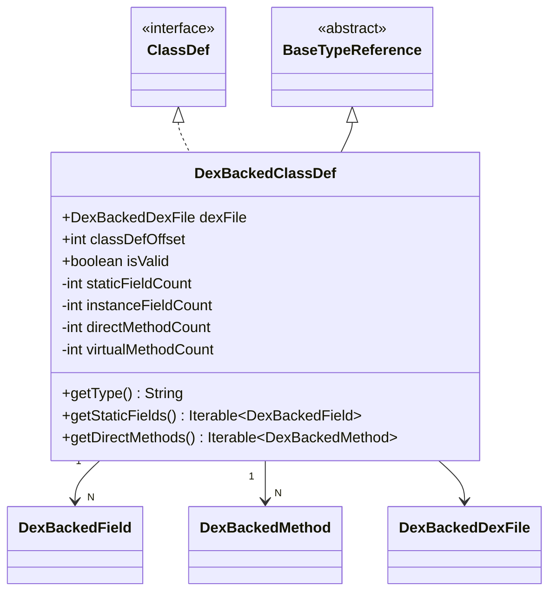

# 🏗️ DexBackedClassDef

基于字节数据的类定义实现，ZjDroid 在原版基础上增加了 **`isValid` 容错机制**以应对加壳应用中损坏的 DEX 结构。

| 属性 | 值 |
|------|----|
| 包名 | `org.jf.dexlib2.dexbacked` |
| 类型 | `class extends BaseTypeReference implements ClassDef` |
| 源码 | [DexBackedClassDef.java](https://github.com/android-security-engineer/ZjDroid-skills/blob/master/src/org/jf/dexlib2/dexbacked/DexBackedClassDef.java) |

## 🎯 职责

`DexBackedClassDef` 是 `ClassDef` 接口的具体实现，通过读取 `class_def_item` 和 `class_data_item` 结构，惰性解析一个类的完整信息（字段、方法、注解）。

## 🧠 关键实现

### isValid 容错机制（ZjDroid 新增）

```java
private boolean isValid = true; // ZjDroid 新增字段

public DexBackedClassDef(DexBackedDexFile dexFile, int classDefOffset) {
    this.dexFile = dexFile;
    this.classDefOffset = classDefOffset;

    try {
        int classDataOffset = dexFile.readSmallUint(
            classDefOffset + ClassDefItem.CLASS_DATA_OFFSET);

        if (classDataOffset == 0) {
            // 接口/抽象类可能没有 class_data_item
            staticFieldsOffset = -1;
            staticFieldCount = instanceFieldCount = directMethodCount = virtualMethodCount = 0;
        } else {
            DexReader reader = dexFile.readerAt(classDataOffset);
            // 读取 class_data_item 头部四个 ULEB128 计数
            staticFieldCount   = reader.readSmallUleb128();
            instanceFieldCount = reader.readSmallUleb128();
            directMethodCount  = reader.readSmallUleb128();
            virtualMethodCount = reader.readSmallUleb128();
            staticFieldsOffset = reader.getOffset();
        }
    } catch (Exception e) {
        e.printStackTrace();
        this.isValid = false; // 解析失败：标记为无效，外层跳过
    }
}
```

::: warning 为什么需要容错？
加壳应用经常在运行时动态修复 DEX 结构，可能导致某些类的 `class_data_item` 指针暂时无效或处于不完整状态。ZjDroid 通过 `try/catch + isValid` 标志跳过这些损坏的类，而不是让整个脱壳过程崩溃。
:::

### 惰性字段/方法遍历

`DexBackedClassDef` 使用**懒加载链式偏移**：各 section 的偏移量只在首次访问时计算，后续访问复用缓存值。

```java
private int getDirectMethodsOffset() {
    if (directMethodsOffset > 0) {
        return directMethodsOffset;  // 已计算，直接返回
    }
    // 未计算：跳过所有实例字段，定位到 direct_methods 起始位置
    DexReader reader = dexFile.readerAt(getInstanceFieldsOffset());
    DexBackedField.skipFields(reader, instanceFieldCount);
    directMethodsOffset = reader.getOffset();
    return directMethodsOffset;
}
```

遍历顺序：静态字段 → 实例字段 → 直接方法 → 虚方法，与 DEX `class_data_item` 格式完全对应。

### getType() 实现

```java
@Override
public String getType() {
    return dexFile.getType(
        dexFile.readSmallUint(classDefOffset + ClassDefItem.CLASS_OFFSET)
    );
}
```

通过 `class_def_item.class_idx`（type index）→ `type_id_item.descriptor_idx`（string index）→ 字符串表，完成三级间接查找，得到形如 `Lcom/example/Foo;` 的类型描述符。

## 🔗 关系



## 📌 小结

`DexBackedClassDef` 是脱壳流程中**访问量最大的类**——每个 DEX 类都要创建一个实例。ZjDroid 新增的 `isValid` 机制是脱壳稳定性的关键保障，没有它，遇到一个损坏的类就会导致整个脱壳过程异常终止。

::: tip 关联阅读
- [DexBackedMethod —— 方法体解析](./DexBackedMethod)
- [整体脱壳流水线](/architecture/unpacking-pipeline)
:::
