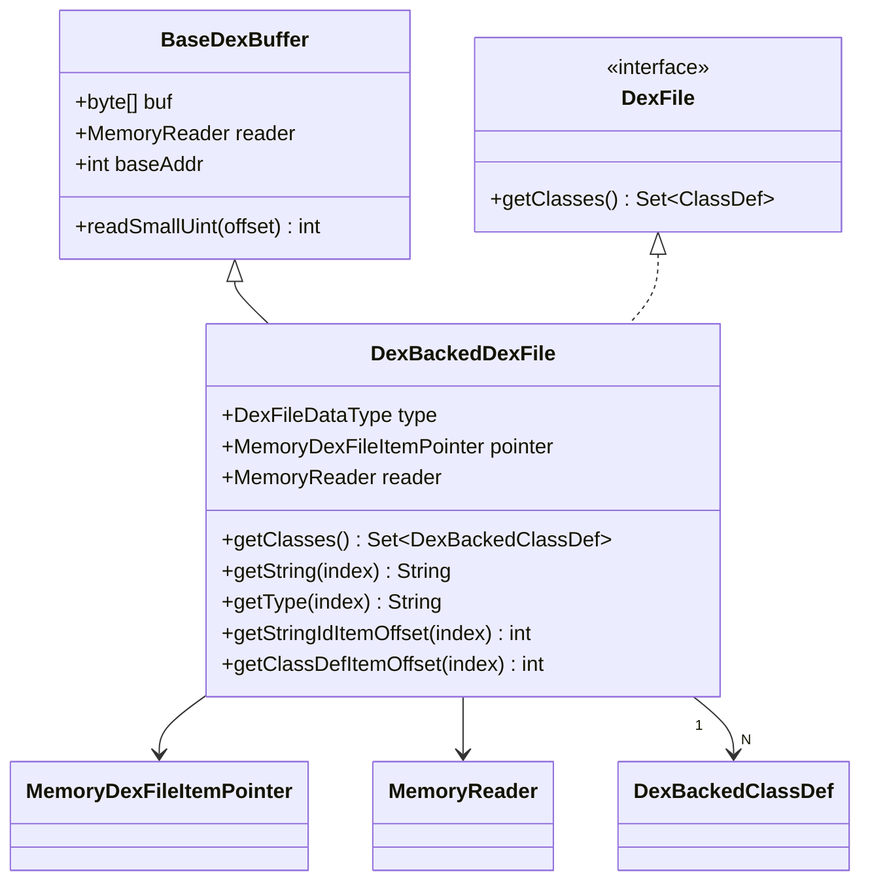

# 📂 DexBackedDexFile

dexbacked 层的**顶层入口**，实现了 `DexFile` 接口，同时是 ZjDroid 内存化改造最核心的承载类。

| 属性 | 值 |
|------|----|
| 包名 | `org.jf.dexlib2.dexbacked` |
| 类型 | `class extends BaseDexBuffer implements DexFile` |
| 源码 | [DexBackedDexFile.java](https://github.com/android-security-engineer/ZjDroid-skills/blob/master/src/org/jf/dexlib2/dexbacked/DexBackedDexFile.java) |

## 🎯 职责

`DexBackedDexFile` 负责：

1. 解析 DEX 文件头（`HeaderItem`），提取各 section 的计数和偏移
2. 提供各类 section 的偏移量计算方法（`getStringIdItemOffset`、`getClassDefItemOffset` 等）
3. 提供字符串/类型查询便捷方法（`getString`、`getType`）
4. 实现 `getClasses()` 返回惰性 ClassDef 集合
5. **（ZjDroid 新增）** 支持 `MEMORYTYPE` 模式，从进程内存而非文件字节读取 DEX

## 🧠 关键实现

### 双模式枚举

```java
public enum DexFileDataType {
    FILETYPE,   // 标准文件字节数组模式
    MEMORYTYPE  // ZjDroid 新增：进程内存模式
}
```

### MEMORYTYPE 构造函数（ZjDroid 新增）

```java
public DexBackedDexFile(Opcodes opcodes,
                        MemoryDexFileItemPointer pointer,
                        MemoryReader reader) {
    super(reader, pointer.getBaseAddr()); // 传入 MemoryReader + 基地址
    this.pointer = pointer;
    this.type    = DexFileDataType.MEMORYTYPE;
    this.reader  = reader;

    // 计数全部置 0（内存模式下不使用 header 中的计数做边界检查）
    stringCount = 0;
    typeCount   = 0;
    protoCount  = 0;
    fieldCount  = 0;
    methodCount = 0;

    // 绝对地址转相对偏移
    stringStartOffset = pointer.getpStringIds() - pointer.getBaseAddr();
    typeStartOffset   = pointer.getpTypeIds()   - pointer.getBaseAddr();
    protoStartOffset  = pointer.getpProtoIds()  - pointer.getBaseAddr();
    fieldStartOffset  = pointer.getpFieldIds()  - pointer.getBaseAddr();
    methodStartOffset = pointer.getpMethodIds() - pointer.getBaseAddr();
    classCount        = pointer.getClassCount();  // 唯一可靠的计数
    classStartOffset  = pointer.getpClassDefs() - pointer.getBaseAddr();
}
```

### FILETYPE 构造函数（原版逻辑）

```java
private DexBackedDexFile(Opcodes opcodes, byte[] buf, int offset, boolean verifyMagic) {
    super(buf);
    this.type = DexFileDataType.FILETYPE;
    if (verifyMagic) {
        verifyMagicAndByteOrder(buf, offset); // 验证 "dex\n035\0" 魔数
    }
    stringCount       = readSmallUint(HeaderItem.STRING_COUNT_OFFSET);
    stringStartOffset = readSmallUint(HeaderItem.STRING_START_OFFSET);
    // ... 从 header 读取其余 section 信息
}
```

### 边界检查的双轨逻辑

```java
public int getStringIdItemOffset(int stringIndex) {
    if (this.type == DexFileDataType.MEMORYTYPE) {
        // 内存模式：跳过越界检查，直接计算
        return stringStartOffset + stringIndex * StringIdItem.ITEM_SIZE;
    }
    // 文件模式：严格检查索引合法性
    if (stringIndex < 0 || stringIndex >= stringCount) {
        throw new InvalidItemIndex(stringIndex, "String index out of bounds: %d", stringIndex);
    }
    return stringStartOffset + stringIndex * StringIdItem.ITEM_SIZE;
}
```

::: info 日志输出助于调试
MEMORYTYPE 构造函数中大量使用 `Logger.log()` 输出各 section 偏移，这在脱壳调试时非常有用，可以验证从 Native 层传入的地址是否正确。
:::

### getClasses() 惰性实现

```java
@Override
public Set<? extends DexBackedClassDef> getClasses() {
    return new FixedSizeSet<DexBackedClassDef>() {
        @Override
        public DexBackedClassDef readItem(int index) {
            return new DexBackedClassDef(DexBackedDexFile.this,
                                         getClassDefItemOffset(index));
        }
        @Override
        public int size() { return classCount; }
    };
}
```

每次迭代到 index `i` 时才创建对应的 `DexBackedClassDef`，避免一次性解析全部类。

## 🔗 关系



## 📌 小结

`DexBackedDexFile` 是 ZjDroid 脱壳路径的"**大门**"。通过新增 `MEMORYTYPE` 构造函数和绕过边界检查的双轨逻辑，ZjDroid 让 dexlib2 的全部解析能力都能应用于进程内存中的 DEX，实现了对原版代码**最小侵入性的改造**。
